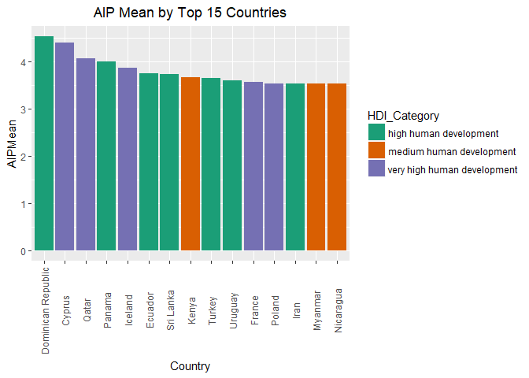

# Analysis
Michael Landrum, Randall Hendrickson  
December 1, 2017  


```r
  hdi_datafile <- here("outputdata", "HDI_By_Countries.csv")
  hdi_df <- read.csv(hdi_datafile, stringsAsFactors = FALSE)

  step2_datafile <- here("outputdata", "question_2e_dataframe.csv")
  df1 <- read.csv(step2_datafile, stringsAsFactors = FALSE)
  head(df1)
```

```
##   Age Gender     Kids Education WorkStatus AnnualInc Occupation JobYears
## 1  68   Male Yes Kids        ma    retired     25000       <NA>        9
## 2  45   Male Yes Kids       deg  part-time     35000       <NA>        0
## 3  19 Female  No Kids       dip    student        NA       <NA>        0
## 4  38   Male Yes Kids        ma  full-time     45000       <NA>       14
## 5  28 Female  No Kids       deg  full-time     35000       <NA>        1
## 6  23 Female  No Kids       deg  full-time     15000       <NA>        1
##   JobMonths   CommSize        Country  Marital Sons Daughters DP1 DP2 DP3
## 1         0 Large-City    El Salvador Divorced    0         5   3   1   1
## 2         0    Village        Bolivia  Married    1         1   3   4   3
## 3         0 Large Town         Cyprus   Single    0         0   5   5   2
## 4         0 Large Town Czech Republic  Married    0         1   3   3   3
## 5         0    Village Czech Republic   Single    0         0   3   3   2
## 6         0 Small Town Czech Republic   Single    0         0   3   4   3
##   DP4 DP5 AIP1 AIP2 AIP3 AIP4 AIP5 AIP6 AIP7 AIP8 AIP9 AIP10 AIP11 AIP12
## 1   1   1    1    1    1    1    1    1    1    1    5     1     1     1
## 2   3   3    3    1    4    3    3    4    3    3    3     3     4     2
## 3   3   3    5    4    4    5    5    5    5    4    5     5     4     3
## 4   3   3    2    1    4    3    5    3    4    5    4     5     4     3
## 5   1   1    1    1    3    3    2    2    2    2    1     1     2     1
## 6   2   2    2    5    5    5    5    3    5    4    4     5     3     5
##   AIP13 AIP14 AIP15 GP1 GP2 GP3 GP4 GP5 GP6 GP7 GP8 GP9 GP10 GP11 GP12
## 1     1     1     3   1   1   1   1   1   1   1   1   1    1    5    1
## 2     2     2     4   4   2   2   2   2   2   4   2   4    2    3    4
## 3     5     4     3   5   2   2   4   3   1   3   2   5    4    5    5
## 4     4     2     1   4   1   3   3   2   3   4   5   4    1    3    4
## 5     2     1     2   4   1   2   4   5   2   4   2   4    1    2    3
## 6     4     5     5   5   5   2   5   4   4   5   4   4    3    4    4
##   GP13 GP14 GP15 GP16 GP17 GP18 GP19 GP20 SWLS1 SWLS2 SWLS3 SWLS4 SWLS5
## 1    1    1    1    1    1    5    1    5     5     5     5     5     5
## 2    2    2    3    4    3    3    4    4     3     4     4     4     3
## 3    3    4    5    2    3    5    5    4     2     2     2     3     4
## 4    3    3    4    4    3    4    5    1     2     4     2     2     2
## 5    2    4    3    2    3    2    3    4     4     4     4     3     4
## 6    3    4    4    4    4    4    4    4     3     2     4     4     3
##   UProcrast OthersProc DPMean  AIPMean GPMean SWLSMean
## 1        no         no    2.0 1.400000   1.60      5.0
## 2       yes        yes    3.0 2.933333   2.90      3.6
## 3       yes        yes    4.0 4.400000   3.60      2.6
## 4       yes        yes    3.0 3.333333   3.20      2.4
## 5        no         no    2.0 1.733333   2.85      3.8
## 6       yes        yes    2.5 4.333333   4.00      3.2
```

```r
  colnames(df1)
```

```
##  [1] "Age"        "Gender"     "Kids"       "Education"  "WorkStatus"
##  [6] "AnnualInc"  "Occupation" "JobYears"   "JobMonths"  "CommSize"  
## [11] "Country"    "Marital"    "Sons"       "Daughters"  "DP1"       
## [16] "DP2"        "DP3"        "DP4"        "DP5"        "AIP1"      
## [21] "AIP2"       "AIP3"       "AIP4"       "AIP5"       "AIP6"      
## [26] "AIP7"       "AIP8"       "AIP9"       "AIP10"      "AIP11"     
## [31] "AIP12"      "AIP13"      "AIP14"      "AIP15"      "GP1"       
## [36] "GP2"        "GP3"        "GP4"        "GP5"        "GP6"       
## [41] "GP7"        "GP8"        "GP9"        "GP10"       "GP11"      
## [46] "GP12"       "GP13"       "GP14"       "GP15"       "GP16"      
## [51] "GP17"       "GP18"       "GP19"       "GP20"       "SWLS1"     
## [56] "SWLS2"      "SWLS3"      "SWLS4"      "SWLS5"      "UProcrast" 
## [61] "OthersProc" "DPMean"     "AIPMean"    "GPMean"     "SWLSMean"
```

```r
  dim(df1)
```

```
## [1] 4264   65
```

```r
  dim(hdi_df)
```

```
## [1] 188   3
```

```r
  head(df1[,62:65])
```

```
##   DPMean  AIPMean GPMean SWLSMean
## 1    2.0 1.400000   1.60      5.0
## 2    3.0 2.933333   2.90      3.6
## 3    4.0 4.400000   3.60      2.6
## 4    3.0 3.333333   3.20      2.4
## 5    2.0 1.733333   2.85      3.8
## 6    2.5 4.333333   4.00      3.2
```

```r
  head(hdi_df)
```

```
##       Country   HDI                HDI_Category
## 1      Norway 0.949 very high human development
## 2   Australia 0.939 very high human development
## 3 Switzerland 0.939 very high human development
## 4     Germany 0.926 very high human development
## 5     Denmark 0.925 very high human development
## 6   Singapore 0.925 very high human development
```

```r
  proc_df <- question3_c_Merge_Data(df1)
  
  dim(proc_df)
```

```
## [1] 4015   67
```

```r
  list_names <- colnames(proc_df)
  kable(list_names, "html", caption = "Merged Columns", row.names=TRUE) %>%
  kable_styling(bootstrap_options = c("striped", "hover", "condensed", "responsive"), full_width = F, position = "left") 
```

<table class="table table-striped table-hover table-condensed table-responsive" style="width: auto !important; ">
<caption>Merged Columns</caption>
<tbody>
<tr>
<td style="text-align:left;"> 1 </td>
   <td style="text-align:left;"> Country </td>
  </tr>
<tr>
<td style="text-align:left;"> 2 </td>
   <td style="text-align:left;"> Age </td>
  </tr>
<tr>
<td style="text-align:left;"> 3 </td>
   <td style="text-align:left;"> Gender </td>
  </tr>
<tr>
<td style="text-align:left;"> 4 </td>
   <td style="text-align:left;"> Kids </td>
  </tr>
<tr>
<td style="text-align:left;"> 5 </td>
   <td style="text-align:left;"> Education </td>
  </tr>
<tr>
<td style="text-align:left;"> 6 </td>
   <td style="text-align:left;"> WorkStatus </td>
  </tr>
<tr>
<td style="text-align:left;"> 7 </td>
   <td style="text-align:left;"> AnnualInc </td>
  </tr>
<tr>
<td style="text-align:left;"> 8 </td>
   <td style="text-align:left;"> Occupation </td>
  </tr>
<tr>
<td style="text-align:left;"> 9 </td>
   <td style="text-align:left;"> JobYears </td>
  </tr>
<tr>
<td style="text-align:left;"> 10 </td>
   <td style="text-align:left;"> JobMonths </td>
  </tr>
<tr>
<td style="text-align:left;"> 11 </td>
   <td style="text-align:left;"> CommSize </td>
  </tr>
<tr>
<td style="text-align:left;"> 12 </td>
   <td style="text-align:left;"> Marital </td>
  </tr>
<tr>
<td style="text-align:left;"> 13 </td>
   <td style="text-align:left;"> Sons </td>
  </tr>
<tr>
<td style="text-align:left;"> 14 </td>
   <td style="text-align:left;"> Daughters </td>
  </tr>
<tr>
<td style="text-align:left;"> 15 </td>
   <td style="text-align:left;"> DP1 </td>
  </tr>
<tr>
<td style="text-align:left;"> 16 </td>
   <td style="text-align:left;"> DP2 </td>
  </tr>
<tr>
<td style="text-align:left;"> 17 </td>
   <td style="text-align:left;"> DP3 </td>
  </tr>
<tr>
<td style="text-align:left;"> 18 </td>
   <td style="text-align:left;"> DP4 </td>
  </tr>
<tr>
<td style="text-align:left;"> 19 </td>
   <td style="text-align:left;"> DP5 </td>
  </tr>
<tr>
<td style="text-align:left;"> 20 </td>
   <td style="text-align:left;"> AIP1 </td>
  </tr>
<tr>
<td style="text-align:left;"> 21 </td>
   <td style="text-align:left;"> AIP2 </td>
  </tr>
<tr>
<td style="text-align:left;"> 22 </td>
   <td style="text-align:left;"> AIP3 </td>
  </tr>
<tr>
<td style="text-align:left;"> 23 </td>
   <td style="text-align:left;"> AIP4 </td>
  </tr>
<tr>
<td style="text-align:left;"> 24 </td>
   <td style="text-align:left;"> AIP5 </td>
  </tr>
<tr>
<td style="text-align:left;"> 25 </td>
   <td style="text-align:left;"> AIP6 </td>
  </tr>
<tr>
<td style="text-align:left;"> 26 </td>
   <td style="text-align:left;"> AIP7 </td>
  </tr>
<tr>
<td style="text-align:left;"> 27 </td>
   <td style="text-align:left;"> AIP8 </td>
  </tr>
<tr>
<td style="text-align:left;"> 28 </td>
   <td style="text-align:left;"> AIP9 </td>
  </tr>
<tr>
<td style="text-align:left;"> 29 </td>
   <td style="text-align:left;"> AIP10 </td>
  </tr>
<tr>
<td style="text-align:left;"> 30 </td>
   <td style="text-align:left;"> AIP11 </td>
  </tr>
<tr>
<td style="text-align:left;"> 31 </td>
   <td style="text-align:left;"> AIP12 </td>
  </tr>
<tr>
<td style="text-align:left;"> 32 </td>
   <td style="text-align:left;"> AIP13 </td>
  </tr>
<tr>
<td style="text-align:left;"> 33 </td>
   <td style="text-align:left;"> AIP14 </td>
  </tr>
<tr>
<td style="text-align:left;"> 34 </td>
   <td style="text-align:left;"> AIP15 </td>
  </tr>
<tr>
<td style="text-align:left;"> 35 </td>
   <td style="text-align:left;"> GP1 </td>
  </tr>
<tr>
<td style="text-align:left;"> 36 </td>
   <td style="text-align:left;"> GP2 </td>
  </tr>
<tr>
<td style="text-align:left;"> 37 </td>
   <td style="text-align:left;"> GP3 </td>
  </tr>
<tr>
<td style="text-align:left;"> 38 </td>
   <td style="text-align:left;"> GP4 </td>
  </tr>
<tr>
<td style="text-align:left;"> 39 </td>
   <td style="text-align:left;"> GP5 </td>
  </tr>
<tr>
<td style="text-align:left;"> 40 </td>
   <td style="text-align:left;"> GP6 </td>
  </tr>
<tr>
<td style="text-align:left;"> 41 </td>
   <td style="text-align:left;"> GP7 </td>
  </tr>
<tr>
<td style="text-align:left;"> 42 </td>
   <td style="text-align:left;"> GP8 </td>
  </tr>
<tr>
<td style="text-align:left;"> 43 </td>
   <td style="text-align:left;"> GP9 </td>
  </tr>
<tr>
<td style="text-align:left;"> 44 </td>
   <td style="text-align:left;"> GP10 </td>
  </tr>
<tr>
<td style="text-align:left;"> 45 </td>
   <td style="text-align:left;"> GP11 </td>
  </tr>
<tr>
<td style="text-align:left;"> 46 </td>
   <td style="text-align:left;"> GP12 </td>
  </tr>
<tr>
<td style="text-align:left;"> 47 </td>
   <td style="text-align:left;"> GP13 </td>
  </tr>
<tr>
<td style="text-align:left;"> 48 </td>
   <td style="text-align:left;"> GP14 </td>
  </tr>
<tr>
<td style="text-align:left;"> 49 </td>
   <td style="text-align:left;"> GP15 </td>
  </tr>
<tr>
<td style="text-align:left;"> 50 </td>
   <td style="text-align:left;"> GP16 </td>
  </tr>
<tr>
<td style="text-align:left;"> 51 </td>
   <td style="text-align:left;"> GP17 </td>
  </tr>
<tr>
<td style="text-align:left;"> 52 </td>
   <td style="text-align:left;"> GP18 </td>
  </tr>
<tr>
<td style="text-align:left;"> 53 </td>
   <td style="text-align:left;"> GP19 </td>
  </tr>
<tr>
<td style="text-align:left;"> 54 </td>
   <td style="text-align:left;"> GP20 </td>
  </tr>
<tr>
<td style="text-align:left;"> 55 </td>
   <td style="text-align:left;"> SWLS1 </td>
  </tr>
<tr>
<td style="text-align:left;"> 56 </td>
   <td style="text-align:left;"> SWLS2 </td>
  </tr>
<tr>
<td style="text-align:left;"> 57 </td>
   <td style="text-align:left;"> SWLS3 </td>
  </tr>
<tr>
<td style="text-align:left;"> 58 </td>
   <td style="text-align:left;"> SWLS4 </td>
  </tr>
<tr>
<td style="text-align:left;"> 59 </td>
   <td style="text-align:left;"> SWLS5 </td>
  </tr>
<tr>
<td style="text-align:left;"> 60 </td>
   <td style="text-align:left;"> UProcrast </td>
  </tr>
<tr>
<td style="text-align:left;"> 61 </td>
   <td style="text-align:left;"> OthersProc </td>
  </tr>
<tr>
<td style="text-align:left;"> 62 </td>
   <td style="text-align:left;"> DPMean </td>
  </tr>
<tr>
<td style="text-align:left;"> 63 </td>
   <td style="text-align:left;"> AIPMean </td>
  </tr>
<tr>
<td style="text-align:left;"> 64 </td>
   <td style="text-align:left;"> GPMean </td>
  </tr>
<tr>
<td style="text-align:left;"> 65 </td>
   <td style="text-align:left;"> SWLSMean </td>
  </tr>
<tr>
<td style="text-align:left;"> 66 </td>
   <td style="text-align:left;"> HDI </td>
  </tr>
<tr>
<td style="text-align:left;"> 67 </td>
   <td style="text-align:left;"> HDI_Category </td>
  </tr>
</tbody>
</table>

```r
  kable(head(proc_df))
```


Country        Age  Gender   Kids       Education   WorkStatus    AnnualInc  Occupation          JobYears   JobMonths  CommSize       Marital     Sons   Daughters   DP1   DP2   DP3   DP4   DP5   AIP1   AIP2   AIP3   AIP4   AIP5   AIP6   AIP7   AIP8   AIP9   AIP10   AIP11   AIP12   AIP13   AIP14   AIP15   GP1   GP2   GP3   GP4   GP5   GP6   GP7   GP8   GP9   GP10   GP11   GP12   GP13   GP14   GP15   GP16   GP17   GP18   GP19   GP20   SWLS1   SWLS2   SWLS3   SWLS4   SWLS5  UProcrast   OthersProc    DPMean    AIPMean   GPMean   SWLSMean     HDI  HDI_Category           
------------  ----  -------  ---------  ----------  -----------  ----------  -----------------  ---------  ----------  -------------  ---------  -----  ----------  ----  ----  ----  ----  ----  -----  -----  -----  -----  -----  -----  -----  -----  -----  ------  ------  ------  ------  ------  ------  ----  ----  ----  ----  ----  ----  ----  ----  ----  -----  -----  -----  -----  -----  -----  -----  -----  -----  -----  -----  ------  ------  ------  ------  ------  ----------  -----------  -------  ---------  -------  ---------  ------  -----------------------
Afghanistan     55  Male     Yes Kids   ma          full-time        150000  NA                         0           0  Large Town     Married        4           2     4     4     4     3     3      3      4      5      4      3      4      3      5      4       3       5       5       1       5       4     4     4     5     3     1     3     4     4     4      4      4      4      3      4      4      4      4      4      3      4       3       3       2       2       2  yes         yes              3.5   3.866667      3.7        2.4   0.479  low human development  
Afghanistan     80  Female   No Kids    grade       unemployed        10000  NA                         0           0  Medium-Sized   Single         0           0     2     3     2     3     5      2      2      3      4      2      2      2      1      1       3       5       4       3       3       4     4     4     1     4     4     4     4     3     2      2      3      3      2      3      2      4      4      4      3      4       2       4       3       3       2  yes         no               3.5   2.733333      3.2        2.8   0.479  low human development  
Afghanistan     55  Female   Yes Kids   deg         full-time         10000  NA                         7           0  Village        Divorced       4           0     4     3     4     3     2      1      2      1      4      3      5      4      4      3       3       3       4       3       3       3     3     2     2     5     3     3     3     5     3      1      2      3      1      1      3      3      3      4      3      3       1       1       1       3       1  no          yes              3.0   3.066667      2.8        1.4   0.479  low human development  
Afghanistan     55  Male     No Kids    deg         full-time         87500  NA                         0           6  Large Town     Married        0           0     3     3     3     4     3      3      2      2      2      3      2      3      3      2       3       4       2       4       2       3     4     2     4     3     3     3     3     4     4      2      2      3      2      4      3      4      3      3      4      4       3       2       2       3       2  yes         no               3.0   2.666667      3.2        2.4   0.479  low human development  
Albania         68  Male     Yes Kids   deg         part-time         87500  Media Consultant           4           0  Large-City     Divorced       0           2     4     3     2     2     1      4      1      5      1      2      1      1      3      2       3       3       1       3       1       5     4     1     2     2     3     2     2     2     4      1      2      4      4      4      4      4      4      3      4      4       3       4       3       5       4  yes         no               2.5   2.400000      3.0        3.8   0.764  high human development 
Albania         45  Female   No Kids    ltuni       full-time        150000  NA                         0           0  Large Town     Single         0           0     3     3     5     3     3      3      1      2      1      2      2      2      2      1       2       3       2       2       1       5     5     3     2     2     5     4     5     5     5      1      3      4      5      5      5      4      3      4      4      4       3       3       3       4       2  yes         no               3.0   2.066667      3.9        3.0   0.764  high human development 

## Verify data


```r
# generate frequency table
counts <- as.data.frame(table(proc_df$Country))
colnames(counts) <- c("Country", "Frequency")

kable(counts, "html", caption = "Procrastination Counts", row.names=TRUE) %>%
  kable_styling(bootstrap_options = c("striped", "hover", "condensed", "responsive"), full_width = F, position = "left") 
```

<table class="table table-striped table-hover table-condensed table-responsive" style="width: auto !important; ">
<caption>Procrastination Counts</caption>
 <thead><tr>
<th style="text-align:left;">   </th>
   <th style="text-align:left;"> Country </th>
   <th style="text-align:right;"> Frequency </th>
  </tr></thead>
<tbody>
<tr>
<td style="text-align:left;"> 1 </td>
   <td style="text-align:left;"> Afghanistan </td>
   <td style="text-align:right;"> 4 </td>
  </tr>
<tr>
<td style="text-align:left;"> 2 </td>
   <td style="text-align:left;"> Albania </td>
   <td style="text-align:right;"> 2 </td>
  </tr>
<tr>
<td style="text-align:left;"> 3 </td>
   <td style="text-align:left;"> Algeria </td>
   <td style="text-align:right;"> 3 </td>
  </tr>
<tr>
<td style="text-align:left;"> 4 </td>
   <td style="text-align:left;"> Andorra </td>
   <td style="text-align:right;"> 2 </td>
  </tr>
<tr>
<td style="text-align:left;"> 5 </td>
   <td style="text-align:left;"> Argentina </td>
   <td style="text-align:right;"> 4 </td>
  </tr>
<tr>
<td style="text-align:left;"> 6 </td>
   <td style="text-align:left;"> Australia </td>
   <td style="text-align:right;"> 104 </td>
  </tr>
<tr>
<td style="text-align:left;"> 7 </td>
   <td style="text-align:left;"> Austria </td>
   <td style="text-align:right;"> 3 </td>
  </tr>
<tr>
<td style="text-align:left;"> 8 </td>
   <td style="text-align:left;"> Bahamas </td>
   <td style="text-align:right;"> 3 </td>
  </tr>
<tr>
<td style="text-align:left;"> 9 </td>
   <td style="text-align:left;"> Barbados </td>
   <td style="text-align:right;"> 1 </td>
  </tr>
<tr>
<td style="text-align:left;"> 10 </td>
   <td style="text-align:left;"> Belgium </td>
   <td style="text-align:right;"> 9 </td>
  </tr>
<tr>
<td style="text-align:left;"> 11 </td>
   <td style="text-align:left;"> Bolivia </td>
   <td style="text-align:right;"> 1 </td>
  </tr>
<tr>
<td style="text-align:left;"> 12 </td>
   <td style="text-align:left;"> Botswana </td>
   <td style="text-align:right;"> 1 </td>
  </tr>
<tr>
<td style="text-align:left;"> 13 </td>
   <td style="text-align:left;"> Brazil </td>
   <td style="text-align:right;"> 20 </td>
  </tr>
<tr>
<td style="text-align:left;"> 14 </td>
   <td style="text-align:left;"> Brunei </td>
   <td style="text-align:right;"> 1 </td>
  </tr>
<tr>
<td style="text-align:left;"> 15 </td>
   <td style="text-align:left;"> Bulgaria </td>
   <td style="text-align:right;"> 2 </td>
  </tr>
<tr>
<td style="text-align:left;"> 16 </td>
   <td style="text-align:left;"> Canada </td>
   <td style="text-align:right;"> 250 </td>
  </tr>
<tr>
<td style="text-align:left;"> 17 </td>
   <td style="text-align:left;"> Chile </td>
   <td style="text-align:right;"> 4 </td>
  </tr>
<tr>
<td style="text-align:left;"> 18 </td>
   <td style="text-align:left;"> China </td>
   <td style="text-align:right;"> 13 </td>
  </tr>
<tr>
<td style="text-align:left;"> 19 </td>
   <td style="text-align:left;"> Croatia </td>
   <td style="text-align:right;"> 4 </td>
  </tr>
<tr>
<td style="text-align:left;"> 20 </td>
   <td style="text-align:left;"> Cyprus </td>
   <td style="text-align:right;"> 1 </td>
  </tr>
<tr>
<td style="text-align:left;"> 21 </td>
   <td style="text-align:left;"> Czech Republic </td>
   <td style="text-align:right;"> 3 </td>
  </tr>
<tr>
<td style="text-align:left;"> 22 </td>
   <td style="text-align:left;"> Denmark </td>
   <td style="text-align:right;"> 9 </td>
  </tr>
<tr>
<td style="text-align:left;"> 23 </td>
   <td style="text-align:left;"> Dominican Republic </td>
   <td style="text-align:right;"> 1 </td>
  </tr>
<tr>
<td style="text-align:left;"> 24 </td>
   <td style="text-align:left;"> Ecuador </td>
   <td style="text-align:right;"> 3 </td>
  </tr>
<tr>
<td style="text-align:left;"> 25 </td>
   <td style="text-align:left;"> Egypt </td>
   <td style="text-align:right;"> 1 </td>
  </tr>
<tr>
<td style="text-align:left;"> 26 </td>
   <td style="text-align:left;"> El Salvador </td>
   <td style="text-align:right;"> 1 </td>
  </tr>
<tr>
<td style="text-align:left;"> 27 </td>
   <td style="text-align:left;"> Estonia </td>
   <td style="text-align:right;"> 1 </td>
  </tr>
<tr>
<td style="text-align:left;"> 28 </td>
   <td style="text-align:left;"> Finland </td>
   <td style="text-align:right;"> 14 </td>
  </tr>
<tr>
<td style="text-align:left;"> 29 </td>
   <td style="text-align:left;"> France </td>
   <td style="text-align:right;"> 13 </td>
  </tr>
<tr>
<td style="text-align:left;"> 30 </td>
   <td style="text-align:left;"> Germany </td>
   <td style="text-align:right;"> 37 </td>
  </tr>
<tr>
<td style="text-align:left;"> 31 </td>
   <td style="text-align:left;"> Ghana </td>
   <td style="text-align:right;"> 2 </td>
  </tr>
<tr>
<td style="text-align:left;"> 32 </td>
   <td style="text-align:left;"> Greece </td>
   <td style="text-align:right;"> 10 </td>
  </tr>
<tr>
<td style="text-align:left;"> 33 </td>
   <td style="text-align:left;"> Guyana </td>
   <td style="text-align:right;"> 1 </td>
  </tr>
<tr>
<td style="text-align:left;"> 34 </td>
   <td style="text-align:left;"> Hong Kong </td>
   <td style="text-align:right;"> 7 </td>
  </tr>
<tr>
<td style="text-align:left;"> 35 </td>
   <td style="text-align:left;"> Hungary </td>
   <td style="text-align:right;"> 1 </td>
  </tr>
<tr>
<td style="text-align:left;"> 36 </td>
   <td style="text-align:left;"> Iceland </td>
   <td style="text-align:right;"> 1 </td>
  </tr>
<tr>
<td style="text-align:left;"> 37 </td>
   <td style="text-align:left;"> India </td>
   <td style="text-align:right;"> 78 </td>
  </tr>
<tr>
<td style="text-align:left;"> 38 </td>
   <td style="text-align:left;"> Iran </td>
   <td style="text-align:right;"> 2 </td>
  </tr>
<tr>
<td style="text-align:left;"> 39 </td>
   <td style="text-align:left;"> Ireland </td>
   <td style="text-align:right;"> 19 </td>
  </tr>
<tr>
<td style="text-align:left;"> 40 </td>
   <td style="text-align:left;"> Israel </td>
   <td style="text-align:right;"> 19 </td>
  </tr>
<tr>
<td style="text-align:left;"> 41 </td>
   <td style="text-align:left;"> Italy </td>
   <td style="text-align:right;"> 67 </td>
  </tr>
<tr>
<td style="text-align:left;"> 42 </td>
   <td style="text-align:left;"> Jamaica </td>
   <td style="text-align:right;"> 1 </td>
  </tr>
<tr>
<td style="text-align:left;"> 43 </td>
   <td style="text-align:left;"> Japan </td>
   <td style="text-align:right;"> 13 </td>
  </tr>
<tr>
<td style="text-align:left;"> 44 </td>
   <td style="text-align:left;"> Kazakhstan </td>
   <td style="text-align:right;"> 1 </td>
  </tr>
<tr>
<td style="text-align:left;"> 45 </td>
   <td style="text-align:left;"> Kenya </td>
   <td style="text-align:right;"> 1 </td>
  </tr>
<tr>
<td style="text-align:left;"> 46 </td>
   <td style="text-align:left;"> Lebanon </td>
   <td style="text-align:right;"> 1 </td>
  </tr>
<tr>
<td style="text-align:left;"> 47 </td>
   <td style="text-align:left;"> Lithuania </td>
   <td style="text-align:right;"> 1 </td>
  </tr>
<tr>
<td style="text-align:left;"> 48 </td>
   <td style="text-align:left;"> Luxembourg </td>
   <td style="text-align:right;"> 1 </td>
  </tr>
<tr>
<td style="text-align:left;"> 49 </td>
   <td style="text-align:left;"> Macedonia </td>
   <td style="text-align:right;"> 1 </td>
  </tr>
<tr>
<td style="text-align:left;"> 50 </td>
   <td style="text-align:left;"> Malaysia </td>
   <td style="text-align:right;"> 5 </td>
  </tr>
<tr>
<td style="text-align:left;"> 51 </td>
   <td style="text-align:left;"> Malta </td>
   <td style="text-align:right;"> 2 </td>
  </tr>
<tr>
<td style="text-align:left;"> 52 </td>
   <td style="text-align:left;"> Mexico </td>
   <td style="text-align:right;"> 12 </td>
  </tr>
<tr>
<td style="text-align:left;"> 53 </td>
   <td style="text-align:left;"> Morocco </td>
   <td style="text-align:right;"> 1 </td>
  </tr>
<tr>
<td style="text-align:left;"> 54 </td>
   <td style="text-align:left;"> Myanmar </td>
   <td style="text-align:right;"> 1 </td>
  </tr>
<tr>
<td style="text-align:left;"> 55 </td>
   <td style="text-align:left;"> Netherlands </td>
   <td style="text-align:right;"> 18 </td>
  </tr>
<tr>
<td style="text-align:left;"> 56 </td>
   <td style="text-align:left;"> New Zealand </td>
   <td style="text-align:right;"> 16 </td>
  </tr>
<tr>
<td style="text-align:left;"> 57 </td>
   <td style="text-align:left;"> Nicaragua </td>
   <td style="text-align:right;"> 1 </td>
  </tr>
<tr>
<td style="text-align:left;"> 58 </td>
   <td style="text-align:left;"> Norway </td>
   <td style="text-align:right;"> 14 </td>
  </tr>
<tr>
<td style="text-align:left;"> 59 </td>
   <td style="text-align:left;"> Pakistan </td>
   <td style="text-align:right;"> 1 </td>
  </tr>
<tr>
<td style="text-align:left;"> 60 </td>
   <td style="text-align:left;"> Panama </td>
   <td style="text-align:right;"> 1 </td>
  </tr>
<tr>
<td style="text-align:left;"> 61 </td>
   <td style="text-align:left;"> Peru </td>
   <td style="text-align:right;"> 3 </td>
  </tr>
<tr>
<td style="text-align:left;"> 62 </td>
   <td style="text-align:left;"> Philippines </td>
   <td style="text-align:right;"> 11 </td>
  </tr>
<tr>
<td style="text-align:left;"> 63 </td>
   <td style="text-align:left;"> Poland </td>
   <td style="text-align:right;"> 5 </td>
  </tr>
<tr>
<td style="text-align:left;"> 64 </td>
   <td style="text-align:left;"> Portugal </td>
   <td style="text-align:right;"> 7 </td>
  </tr>
<tr>
<td style="text-align:left;"> 65 </td>
   <td style="text-align:left;"> Qatar </td>
   <td style="text-align:right;"> 1 </td>
  </tr>
<tr>
<td style="text-align:left;"> 66 </td>
   <td style="text-align:left;"> Romania </td>
   <td style="text-align:right;"> 5 </td>
  </tr>
<tr>
<td style="text-align:left;"> 67 </td>
   <td style="text-align:left;"> Russia </td>
   <td style="text-align:right;"> 1 </td>
  </tr>
<tr>
<td style="text-align:left;"> 68 </td>
   <td style="text-align:left;"> Saudi Arabia </td>
   <td style="text-align:right;"> 2 </td>
  </tr>
<tr>
<td style="text-align:left;"> 69 </td>
   <td style="text-align:left;"> Singapore </td>
   <td style="text-align:right;"> 6 </td>
  </tr>
<tr>
<td style="text-align:left;"> 70 </td>
   <td style="text-align:left;"> Slovenia </td>
   <td style="text-align:right;"> 6 </td>
  </tr>
<tr>
<td style="text-align:left;"> 71 </td>
   <td style="text-align:left;"> South Africa </td>
   <td style="text-align:right;"> 13 </td>
  </tr>
<tr>
<td style="text-align:left;"> 72 </td>
   <td style="text-align:left;"> South Korea </td>
   <td style="text-align:right;"> 2 </td>
  </tr>
<tr>
<td style="text-align:left;"> 73 </td>
   <td style="text-align:left;"> Spain </td>
   <td style="text-align:right;"> 14 </td>
  </tr>
<tr>
<td style="text-align:left;"> 74 </td>
   <td style="text-align:left;"> Sri Lanka </td>
   <td style="text-align:right;"> 1 </td>
  </tr>
<tr>
<td style="text-align:left;"> 75 </td>
   <td style="text-align:left;"> Sweden </td>
   <td style="text-align:right;"> 15 </td>
  </tr>
<tr>
<td style="text-align:left;"> 76 </td>
   <td style="text-align:left;"> Switzerland </td>
   <td style="text-align:right;"> 13 </td>
  </tr>
<tr>
<td style="text-align:left;"> 77 </td>
   <td style="text-align:left;"> Thailand </td>
   <td style="text-align:right;"> 2 </td>
  </tr>
<tr>
<td style="text-align:left;"> 78 </td>
   <td style="text-align:left;"> Turkey </td>
   <td style="text-align:right;"> 9 </td>
  </tr>
<tr>
<td style="text-align:left;"> 79 </td>
   <td style="text-align:left;"> Ukraine </td>
   <td style="text-align:right;"> 2 </td>
  </tr>
<tr>
<td style="text-align:left;"> 80 </td>
   <td style="text-align:left;"> United Kingdom </td>
   <td style="text-align:right;"> 184 </td>
  </tr>
<tr>
<td style="text-align:left;"> 81 </td>
   <td style="text-align:left;"> United States </td>
   <td style="text-align:right;"> 2893 </td>
  </tr>
<tr>
<td style="text-align:left;"> 82 </td>
   <td style="text-align:left;"> Uruguay </td>
   <td style="text-align:right;"> 3 </td>
  </tr>
<tr>
<td style="text-align:left;"> 83 </td>
   <td style="text-align:left;"> Venezuela </td>
   <td style="text-align:right;"> 2 </td>
  </tr>
<tr>
<td style="text-align:left;"> 84 </td>
   <td style="text-align:left;"> Vietnam </td>
   <td style="text-align:right;"> 1 </td>
  </tr>
</tbody>
</table>

```r
proc_unique <- unique(proc_df$Country)
hdi_unique  <- unique(hdi_df$Country)

length(proc_unique)
```

```
## [1] 84
```

```r
length(hdi_unique)
```

```
## [1] 188
```

```r
proc_unique[!(proc_unique %in% hdi_unique)]
```

```
## character(0)
```

```r
hdi_unique[!(hdi_unique %in% proc_unique)]
```

```
##   [1] "Liechtenstein"                    
##   [2] "Slovakia"                         
##   [3] "United Arab Emirates"             
##   [4] "Latvia"                           
##   [5] "Bahrain"                          
##   [6] "Montenegro"                       
##   [7] "Kuwait"                           
##   [8] "Belarus"                          
##   [9] "Oman"                             
##  [10] "Palau"                            
##  [11] "Antigua and Barbuda"              
##  [12] "Seychelles"                       
##  [13] "Mauritius"                        
##  [14] "Trinidad and Tobago"              
##  [15] "Costa Rica"                       
##  [16] "Serbia"                           
##  [17] "Cuba"                             
##  [18] "Georgia"                          
##  [19] "Saint Kitts and Nevis"            
##  [20] "Azerbaijan"                       
##  [21] "Grenada"                          
##  [22] "Bosnia and Herzegovina"           
##  [23] "Armenia"                          
##  [24] "Jordan"                           
##  [25] "Fiji"                             
##  [26] "Mongolia"                         
##  [27] "Saint Lucia"                      
##  [28] "Colombia"                         
##  [29] "Dominica"                         
##  [30] "Suriname"                         
##  [31] "Tunisia"                          
##  [32] "Saint Vincent and the Grenadines" 
##  [33] "Tonga"                            
##  [34] "Libya"                            
##  [35] "Belize"                           
##  [36] "Samoa"                            
##  [37] "Maldives"                         
##  [38] "Uzbekistan"                       
##  [39] "Moldova"                          
##  [40] "Gabon"                            
##  [41] "Paraguay"                         
##  [42] "Turkmenistan"                     
##  [43] "Indonesia"                        
##  [44] "Palestine"                        
##  [45] "Kyrgyzstan"                       
##  [46] "Iraq"                             
##  [47] "Cape Verde"                       
##  [48] "Guatemala"                        
##  [49] "Namibia"                          
##  [50] "Micronesia"                       
##  [51] "Tajikistan"                       
##  [52] "Honduras"                         
##  [53] "Bhutan"                           
##  [54] "Timor Leste"                      
##  [55] "Vanuatu"                          
##  [56] "Congo, Republic of the"           
##  [57] "Equatorial Guinea"                
##  [58] "Kiribati"                         
##  [59] "Laos"                             
##  [60] "Bangladesh"                       
##  [61] "Zambia"                           
##  [62] "São Tomé and Príncipe"            
##  [63] "Cambodia"                         
##  [64] "Nepal"                            
##  [65] "Swaziland"                        
##  [66] "Syria"                            
##  [67] "Angola"                           
##  [68] "Tanzania"                         
##  [69] "Nigeria"                          
##  [70] "Cameroon"                         
##  [71] "Papua New Guinea"                 
##  [72] "Zimbabwe"                         
##  [73] "Solomon Islands"                  
##  [74] "Mauritania"                       
##  [75] "Madagascar"                       
##  [76] "Rwanda"                           
##  [77] "Comoros"                          
##  [78] "Lesotho"                          
##  [79] "Senegal"                          
##  [80] "Haiti"                            
##  [81] "Uganda"                           
##  [82] "Sudan"                            
##  [83] "Togo"                             
##  [84] "Benin"                            
##  [85] "Yemen"                            
##  [86] "Malawi"                           
##  [87] "Côte d'Ivoire"                    
##  [88] "Djibouti"                         
##  [89] "Gambia"                           
##  [90] "Ethiopia"                         
##  [91] "Mali"                             
##  [92] "Congo, Democratic Republic of the"
##  [93] "Liberia"                          
##  [94] "Guinea Bissau"                    
##  [95] "Eritrea"                          
##  [96] "Sierra Leone"                     
##  [97] "Mozambique"                       
##  [98] "South Sudan"                      
##  [99] "Guinea"                           
## [100] "Burundi"                          
## [101] "Burkina Faso"                     
## [102] "Chad"                             
## [103] "Niger"                            
## [104] "Central African Republic"
```
## Preliminary Analysis

### 4 a. 


```r
# start filtering
dim(proc_df)
```

```
## [1] 4015   67
```

```r
# remove all under 18
proc_age_filtered <- subset(proc_df, Age >= 18)
dim(proc_age_filtered)
```

```
## [1] 3863   67
```

```r
# generate frequency table
counts1 <- as.data.frame(table(proc_age_filtered$Age))
colnames(counts1) <- c("Age", "Frequency")

kable(counts1, "html", caption = "Age over 18", row.names=TRUE) %>%
  kable_styling(bootstrap_options = c("striped", "hover", "condensed", "responsive"), full_width = F, position = "left") 
```

<table class="table table-striped table-hover table-condensed table-responsive" style="width: auto !important; ">
<caption>Age over 18</caption>
 <thead><tr>
<th style="text-align:left;">   </th>
   <th style="text-align:left;"> Age </th>
   <th style="text-align:right;"> Frequency </th>
  </tr></thead>
<tbody>
<tr>
<td style="text-align:left;"> 1 </td>
   <td style="text-align:left;"> 19 </td>
   <td style="text-align:right;"> 107 </td>
  </tr>
<tr>
<td style="text-align:left;"> 2 </td>
   <td style="text-align:left;"> 20 </td>
   <td style="text-align:right;"> 117 </td>
  </tr>
<tr>
<td style="text-align:left;"> 3 </td>
   <td style="text-align:left;"> 21 </td>
   <td style="text-align:right;"> 117 </td>
  </tr>
<tr>
<td style="text-align:left;"> 4 </td>
   <td style="text-align:left;"> 22 </td>
   <td style="text-align:right;"> 122 </td>
  </tr>
<tr>
<td style="text-align:left;"> 5 </td>
   <td style="text-align:left;"> 23 </td>
   <td style="text-align:right;"> 118 </td>
  </tr>
<tr>
<td style="text-align:left;"> 6 </td>
   <td style="text-align:left;"> 24 </td>
   <td style="text-align:right;"> 119 </td>
  </tr>
<tr>
<td style="text-align:left;"> 7 </td>
   <td style="text-align:left;"> 25 </td>
   <td style="text-align:right;"> 134 </td>
  </tr>
<tr>
<td style="text-align:left;"> 8 </td>
   <td style="text-align:left;"> 28 </td>
   <td style="text-align:right;"> 551 </td>
  </tr>
<tr>
<td style="text-align:left;"> 9 </td>
   <td style="text-align:left;"> 32 </td>
   <td style="text-align:right;"> 471 </td>
  </tr>
<tr>
<td style="text-align:left;"> 10 </td>
   <td style="text-align:left;"> 38 </td>
   <td style="text-align:right;"> 410 </td>
  </tr>
<tr>
<td style="text-align:left;"> 11 </td>
   <td style="text-align:left;"> 45 </td>
   <td style="text-align:right;"> 741 </td>
  </tr>
<tr>
<td style="text-align:left;"> 12 </td>
   <td style="text-align:left;"> 55 </td>
   <td style="text-align:right;"> 623 </td>
  </tr>
<tr>
<td style="text-align:left;"> 13 </td>
   <td style="text-align:left;"> 68 </td>
   <td style="text-align:right;"> 207 </td>
  </tr>
<tr>
<td style="text-align:left;"> 14 </td>
   <td style="text-align:left;"> 80 </td>
   <td style="text-align:right;"> 26 </td>
  </tr>
</tbody>
</table>

```r
# remove aged 80
proc_age_filtered <- subset(proc_age_filtered, Age != 80)
dim(proc_age_filtered)
```

```
## [1] 3837   67
```

```r
# generate frequency table
counts1 <- as.data.frame(table(proc_age_filtered$Age))
colnames(counts1) <- c("Age", "Frequency")

kable(counts1, "html", caption = "Age over 18", row.names=TRUE) %>%
  kable_styling(bootstrap_options = c("striped", "hover", "condensed", "responsive"), full_width = F, position = "left") 
```

<table class="table table-striped table-hover table-condensed table-responsive" style="width: auto !important; ">
<caption>Age over 18</caption>
 <thead><tr>
<th style="text-align:left;">   </th>
   <th style="text-align:left;"> Age </th>
   <th style="text-align:right;"> Frequency </th>
  </tr></thead>
<tbody>
<tr>
<td style="text-align:left;"> 1 </td>
   <td style="text-align:left;"> 19 </td>
   <td style="text-align:right;"> 107 </td>
  </tr>
<tr>
<td style="text-align:left;"> 2 </td>
   <td style="text-align:left;"> 20 </td>
   <td style="text-align:right;"> 117 </td>
  </tr>
<tr>
<td style="text-align:left;"> 3 </td>
   <td style="text-align:left;"> 21 </td>
   <td style="text-align:right;"> 117 </td>
  </tr>
<tr>
<td style="text-align:left;"> 4 </td>
   <td style="text-align:left;"> 22 </td>
   <td style="text-align:right;"> 122 </td>
  </tr>
<tr>
<td style="text-align:left;"> 5 </td>
   <td style="text-align:left;"> 23 </td>
   <td style="text-align:right;"> 118 </td>
  </tr>
<tr>
<td style="text-align:left;"> 6 </td>
   <td style="text-align:left;"> 24 </td>
   <td style="text-align:right;"> 119 </td>
  </tr>
<tr>
<td style="text-align:left;"> 7 </td>
   <td style="text-align:left;"> 25 </td>
   <td style="text-align:right;"> 134 </td>
  </tr>
<tr>
<td style="text-align:left;"> 8 </td>
   <td style="text-align:left;"> 28 </td>
   <td style="text-align:right;"> 551 </td>
  </tr>
<tr>
<td style="text-align:left;"> 9 </td>
   <td style="text-align:left;"> 32 </td>
   <td style="text-align:right;"> 471 </td>
  </tr>
<tr>
<td style="text-align:left;"> 10 </td>
   <td style="text-align:left;"> 38 </td>
   <td style="text-align:right;"> 410 </td>
  </tr>
<tr>
<td style="text-align:left;"> 11 </td>
   <td style="text-align:left;"> 45 </td>
   <td style="text-align:right;"> 741 </td>
  </tr>
<tr>
<td style="text-align:left;"> 12 </td>
   <td style="text-align:left;"> 55 </td>
   <td style="text-align:right;"> 623 </td>
  </tr>
<tr>
<td style="text-align:left;"> 13 </td>
   <td style="text-align:left;"> 68 </td>
   <td style="text-align:right;"> 207 </td>
  </tr>
</tbody>
</table>

## 4. b.


```r
library(ggplot2)


# start filtering
dim(proc_df)
```

```
## [1] 4015   67
```

```r
# remove all under 18
proc_age_filtered <- subset(proc_df, Age >= 18)
dim(proc_age_filtered)
```

```
## [1] 3863   67
```

```r
# generate frequency table
counts1 <- as.data.frame(table(proc_age_filtered$Age))
colnames(counts1) <- c("Age", "Frequency")

kable(counts1, "html", caption = "Age over 18", row.names=TRUE) %>%
  kable_styling(bootstrap_options = c("striped", "hover", "condensed", "responsive"), full_width = F, position = "left") 
```

<table class="table table-striped table-hover table-condensed table-responsive" style="width: auto !important; ">
<caption>Age over 18</caption>
 <thead><tr>
<th style="text-align:left;">   </th>
   <th style="text-align:left;"> Age </th>
   <th style="text-align:right;"> Frequency </th>
  </tr></thead>
<tbody>
<tr>
<td style="text-align:left;"> 1 </td>
   <td style="text-align:left;"> 19 </td>
   <td style="text-align:right;"> 107 </td>
  </tr>
<tr>
<td style="text-align:left;"> 2 </td>
   <td style="text-align:left;"> 20 </td>
   <td style="text-align:right;"> 117 </td>
  </tr>
<tr>
<td style="text-align:left;"> 3 </td>
   <td style="text-align:left;"> 21 </td>
   <td style="text-align:right;"> 117 </td>
  </tr>
<tr>
<td style="text-align:left;"> 4 </td>
   <td style="text-align:left;"> 22 </td>
   <td style="text-align:right;"> 122 </td>
  </tr>
<tr>
<td style="text-align:left;"> 5 </td>
   <td style="text-align:left;"> 23 </td>
   <td style="text-align:right;"> 118 </td>
  </tr>
<tr>
<td style="text-align:left;"> 6 </td>
   <td style="text-align:left;"> 24 </td>
   <td style="text-align:right;"> 119 </td>
  </tr>
<tr>
<td style="text-align:left;"> 7 </td>
   <td style="text-align:left;"> 25 </td>
   <td style="text-align:right;"> 134 </td>
  </tr>
<tr>
<td style="text-align:left;"> 8 </td>
   <td style="text-align:left;"> 28 </td>
   <td style="text-align:right;"> 551 </td>
  </tr>
<tr>
<td style="text-align:left;"> 9 </td>
   <td style="text-align:left;"> 32 </td>
   <td style="text-align:right;"> 471 </td>
  </tr>
<tr>
<td style="text-align:left;"> 10 </td>
   <td style="text-align:left;"> 38 </td>
   <td style="text-align:right;"> 410 </td>
  </tr>
<tr>
<td style="text-align:left;"> 11 </td>
   <td style="text-align:left;"> 45 </td>
   <td style="text-align:right;"> 741 </td>
  </tr>
<tr>
<td style="text-align:left;"> 12 </td>
   <td style="text-align:left;"> 55 </td>
   <td style="text-align:right;"> 623 </td>
  </tr>
<tr>
<td style="text-align:left;"> 13 </td>
   <td style="text-align:left;"> 68 </td>
   <td style="text-align:right;"> 207 </td>
  </tr>
<tr>
<td style="text-align:left;"> 14 </td>
   <td style="text-align:left;"> 80 </td>
   <td style="text-align:right;"> 26 </td>
  </tr>
</tbody>
</table>

```r
ggplot(data = counts1) + geom_bar(aes(x = counts1$Age, y = counts1$Frequency), stat = "identity")
```

<!-- -->

```r
#income
counts_Income <- as.data.frame(table(proc_age_filtered$AnnualInc))
colnames(counts_Income) <- c("Income", "Frequency")
kable(counts_Income, "html", caption = "Income of those Age over 18", row.names=TRUE) %>%
  kable_styling(bootstrap_options = c("striped", "hover", "condensed", "responsive"), full_width = F, position = "left") 
```

<table class="table table-striped table-hover table-condensed table-responsive" style="width: auto !important; ">
<caption>Income of those Age over 18</caption>
 <thead><tr>
<th style="text-align:left;">   </th>
   <th style="text-align:left;"> Income </th>
   <th style="text-align:right;"> Frequency </th>
  </tr></thead>
<tbody>
<tr>
<td style="text-align:left;"> 1 </td>
   <td style="text-align:left;"> 10000 </td>
   <td style="text-align:right;"> 572 </td>
  </tr>
<tr>
<td style="text-align:left;"> 2 </td>
   <td style="text-align:left;"> 15000 </td>
   <td style="text-align:right;"> 322 </td>
  </tr>
<tr>
<td style="text-align:left;"> 3 </td>
   <td style="text-align:left;"> 25000 </td>
   <td style="text-align:right;"> 382 </td>
  </tr>
<tr>
<td style="text-align:left;"> 4 </td>
   <td style="text-align:left;"> 35000 </td>
   <td style="text-align:right;"> 346 </td>
  </tr>
<tr>
<td style="text-align:left;"> 5 </td>
   <td style="text-align:left;"> 45000 </td>
   <td style="text-align:right;"> 365 </td>
  </tr>
<tr>
<td style="text-align:left;"> 6 </td>
   <td style="text-align:left;"> 55000 </td>
   <td style="text-align:right;"> 298 </td>
  </tr>
<tr>
<td style="text-align:left;"> 7 </td>
   <td style="text-align:left;"> 67500 </td>
   <td style="text-align:right;"> 357 </td>
  </tr>
<tr>
<td style="text-align:left;"> 8 </td>
   <td style="text-align:left;"> 87500 </td>
   <td style="text-align:right;"> 359 </td>
  </tr>
<tr>
<td style="text-align:left;"> 9 </td>
   <td style="text-align:left;"> 150000 </td>
   <td style="text-align:right;"> 393 </td>
  </tr>
<tr>
<td style="text-align:left;"> 10 </td>
   <td style="text-align:left;"> 250000 </td>
   <td style="text-align:right;"> 121 </td>
  </tr>
</tbody>
</table>

```r
ggplot(data = counts_Income) + geom_bar(aes(x = counts_Income$Income, y = counts_Income$Frequency), stat = "identity")
```

<!-- -->

```r
# HDI
counts_HDI <- as.data.frame(table(proc_age_filtered$HDI))
colnames(counts_HDI) <- c("HDI", "Frequency")
kable(counts_HDI, "html", caption = "HDI counts of those Age over 18", row.names=TRUE) %>%
  kable_styling(bootstrap_options = c("striped", "hover", "condensed", "responsive"), full_width = F, position = "left") 
```

<table class="table table-striped table-hover table-condensed table-responsive" style="width: auto !important; ">
<caption>HDI counts of those Age over 18</caption>
 <thead><tr>
<th style="text-align:left;">   </th>
   <th style="text-align:left;"> HDI </th>
   <th style="text-align:right;"> Frequency </th>
  </tr></thead>
<tbody>
<tr>
<td style="text-align:left;"> 1 </td>
   <td style="text-align:left;"> 0.479 </td>
   <td style="text-align:right;"> 4 </td>
  </tr>
<tr>
<td style="text-align:left;"> 2 </td>
   <td style="text-align:left;"> 0.55 </td>
   <td style="text-align:right;"> 1 </td>
  </tr>
<tr>
<td style="text-align:left;"> 3 </td>
   <td style="text-align:left;"> 0.555 </td>
   <td style="text-align:right;"> 1 </td>
  </tr>
<tr>
<td style="text-align:left;"> 4 </td>
   <td style="text-align:left;"> 0.556 </td>
   <td style="text-align:right;"> 1 </td>
  </tr>
<tr>
<td style="text-align:left;"> 5 </td>
   <td style="text-align:left;"> 0.579 </td>
   <td style="text-align:right;"> 2 </td>
  </tr>
<tr>
<td style="text-align:left;"> 6 </td>
   <td style="text-align:left;"> 0.624 </td>
   <td style="text-align:right;"> 78 </td>
  </tr>
<tr>
<td style="text-align:left;"> 7 </td>
   <td style="text-align:left;"> 0.638 </td>
   <td style="text-align:right;"> 1 </td>
  </tr>
<tr>
<td style="text-align:left;"> 8 </td>
   <td style="text-align:left;"> 0.645 </td>
   <td style="text-align:right;"> 1 </td>
  </tr>
<tr>
<td style="text-align:left;"> 9 </td>
   <td style="text-align:left;"> 0.647 </td>
   <td style="text-align:right;"> 1 </td>
  </tr>
<tr>
<td style="text-align:left;"> 10 </td>
   <td style="text-align:left;"> 0.666 </td>
   <td style="text-align:right;"> 12 </td>
  </tr>
<tr>
<td style="text-align:left;"> 11 </td>
   <td style="text-align:left;"> 0.674 </td>
   <td style="text-align:right;"> 1 </td>
  </tr>
<tr>
<td style="text-align:left;"> 12 </td>
   <td style="text-align:left;"> 0.68 </td>
   <td style="text-align:right;"> 1 </td>
  </tr>
<tr>
<td style="text-align:left;"> 13 </td>
   <td style="text-align:left;"> 0.682 </td>
   <td style="text-align:right;"> 11 </td>
  </tr>
<tr>
<td style="text-align:left;"> 14 </td>
   <td style="text-align:left;"> 0.683 </td>
   <td style="text-align:right;"> 1 </td>
  </tr>
<tr>
<td style="text-align:left;"> 15 </td>
   <td style="text-align:left;"> 0.691 </td>
   <td style="text-align:right;"> 1 </td>
  </tr>
<tr>
<td style="text-align:left;"> 16 </td>
   <td style="text-align:left;"> 0.698 </td>
   <td style="text-align:right;"> 1 </td>
  </tr>
<tr>
<td style="text-align:left;"> 17 </td>
   <td style="text-align:left;"> 0.722 </td>
   <td style="text-align:right;"> 1 </td>
  </tr>
<tr>
<td style="text-align:left;"> 18 </td>
   <td style="text-align:left;"> 0.73 </td>
   <td style="text-align:right;"> 1 </td>
  </tr>
<tr>
<td style="text-align:left;"> 19 </td>
   <td style="text-align:left;"> 0.738 </td>
   <td style="text-align:right;"> 12 </td>
  </tr>
<tr>
<td style="text-align:left;"> 20 </td>
   <td style="text-align:left;"> 0.739 </td>
   <td style="text-align:right;"> 3 </td>
  </tr>
<tr>
<td style="text-align:left;"> 21 </td>
   <td style="text-align:left;"> 0.74 </td>
   <td style="text-align:right;"> 4 </td>
  </tr>
<tr>
<td style="text-align:left;"> 22 </td>
   <td style="text-align:left;"> 0.743 </td>
   <td style="text-align:right;"> 2 </td>
  </tr>
<tr>
<td style="text-align:left;"> 23 </td>
   <td style="text-align:left;"> 0.745 </td>
   <td style="text-align:right;"> 3 </td>
  </tr>
<tr>
<td style="text-align:left;"> 24 </td>
   <td style="text-align:left;"> 0.748 </td>
   <td style="text-align:right;"> 1 </td>
  </tr>
<tr>
<td style="text-align:left;"> 25 </td>
   <td style="text-align:left;"> 0.754 </td>
   <td style="text-align:right;"> 20 </td>
  </tr>
<tr>
<td style="text-align:left;"> 26 </td>
   <td style="text-align:left;"> 0.762 </td>
   <td style="text-align:right;"> 12 </td>
  </tr>
<tr>
<td style="text-align:left;"> 27 </td>
   <td style="text-align:left;"> 0.764 </td>
   <td style="text-align:right;"> 2 </td>
  </tr>
<tr>
<td style="text-align:left;"> 28 </td>
   <td style="text-align:left;"> 0.766 </td>
   <td style="text-align:right;"> 1 </td>
  </tr>
<tr>
<td style="text-align:left;"> 29 </td>
   <td style="text-align:left;"> 0.767 </td>
   <td style="text-align:right;"> 11 </td>
  </tr>
<tr>
<td style="text-align:left;"> 30 </td>
   <td style="text-align:left;"> 0.774 </td>
   <td style="text-align:right;"> 2 </td>
  </tr>
<tr>
<td style="text-align:left;"> 31 </td>
   <td style="text-align:left;"> 0.788 </td>
   <td style="text-align:right;"> 1 </td>
  </tr>
<tr>
<td style="text-align:left;"> 32 </td>
   <td style="text-align:left;"> 0.789 </td>
   <td style="text-align:right;"> 4 </td>
  </tr>
<tr>
<td style="text-align:left;"> 33 </td>
   <td style="text-align:left;"> 0.792 </td>
   <td style="text-align:right;"> 1 </td>
  </tr>
<tr>
<td style="text-align:left;"> 34 </td>
   <td style="text-align:left;"> 0.794 </td>
   <td style="text-align:right;"> 3 </td>
  </tr>
<tr>
<td style="text-align:left;"> 35 </td>
   <td style="text-align:left;"> 0.795 </td>
   <td style="text-align:right;"> 4 </td>
  </tr>
<tr>
<td style="text-align:left;"> 36 </td>
   <td style="text-align:left;"> 0.802 </td>
   <td style="text-align:right;"> 5 </td>
  </tr>
<tr>
<td style="text-align:left;"> 37 </td>
   <td style="text-align:left;"> 0.804 </td>
   <td style="text-align:right;"> 1 </td>
  </tr>
<tr>
<td style="text-align:left;"> 38 </td>
   <td style="text-align:left;"> 0.827 </td>
   <td style="text-align:right;"> 7 </td>
  </tr>
<tr>
<td style="text-align:left;"> 39 </td>
   <td style="text-align:left;"> 0.836 </td>
   <td style="text-align:right;"> 1 </td>
  </tr>
<tr>
<td style="text-align:left;"> 40 </td>
   <td style="text-align:left;"> 0.843 </td>
   <td style="text-align:right;"> 7 </td>
  </tr>
<tr>
<td style="text-align:left;"> 41 </td>
   <td style="text-align:left;"> 0.847 </td>
   <td style="text-align:right;"> 6 </td>
  </tr>
<tr>
<td style="text-align:left;"> 42 </td>
   <td style="text-align:left;"> 0.848 </td>
   <td style="text-align:right;"> 1 </td>
  </tr>
<tr>
<td style="text-align:left;"> 43 </td>
   <td style="text-align:left;"> 0.855 </td>
   <td style="text-align:right;"> 5 </td>
  </tr>
<tr>
<td style="text-align:left;"> 44 </td>
   <td style="text-align:left;"> 0.856 </td>
   <td style="text-align:right;"> 4 </td>
  </tr>
<tr>
<td style="text-align:left;"> 45 </td>
   <td style="text-align:left;"> 0.858 </td>
   <td style="text-align:right;"> 2 </td>
  </tr>
<tr>
<td style="text-align:left;"> 46 </td>
   <td style="text-align:left;"> 0.865 </td>
   <td style="text-align:right;"> 1 </td>
  </tr>
<tr>
<td style="text-align:left;"> 47 </td>
   <td style="text-align:left;"> 0.866 </td>
   <td style="text-align:right;"> 10 </td>
  </tr>
<tr>
<td style="text-align:left;"> 48 </td>
   <td style="text-align:left;"> 0.878 </td>
   <td style="text-align:right;"> 3 </td>
  </tr>
<tr>
<td style="text-align:left;"> 49 </td>
   <td style="text-align:left;"> 0.884 </td>
   <td style="text-align:right;"> 13 </td>
  </tr>
<tr>
<td style="text-align:left;"> 50 </td>
   <td style="text-align:left;"> 0.887 </td>
   <td style="text-align:right;"> 62 </td>
  </tr>
<tr>
<td style="text-align:left;"> 51 </td>
   <td style="text-align:left;"> 0.89 </td>
   <td style="text-align:right;"> 6 </td>
  </tr>
<tr>
<td style="text-align:left;"> 52 </td>
   <td style="text-align:left;"> 0.893 </td>
   <td style="text-align:right;"> 3 </td>
  </tr>
<tr>
<td style="text-align:left;"> 53 </td>
   <td style="text-align:left;"> 0.895 </td>
   <td style="text-align:right;"> 12 </td>
  </tr>
<tr>
<td style="text-align:left;"> 54 </td>
   <td style="text-align:left;"> 0.896 </td>
   <td style="text-align:right;"> 9 </td>
  </tr>
<tr>
<td style="text-align:left;"> 55 </td>
   <td style="text-align:left;"> 0.897 </td>
   <td style="text-align:right;"> 13 </td>
  </tr>
<tr>
<td style="text-align:left;"> 56 </td>
   <td style="text-align:left;"> 0.898 </td>
   <td style="text-align:right;"> 1 </td>
  </tr>
<tr>
<td style="text-align:left;"> 57 </td>
   <td style="text-align:left;"> 0.899 </td>
   <td style="text-align:right;"> 19 </td>
  </tr>
<tr>
<td style="text-align:left;"> 58 </td>
   <td style="text-align:left;"> 0.901 </td>
   <td style="text-align:right;"> 2 </td>
  </tr>
<tr>
<td style="text-align:left;"> 59 </td>
   <td style="text-align:left;"> 0.903 </td>
   <td style="text-align:right;"> 13 </td>
  </tr>
<tr>
<td style="text-align:left;"> 60 </td>
   <td style="text-align:left;"> 0.909 </td>
   <td style="text-align:right;"> 177 </td>
  </tr>
<tr>
<td style="text-align:left;"> 61 </td>
   <td style="text-align:left;"> 0.913 </td>
   <td style="text-align:right;"> 15 </td>
  </tr>
<tr>
<td style="text-align:left;"> 62 </td>
   <td style="text-align:left;"> 0.915 </td>
   <td style="text-align:right;"> 12 </td>
  </tr>
<tr>
<td style="text-align:left;"> 63 </td>
   <td style="text-align:left;"> 0.917 </td>
   <td style="text-align:right;"> 7 </td>
  </tr>
<tr>
<td style="text-align:left;"> 64 </td>
   <td style="text-align:left;"> 0.92 </td>
   <td style="text-align:right;"> 3028 </td>
  </tr>
<tr>
<td style="text-align:left;"> 65 </td>
   <td style="text-align:left;"> 0.921 </td>
   <td style="text-align:right;"> 1 </td>
  </tr>
<tr>
<td style="text-align:left;"> 66 </td>
   <td style="text-align:left;"> 0.923 </td>
   <td style="text-align:right;"> 19 </td>
  </tr>
<tr>
<td style="text-align:left;"> 67 </td>
   <td style="text-align:left;"> 0.924 </td>
   <td style="text-align:right;"> 18 </td>
  </tr>
<tr>
<td style="text-align:left;"> 68 </td>
   <td style="text-align:left;"> 0.925 </td>
   <td style="text-align:right;"> 13 </td>
  </tr>
<tr>
<td style="text-align:left;"> 69 </td>
   <td style="text-align:left;"> 0.926 </td>
   <td style="text-align:right;"> 36 </td>
  </tr>
<tr>
<td style="text-align:left;"> 70 </td>
   <td style="text-align:left;"> 0.939 </td>
   <td style="text-align:right;"> 111 </td>
  </tr>
<tr>
<td style="text-align:left;"> 71 </td>
   <td style="text-align:left;"> 0.949 </td>
   <td style="text-align:right;"> 14 </td>
  </tr>
</tbody>
</table>

```r
ggplot(data = counts_HDI) + geom_bar(aes(x = counts_HDI$HDI, y = counts_HDI$Frequency), stat = "identity")
```

<!-- -->

```r
ggplot(data = proc_age_filtered, aes(proc_age_filtered$HDI)) + geom_histogram(bins = 35)
```

<!-- -->

```r
# descriptive stats

## subset filtered data
df <- proc_age_filtered

summary_df <- df[ , c( match("Age",names(df)),
                match("AnnualInc",names(df)),
                match("HDI",names(df)),
                match("DPMean",names(df)),
                match("AIPMean",names(df)),
                match("GPMean",names(df)),
                match("SWLSMean",names(df)) ) ]

## get some statistics of each coliumn
medians <- apply(summary_df, 2, function(x) round( median(x,na.rm=TRUE), 2) )
mins    <- apply(summary_df, 2, function(x) round( min(x, na.rm=TRUE ), 1) )
means   <- apply(summary_df, 2, function(x) round( mean(x,na.rm=TRUE), 2) )
sds     <- apply(summary_df, 2, function(x) round( sd(x,na.rm=TRUE), 2) )
q1s     <- apply(summary_df, 2, function(x) round( quantile(x,0.25,na.rm=TRUE ), 1) )
q3s     <- apply(summary_df, 2, function(x) round( quantile(x,0.75,na.rm=TRUE ), 1) )
maxs    <- apply(summary_df, 2, function(x) round( max(x, na.rm=TRUE ), 0) )

summary_stats <- cbind(mins, medians, means, maxs,q1s,q3s,sds)

kable(summary_stats, "html", caption = "Summary Statistics (over 18)", row.names=TRUE) %>%
  kable_styling(bootstrap_options = c("striped", "hover", "condensed", "responsive"), full_width = F, position = "left") 
```

<table class="table table-striped table-hover table-condensed table-responsive" style="width: auto !important; ">
<caption>Summary Statistics (over 18)</caption>
 <thead><tr>
<th style="text-align:left;">   </th>
   <th style="text-align:right;"> mins </th>
   <th style="text-align:right;"> medians </th>
   <th style="text-align:right;"> means </th>
   <th style="text-align:right;"> maxs </th>
   <th style="text-align:right;"> q1s </th>
   <th style="text-align:right;"> q3s </th>
   <th style="text-align:right;"> sds </th>
  </tr></thead>
<tbody>
<tr>
<td style="text-align:left;"> Age </td>
   <td style="text-align:right;"> 19.0 </td>
   <td style="text-align:right;"> 38.00 </td>
   <td style="text-align:right;"> 38.38 </td>
   <td style="text-align:right;"> 80 </td>
   <td style="text-align:right;"> 28.0 </td>
   <td style="text-align:right;"> 45.0 </td>
   <td style="text-align:right;"> 13.79 </td>
  </tr>
<tr>
<td style="text-align:left;"> AnnualInc </td>
   <td style="text-align:right;"> 10000.0 </td>
   <td style="text-align:right;"> 45000.00 </td>
   <td style="text-align:right;"> 59668.56 </td>
   <td style="text-align:right;"> 250000 </td>
   <td style="text-align:right;"> 15000.0 </td>
   <td style="text-align:right;"> 67500.0 </td>
   <td style="text-align:right;"> 55177.09 </td>
  </tr>
<tr>
<td style="text-align:left;"> HDI </td>
   <td style="text-align:right;"> 0.5 </td>
   <td style="text-align:right;"> 0.92 </td>
   <td style="text-align:right;"> 0.91 </td>
   <td style="text-align:right;"> 1 </td>
   <td style="text-align:right;"> 0.9 </td>
   <td style="text-align:right;"> 0.9 </td>
   <td style="text-align:right;"> 0.06 </td>
  </tr>
<tr>
<td style="text-align:left;"> DPMean </td>
   <td style="text-align:right;"> 1.0 </td>
   <td style="text-align:right;"> 3.00 </td>
   <td style="text-align:right;"> 3.02 </td>
   <td style="text-align:right;"> 5 </td>
   <td style="text-align:right;"> 2.5 </td>
   <td style="text-align:right;"> 3.5 </td>
   <td style="text-align:right;"> 0.99 </td>
  </tr>
<tr>
<td style="text-align:left;"> AIPMean </td>
   <td style="text-align:right;"> 1.0 </td>
   <td style="text-align:right;"> 2.93 </td>
   <td style="text-align:right;"> 2.97 </td>
   <td style="text-align:right;"> 5 </td>
   <td style="text-align:right;"> 2.4 </td>
   <td style="text-align:right;"> 3.5 </td>
   <td style="text-align:right;"> 0.80 </td>
  </tr>
<tr>
<td style="text-align:left;"> GPMean </td>
   <td style="text-align:right;"> 1.0 </td>
   <td style="text-align:right;"> 3.25 </td>
   <td style="text-align:right;"> 3.24 </td>
   <td style="text-align:right;"> 5 </td>
   <td style="text-align:right;"> 2.8 </td>
   <td style="text-align:right;"> 3.8 </td>
   <td style="text-align:right;"> 0.69 </td>
  </tr>
<tr>
<td style="text-align:left;"> SWLSMean </td>
   <td style="text-align:right;"> 1.0 </td>
   <td style="text-align:right;"> 3.00 </td>
   <td style="text-align:right;"> 3.05 </td>
   <td style="text-align:right;"> 5 </td>
   <td style="text-align:right;"> 2.4 </td>
   <td style="text-align:right;"> 3.8 </td>
   <td style="text-align:right;"> 0.97 </td>
  </tr>
</tbody>
</table>

## 4. d. gender, work status, occupation


```r
# Gender, Work Status, Occupation

# generate frequency tables
counts_gender <- as.data.frame(table(proc_age_filtered$Gender))
colnames(counts_gender) <- c("Gender", "Frequency")

counts_workstatus <- as.data.frame(table(proc_age_filtered$WorkStatus))
colnames(counts_workstatus) <- c("Work Status", "Frequency")

counts_occupation <- as.data.frame(table(proc_age_filtered$Occupation))
colnames(counts_occupation) <- c("Occupation", "Frequency")

kable(counts_gender, "html", caption = "Gender for those over 18", row.names=FALSE) %>%
  kable_styling(bootstrap_options = c("striped", "hover", "condensed", "responsive"), full_width = F, position = "left") 
```

<table class="table table-striped table-hover table-condensed table-responsive" style="width: auto !important; ">
<caption>Gender for those over 18</caption>
 <thead><tr>
<th style="text-align:left;"> Gender </th>
   <th style="text-align:right;"> Frequency </th>
  </tr></thead>
<tbody>
<tr>
<td style="text-align:left;">  </td>
   <td style="text-align:right;"> 5 </td>
  </tr>
<tr>
<td style="text-align:left;"> Female </td>
   <td style="text-align:right;"> 2204 </td>
  </tr>
<tr>
<td style="text-align:left;"> Male </td>
   <td style="text-align:right;"> 1654 </td>
  </tr>
</tbody>
</table>

```r
kable(counts_workstatus, "html", caption = "Gender and Work Status for those over 18", row.names=FALSE) %>%
  kable_styling(bootstrap_options = c("striped", "hover", "condensed", "responsive"), full_width = F, position = "left") 
```

<table class="table table-striped table-hover table-condensed table-responsive" style="width: auto !important; ">
<caption>Gender and Work Status for those over 18</caption>
 <thead><tr>
<th style="text-align:left;"> Work Status </th>
   <th style="text-align:right;"> Frequency </th>
  </tr></thead>
<tbody>
<tr>
<td style="text-align:left;">  </td>
   <td style="text-align:right;"> 24 </td>
  </tr>
<tr>
<td style="text-align:left;"> full-time </td>
   <td style="text-align:right;"> 2196 </td>
  </tr>
<tr>
<td style="text-align:left;"> part-time </td>
   <td style="text-align:right;"> 453 </td>
  </tr>
<tr>
<td style="text-align:left;"> retired </td>
   <td style="text-align:right;"> 163 </td>
  </tr>
<tr>
<td style="text-align:left;"> student </td>
   <td style="text-align:right;"> 787 </td>
  </tr>
<tr>
<td style="text-align:left;"> unemployed </td>
   <td style="text-align:right;"> 240 </td>
  </tr>
</tbody>
</table>

```r
kable(counts_occupation, "html", caption = "Occupation", row.names=TRUE) %>%
  kable_styling(bootstrap_options = c("striped", "hover", "condensed", "responsive"), full_width = F, position = "left") 
```

<table class="table table-striped table-hover table-condensed table-responsive" style="width: auto !important; ">
<caption>Occupation</caption>
 <thead><tr>
<th style="text-align:left;">   </th>
   <th style="text-align:left;"> Occupation </th>
   <th style="text-align:right;"> Frequency </th>
  </tr></thead>
<tbody>
<tr>
<td style="text-align:left;"> 1 </td>
   <td style="text-align:left;"> 'Utterly shiftless arts student'... at p </td>
   <td style="text-align:right;"> 1 </td>
  </tr>
<tr>
<td style="text-align:left;"> 2 </td>
   <td style="text-align:left;"> Accountant </td>
   <td style="text-align:right;"> 2 </td>
  </tr>
<tr>
<td style="text-align:left;"> 3 </td>
   <td style="text-align:left;"> acupuncturist </td>
   <td style="text-align:right;"> 1 </td>
  </tr>
<tr>
<td style="text-align:left;"> 4 </td>
   <td style="text-align:left;"> admin assist </td>
   <td style="text-align:right;"> 2 </td>
  </tr>
<tr>
<td style="text-align:left;"> 5 </td>
   <td style="text-align:left;"> anthropologist </td>
   <td style="text-align:right;"> 1 </td>
  </tr>
<tr>
<td style="text-align:left;"> 6 </td>
   <td style="text-align:left;"> Assistant </td>
   <td style="text-align:right;"> 1 </td>
  </tr>
<tr>
<td style="text-align:left;"> 7 </td>
   <td style="text-align:left;"> Attorney-self employed </td>
   <td style="text-align:right;"> 1 </td>
  </tr>
<tr>
<td style="text-align:left;"> 8 </td>
   <td style="text-align:left;"> bookseller </td>
   <td style="text-align:right;"> 1 </td>
  </tr>
<tr>
<td style="text-align:left;"> 9 </td>
   <td style="text-align:left;"> Communications </td>
   <td style="text-align:right;"> 2 </td>
  </tr>
<tr>
<td style="text-align:left;"> 10 </td>
   <td style="text-align:left;"> consultant </td>
   <td style="text-align:right;"> 12 </td>
  </tr>
<tr>
<td style="text-align:left;"> 11 </td>
   <td style="text-align:left;"> designer </td>
   <td style="text-align:right;"> 2 </td>
  </tr>
<tr>
<td style="text-align:left;"> 12 </td>
   <td style="text-align:left;"> Diplomat </td>
   <td style="text-align:right;"> 2 </td>
  </tr>
<tr>
<td style="text-align:left;"> 13 </td>
   <td style="text-align:left;"> Epidemiologist </td>
   <td style="text-align:right;"> 2 </td>
  </tr>
<tr>
<td style="text-align:left;"> 14 </td>
   <td style="text-align:left;"> houswife </td>
   <td style="text-align:right;"> 16 </td>
  </tr>
<tr>
<td style="text-align:left;"> 15 </td>
   <td style="text-align:left;"> innkeeper </td>
   <td style="text-align:right;"> 1 </td>
  </tr>
<tr>
<td style="text-align:left;"> 16 </td>
   <td style="text-align:left;"> Military </td>
   <td style="text-align:right;"> 1 </td>
  </tr>
<tr>
<td style="text-align:left;"> 17 </td>
   <td style="text-align:left;"> Research/Teaching Assistant </td>
   <td style="text-align:right;"> 1 </td>
  </tr>
<tr>
<td style="text-align:left;"> 18 </td>
   <td style="text-align:left;"> specialist </td>
   <td style="text-align:right;"> 1 </td>
  </tr>
<tr>
<td style="text-align:left;"> 19 </td>
   <td style="text-align:left;"> teacher </td>
   <td style="text-align:right;"> 73 </td>
  </tr>
<tr>
<td style="text-align:left;"> 20 </td>
   <td style="text-align:left;"> Teaching Assistant/Graduate student </td>
   <td style="text-align:right;"> 1 </td>
  </tr>
<tr>
<td style="text-align:left;"> 21 </td>
   <td style="text-align:left;"> university faculty </td>
   <td style="text-align:right;"> 1 </td>
  </tr>
<tr>
<td style="text-align:left;"> 22 </td>
   <td style="text-align:left;"> veterinarian </td>
   <td style="text-align:right;"> 2 </td>
  </tr>
<tr>
<td style="text-align:left;"> 23 </td>
   <td style="text-align:left;"> abc </td>
   <td style="text-align:right;"> 1 </td>
  </tr>
<tr>
<td style="text-align:left;"> 24 </td>
   <td style="text-align:left;"> Academic </td>
   <td style="text-align:right;"> 1 </td>
  </tr>
<tr>
<td style="text-align:left;"> 25 </td>
   <td style="text-align:left;"> Academic Assistant </td>
   <td style="text-align:right;"> 2 </td>
  </tr>
<tr>
<td style="text-align:left;"> 26 </td>
   <td style="text-align:left;"> academic/career coach &amp; admin assistant </td>
   <td style="text-align:right;"> 1 </td>
  </tr>
<tr>
<td style="text-align:left;"> 27 </td>
   <td style="text-align:left;"> Account Manager </td>
   <td style="text-align:right;"> 1 </td>
  </tr>
<tr>
<td style="text-align:left;"> 28 </td>
   <td style="text-align:left;"> account planner </td>
   <td style="text-align:right;"> 1 </td>
  </tr>
<tr>
<td style="text-align:left;"> 29 </td>
   <td style="text-align:left;"> Account Service Rep </td>
   <td style="text-align:right;"> 1 </td>
  </tr>
<tr>
<td style="text-align:left;"> 30 </td>
   <td style="text-align:left;"> Accounting </td>
   <td style="text-align:right;"> 2 </td>
  </tr>
<tr>
<td style="text-align:left;"> 31 </td>
   <td style="text-align:left;"> Accounting Assistant </td>
   <td style="text-align:right;"> 1 </td>
  </tr>
<tr>
<td style="text-align:left;"> 32 </td>
   <td style="text-align:left;"> Accounting Manager </td>
   <td style="text-align:right;"> 2 </td>
  </tr>
<tr>
<td style="text-align:left;"> 33 </td>
   <td style="text-align:left;"> Accounts Payable </td>
   <td style="text-align:right;"> 1 </td>
  </tr>
<tr>
<td style="text-align:left;"> 34 </td>
   <td style="text-align:left;"> Accounts Payable / Fleet Manager </td>
   <td style="text-align:right;"> 1 </td>
  </tr>
<tr>
<td style="text-align:left;"> 35 </td>
   <td style="text-align:left;"> acounting analyst </td>
   <td style="text-align:right;"> 1 </td>
  </tr>
<tr>
<td style="text-align:left;"> 36 </td>
   <td style="text-align:left;"> Activities Leader </td>
   <td style="text-align:right;"> 1 </td>
  </tr>
<tr>
<td style="text-align:left;"> 37 </td>
   <td style="text-align:left;"> Actress </td>
   <td style="text-align:right;"> 1 </td>
  </tr>
<tr>
<td style="text-align:left;"> 38 </td>
   <td style="text-align:left;"> adjunct faculty / University + communit </td>
   <td style="text-align:right;"> 1 </td>
  </tr>
<tr>
<td style="text-align:left;"> 39 </td>
   <td style="text-align:left;"> Administration Assistant </td>
   <td style="text-align:right;"> 4 </td>
  </tr>
<tr>
<td style="text-align:left;"> 40 </td>
   <td style="text-align:left;"> Administrative Asistant for Jewelry Stor </td>
   <td style="text-align:right;"> 1 </td>
  </tr>
<tr>
<td style="text-align:left;"> 41 </td>
   <td style="text-align:left;"> Administrative Officer </td>
   <td style="text-align:right;"> 1 </td>
  </tr>
<tr>
<td style="text-align:left;"> 42 </td>
   <td style="text-align:left;"> Administrator </td>
   <td style="text-align:right;"> 10 </td>
  </tr>
<tr>
<td style="text-align:left;"> 43 </td>
   <td style="text-align:left;"> advocate </td>
   <td style="text-align:right;"> 1 </td>
  </tr>
<tr>
<td style="text-align:left;"> 44 </td>
   <td style="text-align:left;"> Agronomist </td>
   <td style="text-align:right;"> 1 </td>
  </tr>
<tr>
<td style="text-align:left;"> 45 </td>
   <td style="text-align:left;"> airline </td>
   <td style="text-align:right;"> 1 </td>
  </tr>
<tr>
<td style="text-align:left;"> 46 </td>
   <td style="text-align:left;"> airport ground handler </td>
   <td style="text-align:right;"> 1 </td>
  </tr>
<tr>
<td style="text-align:left;"> 47 </td>
   <td style="text-align:left;"> analyst </td>
   <td style="text-align:right;"> 1 </td>
  </tr>
<tr>
<td style="text-align:left;"> 48 </td>
   <td style="text-align:left;"> Analyst </td>
   <td style="text-align:right;"> 4 </td>
  </tr>
<tr>
<td style="text-align:left;"> 49 </td>
   <td style="text-align:left;"> Antique Dealer </td>
   <td style="text-align:right;"> 1 </td>
  </tr>
<tr>
<td style="text-align:left;"> 50 </td>
   <td style="text-align:left;"> Architect </td>
   <td style="text-align:right;"> 4 </td>
  </tr>
<tr>
<td style="text-align:left;"> 51 </td>
   <td style="text-align:left;"> Art Director </td>
   <td style="text-align:right;"> 2 </td>
  </tr>
<tr>
<td style="text-align:left;"> 52 </td>
   <td style="text-align:left;"> Artist </td>
   <td style="text-align:right;"> 6 </td>
  </tr>
<tr>
<td style="text-align:left;"> 53 </td>
   <td style="text-align:left;"> Artist/ designer/builder </td>
   <td style="text-align:right;"> 1 </td>
  </tr>
<tr>
<td style="text-align:left;"> 54 </td>
   <td style="text-align:left;"> Artist/administrator </td>
   <td style="text-align:right;"> 1 </td>
  </tr>
<tr>
<td style="text-align:left;"> 55 </td>
   <td style="text-align:left;"> artist/designer/homemaker </td>
   <td style="text-align:right;"> 1 </td>
  </tr>
<tr>
<td style="text-align:left;"> 56 </td>
   <td style="text-align:left;"> Assistant District Attorney </td>
   <td style="text-align:right;"> 1 </td>
  </tr>
<tr>
<td style="text-align:left;"> 57 </td>
   <td style="text-align:left;"> assistant general counsel </td>
   <td style="text-align:right;"> 1 </td>
  </tr>
<tr>
<td style="text-align:left;"> 58 </td>
   <td style="text-align:left;"> assistant professor </td>
   <td style="text-align:right;"> 10 </td>
  </tr>
<tr>
<td style="text-align:left;"> 59 </td>
   <td style="text-align:left;"> Assistant Professor </td>
   <td style="text-align:right;"> 3 </td>
  </tr>
<tr>
<td style="text-align:left;"> 60 </td>
   <td style="text-align:left;"> Assoc. Governmental Program Analyst </td>
   <td style="text-align:right;"> 1 </td>
  </tr>
<tr>
<td style="text-align:left;"> 61 </td>
   <td style="text-align:left;"> associate </td>
   <td style="text-align:right;"> 2 </td>
  </tr>
<tr>
<td style="text-align:left;"> 62 </td>
   <td style="text-align:left;"> Associate / investment banking </td>
   <td style="text-align:right;"> 1 </td>
  </tr>
<tr>
<td style="text-align:left;"> 63 </td>
   <td style="text-align:left;"> associate at law firm </td>
   <td style="text-align:right;"> 1 </td>
  </tr>
<tr>
<td style="text-align:left;"> 64 </td>
   <td style="text-align:left;"> Associate Director </td>
   <td style="text-align:right;"> 1 </td>
  </tr>
<tr>
<td style="text-align:left;"> 65 </td>
   <td style="text-align:left;"> Associate director/ marketing communicat </td>
   <td style="text-align:right;"> 1 </td>
  </tr>
<tr>
<td style="text-align:left;"> 66 </td>
   <td style="text-align:left;"> Associate Producer </td>
   <td style="text-align:right;"> 1 </td>
  </tr>
<tr>
<td style="text-align:left;"> 67 </td>
   <td style="text-align:left;"> asst </td>
   <td style="text-align:right;"> 1 </td>
  </tr>
<tr>
<td style="text-align:left;"> 68 </td>
   <td style="text-align:left;"> Asst. Pre-school Teacher </td>
   <td style="text-align:right;"> 1 </td>
  </tr>
<tr>
<td style="text-align:left;"> 69 </td>
   <td style="text-align:left;"> Asst. Prof. </td>
   <td style="text-align:right;"> 1 </td>
  </tr>
<tr>
<td style="text-align:left;"> 70 </td>
   <td style="text-align:left;"> Astrohysicist </td>
   <td style="text-align:right;"> 1 </td>
  </tr>
<tr>
<td style="text-align:left;"> 71 </td>
   <td style="text-align:left;"> attorney </td>
   <td style="text-align:right;"> 19 </td>
  </tr>
<tr>
<td style="text-align:left;"> 72 </td>
   <td style="text-align:left;"> Attorney </td>
   <td style="text-align:right;"> 30 </td>
  </tr>
<tr>
<td style="text-align:left;"> 73 </td>
   <td style="text-align:left;"> Attorney - self employed for 2 years – f </td>
   <td style="text-align:right;"> 1 </td>
  </tr>
<tr>
<td style="text-align:left;"> 74 </td>
   <td style="text-align:left;"> Attorney – Associate </td>
   <td style="text-align:right;"> 1 </td>
  </tr>
<tr>
<td style="text-align:left;"> 75 </td>
   <td style="text-align:left;"> audio engineer </td>
   <td style="text-align:right;"> 1 </td>
  </tr>
<tr>
<td style="text-align:left;"> 76 </td>
   <td style="text-align:left;"> Aviation Specialist </td>
   <td style="text-align:right;"> 1 </td>
  </tr>
<tr>
<td style="text-align:left;"> 77 </td>
   <td style="text-align:left;"> Bank Teller </td>
   <td style="text-align:right;"> 3 </td>
  </tr>
<tr>
<td style="text-align:left;"> 78 </td>
   <td style="text-align:left;"> banker </td>
   <td style="text-align:right;"> 2 </td>
  </tr>
<tr>
<td style="text-align:left;"> 79 </td>
   <td style="text-align:left;"> Bar &amp; Restaurant Owner </td>
   <td style="text-align:right;"> 1 </td>
  </tr>
<tr>
<td style="text-align:left;"> 80 </td>
   <td style="text-align:left;"> Bartender </td>
   <td style="text-align:right;"> 1 </td>
  </tr>
<tr>
<td style="text-align:left;"> 81 </td>
   <td style="text-align:left;"> Biologist </td>
   <td style="text-align:right;"> 1 </td>
  </tr>
<tr>
<td style="text-align:left;"> 82 </td>
   <td style="text-align:left;"> bookkeeper </td>
   <td style="text-align:right;"> 1 </td>
  </tr>
<tr>
<td style="text-align:left;"> 83 </td>
   <td style="text-align:left;"> bookkeeper/ actor </td>
   <td style="text-align:right;"> 1 </td>
  </tr>
<tr>
<td style="text-align:left;"> 84 </td>
   <td style="text-align:left;"> Box Office Representative </td>
   <td style="text-align:right;"> 1 </td>
  </tr>
<tr>
<td style="text-align:left;"> 85 </td>
   <td style="text-align:left;"> Braillist </td>
   <td style="text-align:right;"> 1 </td>
  </tr>
<tr>
<td style="text-align:left;"> 86 </td>
   <td style="text-align:left;"> Budget analyst </td>
   <td style="text-align:right;"> 1 </td>
  </tr>
<tr>
<td style="text-align:left;"> 87 </td>
   <td style="text-align:left;"> business </td>
   <td style="text-align:right;"> 1 </td>
  </tr>
<tr>
<td style="text-align:left;"> 88 </td>
   <td style="text-align:left;"> Business / Test Analyst </td>
   <td style="text-align:right;"> 1 </td>
  </tr>
<tr>
<td style="text-align:left;"> 89 </td>
   <td style="text-align:left;"> BUSINESS CONSULTA </td>
   <td style="text-align:right;"> 1 </td>
  </tr>
<tr>
<td style="text-align:left;"> 90 </td>
   <td style="text-align:left;"> business consultant </td>
   <td style="text-align:right;"> 1 </td>
  </tr>
<tr>
<td style="text-align:left;"> 91 </td>
   <td style="text-align:left;"> business manager </td>
   <td style="text-align:right;"> 1 </td>
  </tr>
<tr>
<td style="text-align:left;"> 92 </td>
   <td style="text-align:left;"> Business Owner </td>
   <td style="text-align:right;"> 7 </td>
  </tr>
<tr>
<td style="text-align:left;"> 93 </td>
   <td style="text-align:left;"> Business Systems Analyst </td>
   <td style="text-align:right;"> 1 </td>
  </tr>
<tr>
<td style="text-align:left;"> 94 </td>
   <td style="text-align:left;"> businesswoman </td>
   <td style="text-align:right;"> 1 </td>
  </tr>
<tr>
<td style="text-align:left;"> 95 </td>
   <td style="text-align:left;"> buyer </td>
   <td style="text-align:right;"> 1 </td>
  </tr>
<tr>
<td style="text-align:left;"> 96 </td>
   <td style="text-align:left;"> C E O/ M D </td>
   <td style="text-align:right;"> 1 </td>
  </tr>
<tr>
<td style="text-align:left;"> 97 </td>
   <td style="text-align:left;"> CAD operator </td>
   <td style="text-align:right;"> 1 </td>
  </tr>
<tr>
<td style="text-align:left;"> 98 </td>
   <td style="text-align:left;"> CAD Technician </td>
   <td style="text-align:right;"> 1 </td>
  </tr>
<tr>
<td style="text-align:left;"> 99 </td>
   <td style="text-align:left;"> Camera Coordinator </td>
   <td style="text-align:right;"> 1 </td>
  </tr>
<tr>
<td style="text-align:left;"> 100 </td>
   <td style="text-align:left;"> Campus Planner </td>
   <td style="text-align:right;"> 1 </td>
  </tr>
<tr>
<td style="text-align:left;"> 101 </td>
   <td style="text-align:left;"> Capstone Golf Course </td>
   <td style="text-align:right;"> 1 </td>
  </tr>
<tr>
<td style="text-align:left;"> 102 </td>
   <td style="text-align:left;"> Career Placement Associate </td>
   <td style="text-align:right;"> 1 </td>
  </tr>
<tr>
<td style="text-align:left;"> 103 </td>
   <td style="text-align:left;"> Case Manager </td>
   <td style="text-align:right;"> 1 </td>
  </tr>
<tr>
<td style="text-align:left;"> 104 </td>
   <td style="text-align:left;"> Casting Director </td>
   <td style="text-align:right;"> 1 </td>
  </tr>
<tr>
<td style="text-align:left;"> 105 </td>
   <td style="text-align:left;"> cataloguer /  freelance artist </td>
   <td style="text-align:right;"> 1 </td>
  </tr>
<tr>
<td style="text-align:left;"> 106 </td>
   <td style="text-align:left;"> catholic priest/ full timestudent </td>
   <td style="text-align:right;"> 1 </td>
  </tr>
<tr>
<td style="text-align:left;"> 107 </td>
   <td style="text-align:left;"> ceo </td>
   <td style="text-align:right;"> 3 </td>
  </tr>
<tr>
<td style="text-align:left;"> 108 </td>
   <td style="text-align:left;"> Certified Nurse's Assistant </td>
   <td style="text-align:right;"> 1 </td>
  </tr>
<tr>
<td style="text-align:left;"> 109 </td>
   <td style="text-align:left;"> chairman of the board </td>
   <td style="text-align:right;"> 1 </td>
  </tr>
<tr>
<td style="text-align:left;"> 110 </td>
   <td style="text-align:left;"> chauffeur </td>
   <td style="text-align:right;"> 1 </td>
  </tr>
<tr>
<td style="text-align:left;"> 111 </td>
   <td style="text-align:left;"> Chief Financial Officer </td>
   <td style="text-align:right;"> 1 </td>
  </tr>
<tr>
<td style="text-align:left;"> 112 </td>
   <td style="text-align:left;"> Chief of Staff </td>
   <td style="text-align:right;"> 2 </td>
  </tr>
<tr>
<td style="text-align:left;"> 113 </td>
   <td style="text-align:left;"> Chiefe Development Engineer </td>
   <td style="text-align:right;"> 1 </td>
  </tr>
<tr>
<td style="text-align:left;"> 114 </td>
   <td style="text-align:left;"> chiropractor </td>
   <td style="text-align:right;"> 1 </td>
  </tr>
<tr>
<td style="text-align:left;"> 115 </td>
   <td style="text-align:left;"> civil servant </td>
   <td style="text-align:right;"> 1 </td>
  </tr>
<tr>
<td style="text-align:left;"> 116 </td>
   <td style="text-align:left;"> Civil servant </td>
   <td style="text-align:right;"> 1 </td>
  </tr>
<tr>
<td style="text-align:left;"> 117 </td>
   <td style="text-align:left;"> clerk </td>
   <td style="text-align:right;"> 5 </td>
  </tr>
<tr>
<td style="text-align:left;"> 118 </td>
   <td style="text-align:left;"> Client Relationship Assistant </td>
   <td style="text-align:right;"> 1 </td>
  </tr>
<tr>
<td style="text-align:left;"> 119 </td>
   <td style="text-align:left;"> Clinical Dietitian </td>
   <td style="text-align:right;"> 1 </td>
  </tr>
<tr>
<td style="text-align:left;"> 120 </td>
   <td style="text-align:left;"> clinical psychologist </td>
   <td style="text-align:right;"> 1 </td>
  </tr>
<tr>
<td style="text-align:left;"> 121 </td>
   <td style="text-align:left;"> Clinical Research Assistant </td>
   <td style="text-align:right;"> 1 </td>
  </tr>
<tr>
<td style="text-align:left;"> 122 </td>
   <td style="text-align:left;"> Clinical Trial Assistant </td>
   <td style="text-align:right;"> 1 </td>
  </tr>
<tr>
<td style="text-align:left;"> 123 </td>
   <td style="text-align:left;"> Clutter clearer,  video editor, caterer </td>
   <td style="text-align:right;"> 2 </td>
  </tr>
<tr>
<td style="text-align:left;"> 124 </td>
   <td style="text-align:left;"> Co-Proprietor </td>
   <td style="text-align:right;"> 1 </td>
  </tr>
<tr>
<td style="text-align:left;"> 125 </td>
   <td style="text-align:left;"> Collection management specialist </td>
   <td style="text-align:right;"> 1 </td>
  </tr>
<tr>
<td style="text-align:left;"> 126 </td>
   <td style="text-align:left;"> College Administrator </td>
   <td style="text-align:right;"> 1 </td>
  </tr>
<tr>
<td style="text-align:left;"> 127 </td>
   <td style="text-align:left;"> college faculty </td>
   <td style="text-align:right;"> 1 </td>
  </tr>
<tr>
<td style="text-align:left;"> 128 </td>
   <td style="text-align:left;"> college professor </td>
   <td style="text-align:right;"> 43 </td>
  </tr>
<tr>
<td style="text-align:left;"> 129 </td>
   <td style="text-align:left;"> Communications &amp; Publishing </td>
   <td style="text-align:right;"> 1 </td>
  </tr>
<tr>
<td style="text-align:left;"> 130 </td>
   <td style="text-align:left;"> company director </td>
   <td style="text-align:right;"> 1 </td>
  </tr>
<tr>
<td style="text-align:left;"> 131 </td>
   <td style="text-align:left;"> Computer Consultant </td>
   <td style="text-align:right;"> 3 </td>
  </tr>
<tr>
<td style="text-align:left;"> 132 </td>
   <td style="text-align:left;"> Computer Instructor (Continuing Educatio </td>
   <td style="text-align:right;"> 1 </td>
  </tr>
<tr>
<td style="text-align:left;"> 133 </td>
   <td style="text-align:left;"> Computer Operator </td>
   <td style="text-align:right;"> 1 </td>
  </tr>
<tr>
<td style="text-align:left;"> 134 </td>
   <td style="text-align:left;"> Computer Programmer </td>
   <td style="text-align:right;"> 4 </td>
  </tr>
<tr>
<td style="text-align:left;"> 135 </td>
   <td style="text-align:left;"> Computer Science </td>
   <td style="text-align:right;"> 1 </td>
  </tr>
<tr>
<td style="text-align:left;"> 136 </td>
   <td style="text-align:left;"> Computer Systems Analyst </td>
   <td style="text-align:right;"> 1 </td>
  </tr>
<tr>
<td style="text-align:left;"> 137 </td>
   <td style="text-align:left;"> Computers </td>
   <td style="text-align:right;"> 1 </td>
  </tr>
<tr>
<td style="text-align:left;"> 138 </td>
   <td style="text-align:left;"> Consultant and entrepreneur (small busin </td>
   <td style="text-align:right;"> 1 </td>
  </tr>
<tr>
<td style="text-align:left;"> 139 </td>
   <td style="text-align:left;"> Consulting Manager </td>
   <td style="text-align:right;"> 1 </td>
  </tr>
<tr>
<td style="text-align:left;"> 140 </td>
   <td style="text-align:left;"> Consumer Case Coordinator </td>
   <td style="text-align:right;"> 2 </td>
  </tr>
<tr>
<td style="text-align:left;"> 141 </td>
   <td style="text-align:left;"> Controller </td>
   <td style="text-align:right;"> 1 </td>
  </tr>
<tr>
<td style="text-align:left;"> 142 </td>
   <td style="text-align:left;"> Contsuruction Management </td>
   <td style="text-align:right;"> 1 </td>
  </tr>
<tr>
<td style="text-align:left;"> 143 </td>
   <td style="text-align:left;"> Coordinator of International Programs </td>
   <td style="text-align:right;"> 1 </td>
  </tr>
<tr>
<td style="text-align:left;"> 144 </td>
   <td style="text-align:left;"> coordinatore operativo </td>
   <td style="text-align:right;"> 1 </td>
  </tr>
<tr>
<td style="text-align:left;"> 145 </td>
   <td style="text-align:left;"> copy supervisor </td>
   <td style="text-align:right;"> 1 </td>
  </tr>
<tr>
<td style="text-align:left;"> 146 </td>
   <td style="text-align:left;"> Copy Writer </td>
   <td style="text-align:right;"> 2 </td>
  </tr>
<tr>
<td style="text-align:left;"> 147 </td>
   <td style="text-align:left;"> Corporate instructor </td>
   <td style="text-align:right;"> 1 </td>
  </tr>
<tr>
<td style="text-align:left;"> 148 </td>
   <td style="text-align:left;"> Corporate Trainer </td>
   <td style="text-align:right;"> 1 </td>
  </tr>
<tr>
<td style="text-align:left;"> 149 </td>
   <td style="text-align:left;"> Corporation President </td>
   <td style="text-align:right;"> 1 </td>
  </tr>
<tr>
<td style="text-align:left;"> 150 </td>
   <td style="text-align:left;"> Corrections </td>
   <td style="text-align:right;"> 1 </td>
  </tr>
<tr>
<td style="text-align:left;"> 151 </td>
   <td style="text-align:left;"> Counselor </td>
   <td style="text-align:right;"> 2 </td>
  </tr>
<tr>
<td style="text-align:left;"> 152 </td>
   <td style="text-align:left;"> Country Style Employee </td>
   <td style="text-align:right;"> 1 </td>
  </tr>
<tr>
<td style="text-align:left;"> 153 </td>
   <td style="text-align:left;"> Creative Consultant </td>
   <td style="text-align:right;"> 1 </td>
  </tr>
<tr>
<td style="text-align:left;"> 154 </td>
   <td style="text-align:left;"> Creative Director </td>
   <td style="text-align:right;"> 2 </td>
  </tr>
<tr>
<td style="text-align:left;"> 155 </td>
   <td style="text-align:left;"> CRNA </td>
   <td style="text-align:right;"> 1 </td>
  </tr>
<tr>
<td style="text-align:left;"> 156 </td>
   <td style="text-align:left;"> Customer Service </td>
   <td style="text-align:right;"> 9 </td>
  </tr>
<tr>
<td style="text-align:left;"> 157 </td>
   <td style="text-align:left;"> Dance teacher </td>
   <td style="text-align:right;"> 1 </td>
  </tr>
<tr>
<td style="text-align:left;"> 158 </td>
   <td style="text-align:left;"> Data Warehouse Engineer </td>
   <td style="text-align:right;"> 1 </td>
  </tr>
<tr>
<td style="text-align:left;"> 159 </td>
   <td style="text-align:left;"> Dealer </td>
   <td style="text-align:right;"> 1 </td>
  </tr>
<tr>
<td style="text-align:left;"> 160 </td>
   <td style="text-align:left;"> Dental &amp; Disability Coordinator </td>
   <td style="text-align:right;"> 1 </td>
  </tr>
<tr>
<td style="text-align:left;"> 161 </td>
   <td style="text-align:left;"> dentist </td>
   <td style="text-align:right;"> 2 </td>
  </tr>
<tr>
<td style="text-align:left;"> 162 </td>
   <td style="text-align:left;"> Dept. Director (Non-profit) </td>
   <td style="text-align:right;"> 1 </td>
  </tr>
<tr>
<td style="text-align:left;"> 163 </td>
   <td style="text-align:left;"> Deputy Chief of Public Information for t </td>
   <td style="text-align:right;"> 1 </td>
  </tr>
<tr>
<td style="text-align:left;"> 164 </td>
   <td style="text-align:left;"> Deputy Chieif Information Officer </td>
   <td style="text-align:right;"> 1 </td>
  </tr>
<tr>
<td style="text-align:left;"> 165 </td>
   <td style="text-align:left;"> Deputy Director </td>
   <td style="text-align:right;"> 3 </td>
  </tr>
<tr>
<td style="text-align:left;"> 166 </td>
   <td style="text-align:left;"> deputy practice manager </td>
   <td style="text-align:right;"> 1 </td>
  </tr>
<tr>
<td style="text-align:left;"> 167 </td>
   <td style="text-align:left;"> Designer </td>
   <td style="text-align:right;"> 2 </td>
  </tr>
<tr>
<td style="text-align:left;"> 168 </td>
   <td style="text-align:left;"> detail checker </td>
   <td style="text-align:right;"> 1 </td>
  </tr>
<tr>
<td style="text-align:left;"> 169 </td>
   <td style="text-align:left;"> Dietitian </td>
   <td style="text-align:right;"> 1 </td>
  </tr>
<tr>
<td style="text-align:left;"> 170 </td>
   <td style="text-align:left;"> director </td>
   <td style="text-align:right;"> 9 </td>
  </tr>
<tr>
<td style="text-align:left;"> 171 </td>
   <td style="text-align:left;"> Director / information technology </td>
   <td style="text-align:right;"> 1 </td>
  </tr>
<tr>
<td style="text-align:left;"> 172 </td>
   <td style="text-align:left;"> Director of a language program </td>
   <td style="text-align:right;"> 1 </td>
  </tr>
<tr>
<td style="text-align:left;"> 173 </td>
   <td style="text-align:left;"> Director of Academic Affairs </td>
   <td style="text-align:right;"> 1 </td>
  </tr>
<tr>
<td style="text-align:left;"> 174 </td>
   <td style="text-align:left;"> Director of business development </td>
   <td style="text-align:right;"> 1 </td>
  </tr>
<tr>
<td style="text-align:left;"> 175 </td>
   <td style="text-align:left;"> Director of Contract Management </td>
   <td style="text-align:right;"> 1 </td>
  </tr>
<tr>
<td style="text-align:left;"> 176 </td>
   <td style="text-align:left;"> Director of non-profit organization </td>
   <td style="text-align:right;"> 1 </td>
  </tr>
<tr>
<td style="text-align:left;"> 177 </td>
   <td style="text-align:left;"> Director of Software Company </td>
   <td style="text-align:right;"> 1 </td>
  </tr>
<tr>
<td style="text-align:left;"> 178 </td>
   <td style="text-align:left;"> Director Operations </td>
   <td style="text-align:right;"> 1 </td>
  </tr>
<tr>
<td style="text-align:left;"> 179 </td>
   <td style="text-align:left;"> Director,social Dvelopment </td>
   <td style="text-align:right;"> 1 </td>
  </tr>
<tr>
<td style="text-align:left;"> 180 </td>
   <td style="text-align:left;"> Disability Allowance </td>
   <td style="text-align:right;"> 1 </td>
  </tr>
<tr>
<td style="text-align:left;"> 181 </td>
   <td style="text-align:left;"> Dish Washer </td>
   <td style="text-align:right;"> 1 </td>
  </tr>
<tr>
<td style="text-align:left;"> 182 </td>
   <td style="text-align:left;"> Divisional Manager of a large cosmetics </td>
   <td style="text-align:right;"> 1 </td>
  </tr>
<tr>
<td style="text-align:left;"> 183 </td>
   <td style="text-align:left;"> Doctor Research </td>
   <td style="text-align:right;"> 1 </td>
  </tr>
<tr>
<td style="text-align:left;"> 184 </td>
   <td style="text-align:left;"> Doctor; Physician </td>
   <td style="text-align:right;"> 14 </td>
  </tr>
<tr>
<td style="text-align:left;"> 185 </td>
   <td style="text-align:left;"> Driver </td>
   <td style="text-align:right;"> 2 </td>
  </tr>
<tr>
<td style="text-align:left;"> 186 </td>
   <td style="text-align:left;"> Early child hood teacher </td>
   <td style="text-align:right;"> 1 </td>
  </tr>
<tr>
<td style="text-align:left;"> 187 </td>
   <td style="text-align:left;"> Early Childhood Education Student/ Nanny </td>
   <td style="text-align:right;"> 1 </td>
  </tr>
<tr>
<td style="text-align:left;"> 188 </td>
   <td style="text-align:left;"> Ecology technician </td>
   <td style="text-align:right;"> 1 </td>
  </tr>
<tr>
<td style="text-align:left;"> 189 </td>
   <td style="text-align:left;"> Economist </td>
   <td style="text-align:right;"> 1 </td>
  </tr>
<tr>
<td style="text-align:left;"> 190 </td>
   <td style="text-align:left;"> Economy </td>
   <td style="text-align:right;"> 1 </td>
  </tr>
<tr>
<td style="text-align:left;"> 191 </td>
   <td style="text-align:left;"> Editor </td>
   <td style="text-align:right;"> 21 </td>
  </tr>
<tr>
<td style="text-align:left;"> 192 </td>
   <td style="text-align:left;"> Editor Attorney </td>
   <td style="text-align:right;"> 1 </td>
  </tr>
<tr>
<td style="text-align:left;"> 193 </td>
   <td style="text-align:left;"> education </td>
   <td style="text-align:right;"> 1 </td>
  </tr>
<tr>
<td style="text-align:left;"> 194 </td>
   <td style="text-align:left;"> Education (at a university) </td>
   <td style="text-align:right;"> 1 </td>
  </tr>
<tr>
<td style="text-align:left;"> 195 </td>
   <td style="text-align:left;"> education administration </td>
   <td style="text-align:right;"> 1 </td>
  </tr>
<tr>
<td style="text-align:left;"> 196 </td>
   <td style="text-align:left;"> Education Specialist </td>
   <td style="text-align:right;"> 1 </td>
  </tr>
<tr>
<td style="text-align:left;"> 197 </td>
   <td style="text-align:left;"> Educator/Student </td>
   <td style="text-align:right;"> 1 </td>
  </tr>
<tr>
<td style="text-align:left;"> 198 </td>
   <td style="text-align:left;"> EFL Teacher/ Professional Researcher </td>
   <td style="text-align:right;"> 1 </td>
  </tr>
<tr>
<td style="text-align:left;"> 199 </td>
   <td style="text-align:left;"> EHS Manager </td>
   <td style="text-align:right;"> 1 </td>
  </tr>
<tr>
<td style="text-align:left;"> 200 </td>
   <td style="text-align:left;"> election services </td>
   <td style="text-align:right;"> 1 </td>
  </tr>
<tr>
<td style="text-align:left;"> 201 </td>
   <td style="text-align:left;"> Electrical Technician </td>
   <td style="text-align:right;"> 1 </td>
  </tr>
<tr>
<td style="text-align:left;"> 202 </td>
   <td style="text-align:left;"> electronic technician </td>
   <td style="text-align:right;"> 1 </td>
  </tr>
<tr>
<td style="text-align:left;"> 203 </td>
   <td style="text-align:left;"> employed by a church </td>
   <td style="text-align:right;"> 1 </td>
  </tr>
<tr>
<td style="text-align:left;"> 204 </td>
   <td style="text-align:left;"> EMT </td>
   <td style="text-align:right;"> 1 </td>
  </tr>
<tr>
<td style="text-align:left;"> 205 </td>
   <td style="text-align:left;"> energy therapist </td>
   <td style="text-align:right;"> 1 </td>
  </tr>
<tr>
<td style="text-align:left;"> 206 </td>
   <td style="text-align:left;"> engineer </td>
   <td style="text-align:right;"> 31 </td>
  </tr>
<tr>
<td style="text-align:left;"> 207 </td>
   <td style="text-align:left;"> enologist </td>
   <td style="text-align:right;"> 1 </td>
  </tr>
<tr>
<td style="text-align:left;"> 208 </td>
   <td style="text-align:left;"> entertainer </td>
   <td style="text-align:right;"> 1 </td>
  </tr>
<tr>
<td style="text-align:left;"> 209 </td>
   <td style="text-align:left;"> entrepreneur </td>
   <td style="text-align:right;"> 1 </td>
  </tr>
<tr>
<td style="text-align:left;"> 210 </td>
   <td style="text-align:left;"> Entrepreneur &amp; Consultant </td>
   <td style="text-align:right;"> 1 </td>
  </tr>
<tr>
<td style="text-align:left;"> 211 </td>
   <td style="text-align:left;"> Environmental Analyst </td>
   <td style="text-align:right;"> 1 </td>
  </tr>
<tr>
<td style="text-align:left;"> 212 </td>
   <td style="text-align:left;"> environmental education non profit direc </td>
   <td style="text-align:right;"> 1 </td>
  </tr>
<tr>
<td style="text-align:left;"> 213 </td>
   <td style="text-align:left;"> Environmental Engineer </td>
   <td style="text-align:right;"> 1 </td>
  </tr>
<tr>
<td style="text-align:left;"> 214 </td>
   <td style="text-align:left;"> Environmental Senior Specialist </td>
   <td style="text-align:right;"> 1 </td>
  </tr>
<tr>
<td style="text-align:left;"> 215 </td>
   <td style="text-align:left;"> EOD </td>
   <td style="text-align:right;"> 1 </td>
  </tr>
<tr>
<td style="text-align:left;"> 216 </td>
   <td style="text-align:left;"> ESL Teacher/Biologist </td>
   <td style="text-align:right;"> 1 </td>
  </tr>
<tr>
<td style="text-align:left;"> 217 </td>
   <td style="text-align:left;"> Executive </td>
   <td style="text-align:right;"> 1 </td>
  </tr>
<tr>
<td style="text-align:left;"> 218 </td>
   <td style="text-align:left;"> Executive Assistant </td>
   <td style="text-align:right;"> 2 </td>
  </tr>
<tr>
<td style="text-align:left;"> 219 </td>
   <td style="text-align:left;"> Executive Director </td>
   <td style="text-align:right;"> 2 </td>
  </tr>
<tr>
<td style="text-align:left;"> 220 </td>
   <td style="text-align:left;"> Executive officer </td>
   <td style="text-align:right;"> 1 </td>
  </tr>
<tr>
<td style="text-align:left;"> 221 </td>
   <td style="text-align:left;"> Executive Vice President / Senior Lender </td>
   <td style="text-align:right;"> 1 </td>
  </tr>
<tr>
<td style="text-align:left;"> 222 </td>
   <td style="text-align:left;"> Facilitator </td>
   <td style="text-align:right;"> 1 </td>
  </tr>
<tr>
<td style="text-align:left;"> 223 </td>
   <td style="text-align:left;"> Facilities Management </td>
   <td style="text-align:right;"> 1 </td>
  </tr>
<tr>
<td style="text-align:left;"> 224 </td>
   <td style="text-align:left;"> federal excise tax auditor </td>
   <td style="text-align:right;"> 1 </td>
  </tr>
<tr>
<td style="text-align:left;"> 225 </td>
   <td style="text-align:left;"> Field Coordinator </td>
   <td style="text-align:right;"> 1 </td>
  </tr>
<tr>
<td style="text-align:left;"> 226 </td>
   <td style="text-align:left;"> film editor </td>
   <td style="text-align:right;"> 1 </td>
  </tr>
<tr>
<td style="text-align:left;"> 227 </td>
   <td style="text-align:left;"> Film Industry/Miscelanious </td>
   <td style="text-align:right;"> 1 </td>
  </tr>
<tr>
<td style="text-align:left;"> 228 </td>
   <td style="text-align:left;"> Film maker </td>
   <td style="text-align:right;"> 1 </td>
  </tr>
<tr>
<td style="text-align:left;"> 229 </td>
   <td style="text-align:left;"> Finance </td>
   <td style="text-align:right;"> 5 </td>
  </tr>
<tr>
<td style="text-align:left;"> 230 </td>
   <td style="text-align:left;"> Financial Advisor </td>
   <td style="text-align:right;"> 11 </td>
  </tr>
<tr>
<td style="text-align:left;"> 231 </td>
   <td style="text-align:left;"> financial analyst </td>
   <td style="text-align:right;"> 1 </td>
  </tr>
<tr>
<td style="text-align:left;"> 232 </td>
   <td style="text-align:left;"> Financial Analyst </td>
   <td style="text-align:right;"> 1 </td>
  </tr>
<tr>
<td style="text-align:left;"> 233 </td>
   <td style="text-align:left;"> Financial Consultant </td>
   <td style="text-align:right;"> 1 </td>
  </tr>
<tr>
<td style="text-align:left;"> 234 </td>
   <td style="text-align:left;"> Financial Controller </td>
   <td style="text-align:right;"> 1 </td>
  </tr>
<tr>
<td style="text-align:left;"> 235 </td>
   <td style="text-align:left;"> financial officer / small career-trainin </td>
   <td style="text-align:right;"> 1 </td>
  </tr>
<tr>
<td style="text-align:left;"> 236 </td>
   <td style="text-align:left;"> financial risk manager </td>
   <td style="text-align:right;"> 1 </td>
  </tr>
<tr>
<td style="text-align:left;"> 237 </td>
   <td style="text-align:left;"> First VP &amp; Associate General Counsel </td>
   <td style="text-align:right;"> 1 </td>
  </tr>
<tr>
<td style="text-align:left;"> 238 </td>
   <td style="text-align:left;"> Fitness Assistant / wellness mentor / ca </td>
   <td style="text-align:right;"> 1 </td>
  </tr>
<tr>
<td style="text-align:left;"> 239 </td>
   <td style="text-align:left;"> Fitness Instructor </td>
   <td style="text-align:right;"> 1 </td>
  </tr>
<tr>
<td style="text-align:left;"> 240 </td>
   <td style="text-align:left;"> flight surgeon </td>
   <td style="text-align:right;"> 1 </td>
  </tr>
<tr>
<td style="text-align:left;"> 241 </td>
   <td style="text-align:left;"> Food Department Director </td>
   <td style="text-align:right;"> 1 </td>
  </tr>
<tr>
<td style="text-align:left;"> 242 </td>
   <td style="text-align:left;"> Food Service Supervisor </td>
   <td style="text-align:right;"> 1 </td>
  </tr>
<tr>
<td style="text-align:left;"> 243 </td>
   <td style="text-align:left;"> Foreign Affairs Specialist </td>
   <td style="text-align:right;"> 1 </td>
  </tr>
<tr>
<td style="text-align:left;"> 244 </td>
   <td style="text-align:left;"> Framer/Sales Associate </td>
   <td style="text-align:right;"> 1 </td>
  </tr>
<tr>
<td style="text-align:left;"> 245 </td>
   <td style="text-align:left;"> free lance bookkeeper </td>
   <td style="text-align:right;"> 1 </td>
  </tr>
<tr>
<td style="text-align:left;"> 246 </td>
   <td style="text-align:left;"> Free lance editor and tutor--in theory </td>
   <td style="text-align:right;"> 1 </td>
  </tr>
<tr>
<td style="text-align:left;"> 247 </td>
   <td style="text-align:left;"> free professionist </td>
   <td style="text-align:right;"> 1 </td>
  </tr>
<tr>
<td style="text-align:left;"> 248 </td>
   <td style="text-align:left;"> Freelance </td>
   <td style="text-align:right;"> 1 </td>
  </tr>
<tr>
<td style="text-align:left;"> 249 </td>
   <td style="text-align:left;"> Freelance ESL Teacher </td>
   <td style="text-align:right;"> 1 </td>
  </tr>
<tr>
<td style="text-align:left;"> 250 </td>
   <td style="text-align:left;"> Freelance musician / part time EMT / pri </td>
   <td style="text-align:right;"> 1 </td>
  </tr>
<tr>
<td style="text-align:left;"> 251 </td>
   <td style="text-align:left;"> Freelance Project Manager </td>
   <td style="text-align:right;"> 1 </td>
  </tr>
<tr>
<td style="text-align:left;"> 252 </td>
   <td style="text-align:left;"> Full-Time Mother / Part-Time Editor </td>
   <td style="text-align:right;"> 1 </td>
  </tr>
<tr>
<td style="text-align:left;"> 253 </td>
   <td style="text-align:left;"> full time student and part time bartende </td>
   <td style="text-align:right;"> 1 </td>
  </tr>
<tr>
<td style="text-align:left;"> 254 </td>
   <td style="text-align:left;"> fulltime office assistant </td>
   <td style="text-align:right;"> 1 </td>
  </tr>
<tr>
<td style="text-align:left;"> 255 </td>
   <td style="text-align:left;"> furniture maker, home restorer </td>
   <td style="text-align:right;"> 1 </td>
  </tr>
<tr>
<td style="text-align:left;"> 256 </td>
   <td style="text-align:left;"> Gender/Public Health Consultant </td>
   <td style="text-align:right;"> 1 </td>
  </tr>
<tr>
<td style="text-align:left;"> 257 </td>
   <td style="text-align:left;"> Geologist </td>
   <td style="text-align:right;"> 2 </td>
  </tr>
<tr>
<td style="text-align:left;"> 258 </td>
   <td style="text-align:left;"> Geophysicist </td>
   <td style="text-align:right;"> 1 </td>
  </tr>
<tr>
<td style="text-align:left;"> 259 </td>
   <td style="text-align:left;"> Graduate Assistant </td>
   <td style="text-align:right;"> 5 </td>
  </tr>
<tr>
<td style="text-align:left;"> 260 </td>
   <td style="text-align:left;"> Graduate Research Assistant </td>
   <td style="text-align:right;"> 2 </td>
  </tr>
<tr>
<td style="text-align:left;"> 261 </td>
   <td style="text-align:left;"> Graduate Researcher </td>
   <td style="text-align:right;"> 1 </td>
  </tr>
<tr>
<td style="text-align:left;"> 262 </td>
   <td style="text-align:left;"> Graduate student--research and teaching </td>
   <td style="text-align:right;"> 1 </td>
  </tr>
<tr>
<td style="text-align:left;"> 263 </td>
   <td style="text-align:left;"> Graduate student/University instructor </td>
   <td style="text-align:right;"> 1 </td>
  </tr>
<tr>
<td style="text-align:left;"> 264 </td>
   <td style="text-align:left;"> Grants Administrator </td>
   <td style="text-align:right;"> 1 </td>
  </tr>
<tr>
<td style="text-align:left;"> 265 </td>
   <td style="text-align:left;"> Graphic Designer </td>
   <td style="text-align:right;"> 10 </td>
  </tr>
<tr>
<td style="text-align:left;"> 266 </td>
   <td style="text-align:left;"> Groundskeeper </td>
   <td style="text-align:right;"> 1 </td>
  </tr>
<tr>
<td style="text-align:left;"> 267 </td>
   <td style="text-align:left;"> Head - Operations &amp; QA </td>
   <td style="text-align:right;"> 1 </td>
  </tr>
<tr>
<td style="text-align:left;"> 268 </td>
   <td style="text-align:left;"> health care </td>
   <td style="text-align:right;"> 1 </td>
  </tr>
<tr>
<td style="text-align:left;"> 269 </td>
   <td style="text-align:left;"> Healthcare Consultant </td>
   <td style="text-align:right;"> 1 </td>
  </tr>
<tr>
<td style="text-align:left;"> 270 </td>
   <td style="text-align:left;"> home maker </td>
   <td style="text-align:right;"> 11 </td>
  </tr>
<tr>
<td style="text-align:left;"> 271 </td>
   <td style="text-align:left;"> host </td>
   <td style="text-align:right;"> 1 </td>
  </tr>
<tr>
<td style="text-align:left;"> 272 </td>
   <td style="text-align:left;"> hostess </td>
   <td style="text-align:right;"> 1 </td>
  </tr>
<tr>
<td style="text-align:left;"> 273 </td>
   <td style="text-align:left;"> Hotel Desk Clerk </td>
   <td style="text-align:right;"> 1 </td>
  </tr>
<tr>
<td style="text-align:left;"> 274 </td>
   <td style="text-align:left;"> Housekeeping </td>
   <td style="text-align:right;"> 1 </td>
  </tr>
<tr>
<td style="text-align:left;"> 275 </td>
   <td style="text-align:left;"> HR generalist </td>
   <td style="text-align:right;"> 1 </td>
  </tr>
<tr>
<td style="text-align:left;"> 276 </td>
   <td style="text-align:left;"> Human Resource Manager </td>
   <td style="text-align:right;"> 3 </td>
  </tr>
<tr>
<td style="text-align:left;"> 277 </td>
   <td style="text-align:left;"> Human Resource Manger </td>
   <td style="text-align:right;"> 1 </td>
  </tr>
<tr>
<td style="text-align:left;"> 278 </td>
   <td style="text-align:left;"> HVAC Tech </td>
   <td style="text-align:right;"> 1 </td>
  </tr>
<tr>
<td style="text-align:left;"> 279 </td>
   <td style="text-align:left;"> ICT Director </td>
   <td style="text-align:right;"> 1 </td>
  </tr>
<tr>
<td style="text-align:left;"> 280 </td>
   <td style="text-align:left;"> In-house Legal Counsel </td>
   <td style="text-align:right;"> 1 </td>
  </tr>
<tr>
<td style="text-align:left;"> 281 </td>
   <td style="text-align:left;"> information assisstant </td>
   <td style="text-align:right;"> 1 </td>
  </tr>
<tr>
<td style="text-align:left;"> 282 </td>
   <td style="text-align:left;"> Information Developer </td>
   <td style="text-align:right;"> 1 </td>
  </tr>
<tr>
<td style="text-align:left;"> 283 </td>
   <td style="text-align:left;"> Information Management </td>
   <td style="text-align:right;"> 1 </td>
  </tr>
<tr>
<td style="text-align:left;"> 284 </td>
   <td style="text-align:left;"> Information technology </td>
   <td style="text-align:right;"> 1 </td>
  </tr>
<tr>
<td style="text-align:left;"> 285 </td>
   <td style="text-align:left;"> Information Technology Consultant </td>
   <td style="text-align:right;"> 2 </td>
  </tr>
<tr>
<td style="text-align:left;"> 286 </td>
   <td style="text-align:left;"> Instructional Assistant Online </td>
   <td style="text-align:right;"> 1 </td>
  </tr>
<tr>
<td style="text-align:left;"> 287 </td>
   <td style="text-align:left;"> instructor / coach </td>
   <td style="text-align:right;"> 1 </td>
  </tr>
<tr>
<td style="text-align:left;"> 288 </td>
   <td style="text-align:left;"> Insurance </td>
   <td style="text-align:right;"> 2 </td>
  </tr>
<tr>
<td style="text-align:left;"> 289 </td>
   <td style="text-align:left;"> insurance agent </td>
   <td style="text-align:right;"> 1 </td>
  </tr>
<tr>
<td style="text-align:left;"> 290 </td>
   <td style="text-align:left;"> Insurance Agent </td>
   <td style="text-align:right;"> 3 </td>
  </tr>
<tr>
<td style="text-align:left;"> 291 </td>
   <td style="text-align:left;"> insurance broker's assistant </td>
   <td style="text-align:right;"> 1 </td>
  </tr>
<tr>
<td style="text-align:left;"> 292 </td>
   <td style="text-align:left;"> Insurance Claims Supervisor </td>
   <td style="text-align:right;"> 1 </td>
  </tr>
<tr>
<td style="text-align:left;"> 293 </td>
   <td style="text-align:left;"> Insurance Coordinator </td>
   <td style="text-align:right;"> 1 </td>
  </tr>
<tr>
<td style="text-align:left;"> 294 </td>
   <td style="text-align:left;"> intern </td>
   <td style="text-align:right;"> 1 </td>
  </tr>
<tr>
<td style="text-align:left;"> 295 </td>
   <td style="text-align:left;"> Internet &amp; media consultant </td>
   <td style="text-align:right;"> 1 </td>
  </tr>
<tr>
<td style="text-align:left;"> 296 </td>
   <td style="text-align:left;"> Internship </td>
   <td style="text-align:right;"> 2 </td>
  </tr>
<tr>
<td style="text-align:left;"> 297 </td>
   <td style="text-align:left;"> interpreter </td>
   <td style="text-align:right;"> 1 </td>
  </tr>
<tr>
<td style="text-align:left;"> 298 </td>
   <td style="text-align:left;"> Investigative Specialist </td>
   <td style="text-align:right;"> 1 </td>
  </tr>
<tr>
<td style="text-align:left;"> 299 </td>
   <td style="text-align:left;"> Investment Assistant </td>
   <td style="text-align:right;"> 1 </td>
  </tr>
<tr>
<td style="text-align:left;"> 300 </td>
   <td style="text-align:left;"> investment banker </td>
   <td style="text-align:right;"> 1 </td>
  </tr>
<tr>
<td style="text-align:left;"> 301 </td>
   <td style="text-align:left;"> Investment Counsel </td>
   <td style="text-align:right;"> 1 </td>
  </tr>
<tr>
<td style="text-align:left;"> 302 </td>
   <td style="text-align:left;"> ISTraining Coordinator </td>
   <td style="text-align:right;"> 1 </td>
  </tr>
<tr>
<td style="text-align:left;"> 303 </td>
   <td style="text-align:left;"> IT </td>
   <td style="text-align:right;"> 2 </td>
  </tr>
<tr>
<td style="text-align:left;"> 304 </td>
   <td style="text-align:left;"> IT admin </td>
   <td style="text-align:right;"> 1 </td>
  </tr>
<tr>
<td style="text-align:left;"> 305 </td>
   <td style="text-align:left;"> IT Administrator </td>
   <td style="text-align:right;"> 1 </td>
  </tr>
<tr>
<td style="text-align:left;"> 306 </td>
   <td style="text-align:left;"> IT analyst </td>
   <td style="text-align:right;"> 1 </td>
  </tr>
<tr>
<td style="text-align:left;"> 307 </td>
   <td style="text-align:left;"> IT Assistant </td>
   <td style="text-align:right;"> 1 </td>
  </tr>
<tr>
<td style="text-align:left;"> 308 </td>
   <td style="text-align:left;"> IT consultant </td>
   <td style="text-align:right;"> 2 </td>
  </tr>
<tr>
<td style="text-align:left;"> 309 </td>
   <td style="text-align:left;"> IT Consultant </td>
   <td style="text-align:right;"> 2 </td>
  </tr>
<tr>
<td style="text-align:left;"> 310 </td>
   <td style="text-align:left;"> IT director </td>
   <td style="text-align:right;"> 1 </td>
  </tr>
<tr>
<td style="text-align:left;"> 311 </td>
   <td style="text-align:left;"> IT Director </td>
   <td style="text-align:right;"> 1 </td>
  </tr>
<tr>
<td style="text-align:left;"> 312 </td>
   <td style="text-align:left;"> IT Engineer </td>
   <td style="text-align:right;"> 1 </td>
  </tr>
<tr>
<td style="text-align:left;"> 313 </td>
   <td style="text-align:left;"> IT Manager </td>
   <td style="text-align:right;"> 1 </td>
  </tr>
<tr>
<td style="text-align:left;"> 314 </td>
   <td style="text-align:left;"> IT security consultant </td>
   <td style="text-align:right;"> 1 </td>
  </tr>
<tr>
<td style="text-align:left;"> 315 </td>
   <td style="text-align:left;"> IT Specialist </td>
   <td style="text-align:right;"> 2 </td>
  </tr>
<tr>
<td style="text-align:left;"> 316 </td>
   <td style="text-align:left;"> IT Support </td>
   <td style="text-align:right;"> 2 </td>
  </tr>
<tr>
<td style="text-align:left;"> 317 </td>
   <td style="text-align:left;"> IT Support Engineer </td>
   <td style="text-align:right;"> 2 </td>
  </tr>
<tr>
<td style="text-align:left;"> 318 </td>
   <td style="text-align:left;"> IT systems administrator </td>
   <td style="text-align:right;"> 1 </td>
  </tr>
<tr>
<td style="text-align:left;"> 319 </td>
   <td style="text-align:left;"> IT Technician </td>
   <td style="text-align:right;"> 1 </td>
  </tr>
<tr>
<td style="text-align:left;"> 320 </td>
   <td style="text-align:left;"> Janitor </td>
   <td style="text-align:right;"> 1 </td>
  </tr>
<tr>
<td style="text-align:left;"> 321 </td>
   <td style="text-align:left;"> jewelry artist </td>
   <td style="text-align:right;"> 1 </td>
  </tr>
<tr>
<td style="text-align:left;"> 322 </td>
   <td style="text-align:left;"> Journalist </td>
   <td style="text-align:right;"> 6 </td>
  </tr>
<tr>
<td style="text-align:left;"> 323 </td>
   <td style="text-align:left;"> journalist (freelance) </td>
   <td style="text-align:right;"> 2 </td>
  </tr>
<tr>
<td style="text-align:left;"> 324 </td>
   <td style="text-align:left;"> Juvenile Corrections Officer </td>
   <td style="text-align:right;"> 1 </td>
  </tr>
<tr>
<td style="text-align:left;"> 325 </td>
   <td style="text-align:left;"> Lab Director/Archeologist </td>
   <td style="text-align:right;"> 1 </td>
  </tr>
<tr>
<td style="text-align:left;"> 326 </td>
   <td style="text-align:left;"> Lab Services Assistant </td>
   <td style="text-align:right;"> 1 </td>
  </tr>
<tr>
<td style="text-align:left;"> 327 </td>
   <td style="text-align:left;"> Labor Relations Specialist </td>
   <td style="text-align:right;"> 1 </td>
  </tr>
<tr>
<td style="text-align:left;"> 328 </td>
   <td style="text-align:left;"> laboratory technician </td>
   <td style="text-align:right;"> 2 </td>
  </tr>
<tr>
<td style="text-align:left;"> 329 </td>
   <td style="text-align:left;"> laborer (construction) </td>
   <td style="text-align:right;"> 1 </td>
  </tr>
<tr>
<td style="text-align:left;"> 330 </td>
   <td style="text-align:left;"> land use planner </td>
   <td style="text-align:right;"> 1 </td>
  </tr>
<tr>
<td style="text-align:left;"> 331 </td>
   <td style="text-align:left;"> landscape designer </td>
   <td style="text-align:right;"> 1 </td>
  </tr>
<tr>
<td style="text-align:left;"> 332 </td>
   <td style="text-align:left;"> Language Service Provider </td>
   <td style="text-align:right;"> 1 </td>
  </tr>
<tr>
<td style="text-align:left;"> 333 </td>
   <td style="text-align:left;"> language trainer </td>
   <td style="text-align:right;"> 1 </td>
  </tr>
<tr>
<td style="text-align:left;"> 334 </td>
   <td style="text-align:left;"> Law clerk </td>
   <td style="text-align:right;"> 1 </td>
  </tr>
<tr>
<td style="text-align:left;"> 335 </td>
   <td style="text-align:left;"> law enforcement </td>
   <td style="text-align:right;"> 3 </td>
  </tr>
<tr>
<td style="text-align:left;"> 336 </td>
   <td style="text-align:left;"> lecturer </td>
   <td style="text-align:right;"> 2 </td>
  </tr>
<tr>
<td style="text-align:left;"> 337 </td>
   <td style="text-align:left;"> Legal Assistant </td>
   <td style="text-align:right;"> 3 </td>
  </tr>
<tr>
<td style="text-align:left;"> 338 </td>
   <td style="text-align:left;"> Legal Assistant / Office Manager </td>
   <td style="text-align:right;"> 1 </td>
  </tr>
<tr>
<td style="text-align:left;"> 339 </td>
   <td style="text-align:left;"> Legal Secretary </td>
   <td style="text-align:right;"> 1 </td>
  </tr>
<tr>
<td style="text-align:left;"> 340 </td>
   <td style="text-align:left;"> Legislation Analyst </td>
   <td style="text-align:right;"> 1 </td>
  </tr>
<tr>
<td style="text-align:left;"> 341 </td>
   <td style="text-align:left;"> letter carrier </td>
   <td style="text-align:right;"> 2 </td>
  </tr>
<tr>
<td style="text-align:left;"> 342 </td>
   <td style="text-align:left;"> Librarian </td>
   <td style="text-align:right;"> 9 </td>
  </tr>
<tr>
<td style="text-align:left;"> 343 </td>
   <td style="text-align:left;"> Library Assistant </td>
   <td style="text-align:right;"> 1 </td>
  </tr>
<tr>
<td style="text-align:left;"> 344 </td>
   <td style="text-align:left;"> library paraprofessional </td>
   <td style="text-align:right;"> 1 </td>
  </tr>
<tr>
<td style="text-align:left;"> 345 </td>
   <td style="text-align:left;"> Library technician </td>
   <td style="text-align:right;"> 2 </td>
  </tr>
<tr>
<td style="text-align:left;"> 346 </td>
   <td style="text-align:left;"> Licensed Professional Counselor </td>
   <td style="text-align:right;"> 1 </td>
  </tr>
<tr>
<td style="text-align:left;"> 347 </td>
   <td style="text-align:left;"> Life Guard </td>
   <td style="text-align:right;"> 1 </td>
  </tr>
<tr>
<td style="text-align:left;"> 348 </td>
   <td style="text-align:left;"> LPN </td>
   <td style="text-align:right;"> 1 </td>
  </tr>
<tr>
<td style="text-align:left;"> 349 </td>
   <td style="text-align:left;"> maintenance tech. </td>
   <td style="text-align:right;"> 1 </td>
  </tr>
<tr>
<td style="text-align:left;"> 350 </td>
   <td style="text-align:left;"> Management consultant </td>
   <td style="text-align:right;"> 1 </td>
  </tr>
<tr>
<td style="text-align:left;"> 351 </td>
   <td style="text-align:left;"> Management Consultant &amp; Entrepreneur </td>
   <td style="text-align:right;"> 1 </td>
  </tr>
<tr>
<td style="text-align:left;"> 352 </td>
   <td style="text-align:left;"> manager </td>
   <td style="text-align:right;"> 31 </td>
  </tr>
<tr>
<td style="text-align:left;"> 353 </td>
   <td style="text-align:left;"> Manager - Analytical and Environmental S </td>
   <td style="text-align:right;"> 1 </td>
  </tr>
<tr>
<td style="text-align:left;"> 354 </td>
   <td style="text-align:left;"> manager IT </td>
   <td style="text-align:right;"> 1 </td>
  </tr>
<tr>
<td style="text-align:left;"> 355 </td>
   <td style="text-align:left;"> Manager,Interacitve Media </td>
   <td style="text-align:right;"> 1 </td>
  </tr>
<tr>
<td style="text-align:left;"> 356 </td>
   <td style="text-align:left;"> manufacturing </td>
   <td style="text-align:right;"> 1 </td>
  </tr>
<tr>
<td style="text-align:left;"> 357 </td>
   <td style="text-align:left;"> Market Analyst </td>
   <td style="text-align:right;"> 5 </td>
  </tr>
<tr>
<td style="text-align:left;"> 358 </td>
   <td style="text-align:left;"> Market Research Analyst </td>
   <td style="text-align:right;"> 2 </td>
  </tr>
<tr>
<td style="text-align:left;"> 359 </td>
   <td style="text-align:left;"> Marketing </td>
   <td style="text-align:right;"> 20 </td>
  </tr>
<tr>
<td style="text-align:left;"> 360 </td>
   <td style="text-align:left;"> marketing copywriter </td>
   <td style="text-align:right;"> 2 </td>
  </tr>
<tr>
<td style="text-align:left;"> 361 </td>
   <td style="text-align:left;"> Massage Therapist </td>
   <td style="text-align:right;"> 1 </td>
  </tr>
<tr>
<td style="text-align:left;"> 362 </td>
   <td style="text-align:left;"> Master Control Operator </td>
   <td style="text-align:right;"> 1 </td>
  </tr>
<tr>
<td style="text-align:left;"> 363 </td>
   <td style="text-align:left;"> md </td>
   <td style="text-align:right;"> 1 </td>
  </tr>
<tr>
<td style="text-align:left;"> 364 </td>
   <td style="text-align:left;"> Mechanical Engineer </td>
   <td style="text-align:right;"> 1 </td>
  </tr>
<tr>
<td style="text-align:left;"> 365 </td>
   <td style="text-align:left;"> Media Consultant </td>
   <td style="text-align:right;"> 1 </td>
  </tr>
<tr>
<td style="text-align:left;"> 366 </td>
   <td style="text-align:left;"> Media Relations Manager </td>
   <td style="text-align:right;"> 1 </td>
  </tr>
<tr>
<td style="text-align:left;"> 367 </td>
   <td style="text-align:left;"> media relations/science writing </td>
   <td style="text-align:right;"> 1 </td>
  </tr>
<tr>
<td style="text-align:left;"> 368 </td>
   <td style="text-align:left;"> Medical </td>
   <td style="text-align:right;"> 1 </td>
  </tr>
<tr>
<td style="text-align:left;"> 369 </td>
   <td style="text-align:left;"> Medical / Public Health Educator </td>
   <td style="text-align:right;"> 1 </td>
  </tr>
<tr>
<td style="text-align:left;"> 370 </td>
   <td style="text-align:left;"> Medical Laboratory </td>
   <td style="text-align:right;"> 1 </td>
  </tr>
<tr>
<td style="text-align:left;"> 371 </td>
   <td style="text-align:left;"> Medical Practitioner </td>
   <td style="text-align:right;"> 1 </td>
  </tr>
<tr>
<td style="text-align:left;"> 372 </td>
   <td style="text-align:left;"> medical sonographer </td>
   <td style="text-align:right;"> 1 </td>
  </tr>
<tr>
<td style="text-align:left;"> 373 </td>
   <td style="text-align:left;"> medical transcriptionist </td>
   <td style="text-align:right;"> 1 </td>
  </tr>
<tr>
<td style="text-align:left;"> 374 </td>
   <td style="text-align:left;"> Mentor/Special Events intern </td>
   <td style="text-align:right;"> 1 </td>
  </tr>
<tr>
<td style="text-align:left;"> 375 </td>
   <td style="text-align:left;"> mktg </td>
   <td style="text-align:right;"> 1 </td>
  </tr>
<tr>
<td style="text-align:left;"> 376 </td>
   <td style="text-align:left;"> Mover </td>
   <td style="text-align:right;"> 1 </td>
  </tr>
<tr>
<td style="text-align:left;"> 377 </td>
   <td style="text-align:left;"> Multimedia Developer </td>
   <td style="text-align:right;"> 1 </td>
  </tr>
<tr>
<td style="text-align:left;"> 378 </td>
   <td style="text-align:left;"> museum docent </td>
   <td style="text-align:right;"> 1 </td>
  </tr>
<tr>
<td style="text-align:left;"> 379 </td>
   <td style="text-align:left;"> Musician </td>
   <td style="text-align:right;"> 3 </td>
  </tr>
<tr>
<td style="text-align:left;"> 380 </td>
   <td style="text-align:left;"> musician/student/teacher </td>
   <td style="text-align:right;"> 1 </td>
  </tr>
<tr>
<td style="text-align:left;"> 381 </td>
   <td style="text-align:left;"> na </td>
   <td style="text-align:right;"> 3 </td>
  </tr>
<tr>
<td style="text-align:left;"> 382 </td>
   <td style="text-align:left;"> Nanny </td>
   <td style="text-align:right;"> 4 </td>
  </tr>
<tr>
<td style="text-align:left;"> 383 </td>
   <td style="text-align:left;"> Nanny and student </td>
   <td style="text-align:right;"> 1 </td>
  </tr>
<tr>
<td style="text-align:left;"> 384 </td>
   <td style="text-align:left;"> Network Engineer </td>
   <td style="text-align:right;"> 2 </td>
  </tr>
<tr>
<td style="text-align:left;"> 385 </td>
   <td style="text-align:left;"> Network Services Engineer </td>
   <td style="text-align:right;"> 1 </td>
  </tr>
<tr>
<td style="text-align:left;"> 386 </td>
   <td style="text-align:left;"> new realtor </td>
   <td style="text-align:right;"> 1 </td>
  </tr>
<tr>
<td style="text-align:left;"> 387 </td>
   <td style="text-align:left;"> newspaper carrier </td>
   <td style="text-align:right;"> 1 </td>
  </tr>
<tr>
<td style="text-align:left;"> 388 </td>
   <td style="text-align:left;"> Night Dispatch Supervisor  (it's just a </td>
   <td style="text-align:right;"> 1 </td>
  </tr>
<tr>
<td style="text-align:left;"> 389 </td>
   <td style="text-align:left;"> Non-profit Consultant </td>
   <td style="text-align:right;"> 1 </td>
  </tr>
<tr>
<td style="text-align:left;"> 390 </td>
   <td style="text-align:left;"> Nurse </td>
   <td style="text-align:right;"> 13 </td>
  </tr>
<tr>
<td style="text-align:left;"> 391 </td>
   <td style="text-align:left;"> nursing home </td>
   <td style="text-align:right;"> 1 </td>
  </tr>
<tr>
<td style="text-align:left;"> 392 </td>
   <td style="text-align:left;"> office </td>
   <td style="text-align:right;"> 1 </td>
  </tr>
<tr>
<td style="text-align:left;"> 393 </td>
   <td style="text-align:left;"> Office Admin </td>
   <td style="text-align:right;"> 1 </td>
  </tr>
<tr>
<td style="text-align:left;"> 394 </td>
   <td style="text-align:left;"> Office Manager </td>
   <td style="text-align:right;"> 1 </td>
  </tr>
<tr>
<td style="text-align:left;"> 395 </td>
   <td style="text-align:left;"> Office Manager / Accountant </td>
   <td style="text-align:right;"> 1 </td>
  </tr>
<tr>
<td style="text-align:left;"> 396 </td>
   <td style="text-align:left;"> Office Services Manager </td>
   <td style="text-align:right;"> 1 </td>
  </tr>
<tr>
<td style="text-align:left;"> 397 </td>
   <td style="text-align:left;"> Online Media Buyer </td>
   <td style="text-align:right;"> 1 </td>
  </tr>
<tr>
<td style="text-align:left;"> 398 </td>
   <td style="text-align:left;"> operations manager </td>
   <td style="text-align:right;"> 4 </td>
  </tr>
<tr>
<td style="text-align:left;"> 399 </td>
   <td style="text-align:left;"> Organic Grocery Store Cashier/shift lead </td>
   <td style="text-align:right;"> 1 </td>
  </tr>
<tr>
<td style="text-align:left;"> 400 </td>
   <td style="text-align:left;"> Ornithology Graduate Student and Teachin </td>
   <td style="text-align:right;"> 1 </td>
  </tr>
<tr>
<td style="text-align:left;"> 401 </td>
   <td style="text-align:left;"> ouh </td>
   <td style="text-align:right;"> 1 </td>
  </tr>
<tr>
<td style="text-align:left;"> 402 </td>
   <td style="text-align:left;"> Outdoor Recreation Coordinator </td>
   <td style="text-align:right;"> 1 </td>
  </tr>
<tr>
<td style="text-align:left;"> 403 </td>
   <td style="text-align:left;"> Owner </td>
   <td style="text-align:right;"> 2 </td>
  </tr>
<tr>
<td style="text-align:left;"> 404 </td>
   <td style="text-align:left;"> owner - private practice physical therap </td>
   <td style="text-align:right;"> 1 </td>
  </tr>
<tr>
<td style="text-align:left;"> 405 </td>
   <td style="text-align:left;"> P-T College Faculty &amp; P-T Self-Employed </td>
   <td style="text-align:right;"> 1 </td>
  </tr>
<tr>
<td style="text-align:left;"> 406 </td>
   <td style="text-align:left;"> Page Designer for a newspaper </td>
   <td style="text-align:right;"> 1 </td>
  </tr>
<tr>
<td style="text-align:left;"> 407 </td>
   <td style="text-align:left;"> Paralegal </td>
   <td style="text-align:right;"> 2 </td>
  </tr>
<tr>
<td style="text-align:left;"> 408 </td>
   <td style="text-align:left;"> Paraprofessional </td>
   <td style="text-align:right;"> 2 </td>
  </tr>
<tr>
<td style="text-align:left;"> 409 </td>
   <td style="text-align:left;"> Parent Educator/Supervisor </td>
   <td style="text-align:right;"> 1 </td>
  </tr>
<tr>
<td style="text-align:left;"> 410 </td>
   <td style="text-align:left;"> Partner </td>
   <td style="text-align:right;"> 1 </td>
  </tr>
<tr>
<td style="text-align:left;"> 411 </td>
   <td style="text-align:left;"> Pastor ; Life coach  clergy </td>
   <td style="text-align:right;"> 5 </td>
  </tr>
<tr>
<td style="text-align:left;"> 412 </td>
   <td style="text-align:left;"> pathology </td>
   <td style="text-align:right;"> 1 </td>
  </tr>
<tr>
<td style="text-align:left;"> 413 </td>
   <td style="text-align:left;"> PCA for a quadrapilegic and a PCA for a </td>
   <td style="text-align:right;"> 1 </td>
  </tr>
<tr>
<td style="text-align:left;"> 414 </td>
   <td style="text-align:left;"> Pharmaceutical Merchandiser </td>
   <td style="text-align:right;"> 1 </td>
  </tr>
<tr>
<td style="text-align:left;"> 415 </td>
   <td style="text-align:left;"> Pharmacist </td>
   <td style="text-align:right;"> 2 </td>
  </tr>
<tr>
<td style="text-align:left;"> 416 </td>
   <td style="text-align:left;"> pharmacy tech. </td>
   <td style="text-align:right;"> 1 </td>
  </tr>
<tr>
<td style="text-align:left;"> 417 </td>
   <td style="text-align:left;"> phd student researcher </td>
   <td style="text-align:right;"> 1 </td>
  </tr>
<tr>
<td style="text-align:left;"> 418 </td>
   <td style="text-align:left;"> Physical Science Technician </td>
   <td style="text-align:right;"> 1 </td>
  </tr>
<tr>
<td style="text-align:left;"> 419 </td>
   <td style="text-align:left;"> physician (internist) </td>
   <td style="text-align:right;"> 1 </td>
  </tr>
<tr>
<td style="text-align:left;"> 420 </td>
   <td style="text-align:left;"> Physicist </td>
   <td style="text-align:right;"> 1 </td>
  </tr>
<tr>
<td style="text-align:left;"> 421 </td>
   <td style="text-align:left;"> Physiotherapst </td>
   <td style="text-align:right;"> 1 </td>
  </tr>
<tr>
<td style="text-align:left;"> 422 </td>
   <td style="text-align:left;"> pjublic relations director </td>
   <td style="text-align:right;"> 1 </td>
  </tr>
<tr>
<td style="text-align:left;"> 423 </td>
   <td style="text-align:left;"> Plant Engineering Supervisor </td>
   <td style="text-align:right;"> 1 </td>
  </tr>
<tr>
<td style="text-align:left;"> 424 </td>
   <td style="text-align:left;"> Please specify title Manager for Regulat </td>
   <td style="text-align:right;"> 1 </td>
  </tr>
<tr>
<td style="text-align:left;"> 425 </td>
   <td style="text-align:left;"> policy analyst </td>
   <td style="text-align:right;"> 2 </td>
  </tr>
<tr>
<td style="text-align:left;"> 426 </td>
   <td style="text-align:left;"> Post Grad Physician </td>
   <td style="text-align:right;"> 1 </td>
  </tr>
<tr>
<td style="text-align:left;"> 427 </td>
   <td style="text-align:left;"> Postdoc </td>
   <td style="text-align:right;"> 2 </td>
  </tr>
<tr>
<td style="text-align:left;"> 428 </td>
   <td style="text-align:left;"> Postdoctoral Researcher </td>
   <td style="text-align:right;"> 1 </td>
  </tr>
<tr>
<td style="text-align:left;"> 429 </td>
   <td style="text-align:left;"> pr and communications firm owner </td>
   <td style="text-align:right;"> 1 </td>
  </tr>
<tr>
<td style="text-align:left;"> 430 </td>
   <td style="text-align:left;"> President </td>
   <td style="text-align:right;"> 7 </td>
  </tr>
<tr>
<td style="text-align:left;"> 431 </td>
   <td style="text-align:left;"> President Nongovernmental organization </td>
   <td style="text-align:right;"> 1 </td>
  </tr>
<tr>
<td style="text-align:left;"> 432 </td>
   <td style="text-align:left;"> president/CEO </td>
   <td style="text-align:right;"> 1 </td>
  </tr>
<tr>
<td style="text-align:left;"> 433 </td>
   <td style="text-align:left;"> Press Officer </td>
   <td style="text-align:right;"> 2 </td>
  </tr>
<tr>
<td style="text-align:left;"> 434 </td>
   <td style="text-align:left;"> Private Equity Principal </td>
   <td style="text-align:right;"> 1 </td>
  </tr>
<tr>
<td style="text-align:left;"> 435 </td>
   <td style="text-align:left;"> pro poker player /   website owner </td>
   <td style="text-align:right;"> 1 </td>
  </tr>
<tr>
<td style="text-align:left;"> 436 </td>
   <td style="text-align:left;"> Probation Supervisor </td>
   <td style="text-align:right;"> 1 </td>
  </tr>
<tr>
<td style="text-align:left;"> 437 </td>
   <td style="text-align:left;"> Process Engineer </td>
   <td style="text-align:right;"> 1 </td>
  </tr>
<tr>
<td style="text-align:left;"> 438 </td>
   <td style="text-align:left;"> Procrastinator </td>
   <td style="text-align:right;"> 1 </td>
  </tr>
<tr>
<td style="text-align:left;"> 439 </td>
   <td style="text-align:left;"> Produce Associate </td>
   <td style="text-align:right;"> 1 </td>
  </tr>
<tr>
<td style="text-align:left;"> 440 </td>
   <td style="text-align:left;"> producer </td>
   <td style="text-align:right;"> 1 </td>
  </tr>
<tr>
<td style="text-align:left;"> 441 </td>
   <td style="text-align:left;"> Product Field Test Manager </td>
   <td style="text-align:right;"> 1 </td>
  </tr>
<tr>
<td style="text-align:left;"> 442 </td>
   <td style="text-align:left;"> Production Operations Support Analyst </td>
   <td style="text-align:right;"> 1 </td>
  </tr>
<tr>
<td style="text-align:left;"> 443 </td>
   <td style="text-align:left;"> Professional Organizer </td>
   <td style="text-align:right;"> 1 </td>
  </tr>
<tr>
<td style="text-align:left;"> 444 </td>
   <td style="text-align:left;"> Program Assistant </td>
   <td style="text-align:right;"> 1 </td>
  </tr>
<tr>
<td style="text-align:left;"> 445 </td>
   <td style="text-align:left;"> Program Coordinator </td>
   <td style="text-align:right;"> 1 </td>
  </tr>
<tr>
<td style="text-align:left;"> 446 </td>
   <td style="text-align:left;"> Program Director </td>
   <td style="text-align:right;"> 1 </td>
  </tr>
<tr>
<td style="text-align:left;"> 447 </td>
   <td style="text-align:left;"> Program director at a non-profit organiz </td>
   <td style="text-align:right;"> 1 </td>
  </tr>
<tr>
<td style="text-align:left;"> 448 </td>
   <td style="text-align:left;"> Program Manager </td>
   <td style="text-align:right;"> 1 </td>
  </tr>
<tr>
<td style="text-align:left;"> 449 </td>
   <td style="text-align:left;"> Program Manager and Acting Director </td>
   <td style="text-align:right;"> 1 </td>
  </tr>
<tr>
<td style="text-align:left;"> 450 </td>
   <td style="text-align:left;"> Program officer </td>
   <td style="text-align:right;"> 1 </td>
  </tr>
<tr>
<td style="text-align:left;"> 451 </td>
   <td style="text-align:left;"> Program Specialist </td>
   <td style="text-align:right;"> 1 </td>
  </tr>
<tr>
<td style="text-align:left;"> 452 </td>
   <td style="text-align:left;"> Programmer </td>
   <td style="text-align:right;"> 3 </td>
  </tr>
<tr>
<td style="text-align:left;"> 453 </td>
   <td style="text-align:left;"> Programmer Analyst </td>
   <td style="text-align:right;"> 1 </td>
  </tr>
<tr>
<td style="text-align:left;"> 454 </td>
   <td style="text-align:left;"> Programmer/Developer </td>
   <td style="text-align:right;"> 1 </td>
  </tr>
<tr>
<td style="text-align:left;"> 455 </td>
   <td style="text-align:left;"> Programmer/Software Analyst </td>
   <td style="text-align:right;"> 2 </td>
  </tr>
<tr>
<td style="text-align:left;"> 456 </td>
   <td style="text-align:left;"> project manager </td>
   <td style="text-align:right;"> 4 </td>
  </tr>
<tr>
<td style="text-align:left;"> 457 </td>
   <td style="text-align:left;"> Project Manager </td>
   <td style="text-align:right;"> 6 </td>
  </tr>
<tr>
<td style="text-align:left;"> 458 </td>
   <td style="text-align:left;"> Proofreader </td>
   <td style="text-align:right;"> 1 </td>
  </tr>
<tr>
<td style="text-align:left;"> 459 </td>
   <td style="text-align:left;"> Proposal Director </td>
   <td style="text-align:right;"> 1 </td>
  </tr>
<tr>
<td style="text-align:left;"> 460 </td>
   <td style="text-align:left;"> Psychiatrist in Private Practice </td>
   <td style="text-align:right;"> 1 </td>
  </tr>
<tr>
<td style="text-align:left;"> 461 </td>
   <td style="text-align:left;"> psychologis </td>
   <td style="text-align:right;"> 7 </td>
  </tr>
<tr>
<td style="text-align:left;"> 462 </td>
   <td style="text-align:left;"> psychotherapist </td>
   <td style="text-align:right;"> 3 </td>
  </tr>
<tr>
<td style="text-align:left;"> 463 </td>
   <td style="text-align:left;"> Public Health </td>
   <td style="text-align:right;"> 1 </td>
  </tr>
<tr>
<td style="text-align:left;"> 464 </td>
   <td style="text-align:left;"> public relations </td>
   <td style="text-align:right;"> 1 </td>
  </tr>
<tr>
<td style="text-align:left;"> 465 </td>
   <td style="text-align:left;"> Publishing </td>
   <td style="text-align:right;"> 1 </td>
  </tr>
<tr>
<td style="text-align:left;"> 466 </td>
   <td style="text-align:left;"> Quality Manager </td>
   <td style="text-align:right;"> 1 </td>
  </tr>
<tr>
<td style="text-align:left;"> 467 </td>
   <td style="text-align:left;"> Quotations specialist </td>
   <td style="text-align:right;"> 1 </td>
  </tr>
<tr>
<td style="text-align:left;"> 468 </td>
   <td style="text-align:left;"> real estate </td>
   <td style="text-align:right;"> 1 </td>
  </tr>
<tr>
<td style="text-align:left;"> 469 </td>
   <td style="text-align:left;"> real estate agent </td>
   <td style="text-align:right;"> 1 </td>
  </tr>
<tr>
<td style="text-align:left;"> 470 </td>
   <td style="text-align:left;"> Real Estate Appraiser </td>
   <td style="text-align:right;"> 1 </td>
  </tr>
<tr>
<td style="text-align:left;"> 471 </td>
   <td style="text-align:left;"> real estate broker </td>
   <td style="text-align:right;"> 1 </td>
  </tr>
<tr>
<td style="text-align:left;"> 472 </td>
   <td style="text-align:left;"> Real estate developer </td>
   <td style="text-align:right;"> 1 </td>
  </tr>
<tr>
<td style="text-align:left;"> 473 </td>
   <td style="text-align:left;"> realtor </td>
   <td style="text-align:right;"> 1 </td>
  </tr>
<tr>
<td style="text-align:left;"> 474 </td>
   <td style="text-align:left;"> Reasearch assistant </td>
   <td style="text-align:right;"> 1 </td>
  </tr>
<tr>
<td style="text-align:left;"> 475 </td>
   <td style="text-align:left;"> Receptionist </td>
   <td style="text-align:right;"> 3 </td>
  </tr>
<tr>
<td style="text-align:left;"> 476 </td>
   <td style="text-align:left;"> Recreational Staff </td>
   <td style="text-align:right;"> 1 </td>
  </tr>
<tr>
<td style="text-align:left;"> 477 </td>
   <td style="text-align:left;"> Regional Sales Manager </td>
   <td style="text-align:right;"> 1 </td>
  </tr>
<tr>
<td style="text-align:left;"> 478 </td>
   <td style="text-align:left;"> Registered Respiratory Therapist </td>
   <td style="text-align:right;"> 1 </td>
  </tr>
<tr>
<td style="text-align:left;"> 479 </td>
   <td style="text-align:left;"> regulatory affairs </td>
   <td style="text-align:right;"> 1 </td>
  </tr>
<tr>
<td style="text-align:left;"> 480 </td>
   <td style="text-align:left;"> Research / GIS analyst </td>
   <td style="text-align:right;"> 1 </td>
  </tr>
<tr>
<td style="text-align:left;"> 481 </td>
   <td style="text-align:left;"> Research Analyst </td>
   <td style="text-align:right;"> 1 </td>
  </tr>
<tr>
<td style="text-align:left;"> 482 </td>
   <td style="text-align:left;"> Research Assistant </td>
   <td style="text-align:right;"> 8 </td>
  </tr>
<tr>
<td style="text-align:left;"> 483 </td>
   <td style="text-align:left;"> Research Associate </td>
   <td style="text-align:right;"> 4 </td>
  </tr>
<tr>
<td style="text-align:left;"> 484 </td>
   <td style="text-align:left;"> research coordinator </td>
   <td style="text-align:right;"> 1 </td>
  </tr>
<tr>
<td style="text-align:left;"> 485 </td>
   <td style="text-align:left;"> Research intern </td>
   <td style="text-align:right;"> 1 </td>
  </tr>
<tr>
<td style="text-align:left;"> 486 </td>
   <td style="text-align:left;"> Research manager </td>
   <td style="text-align:right;"> 1 </td>
  </tr>
<tr>
<td style="text-align:left;"> 487 </td>
   <td style="text-align:left;"> Research Scholar </td>
   <td style="text-align:right;"> 1 </td>
  </tr>
<tr>
<td style="text-align:left;"> 488 </td>
   <td style="text-align:left;"> Research Scientist </td>
   <td style="text-align:right;"> 8 </td>
  </tr>
<tr>
<td style="text-align:left;"> 489 </td>
   <td style="text-align:left;"> research specialist </td>
   <td style="text-align:right;"> 1 </td>
  </tr>
<tr>
<td style="text-align:left;"> 490 </td>
   <td style="text-align:left;"> research technician </td>
   <td style="text-align:right;"> 1 </td>
  </tr>
<tr>
<td style="text-align:left;"> 491 </td>
   <td style="text-align:left;"> researcher </td>
   <td style="text-align:right;"> 2 </td>
  </tr>
<tr>
<td style="text-align:left;"> 492 </td>
   <td style="text-align:left;"> Researcher - Physician </td>
   <td style="text-align:right;"> 1 </td>
  </tr>
<tr>
<td style="text-align:left;"> 493 </td>
   <td style="text-align:left;"> Residence Don </td>
   <td style="text-align:right;"> 1 </td>
  </tr>
<tr>
<td style="text-align:left;"> 494 </td>
   <td style="text-align:left;"> resident physician </td>
   <td style="text-align:right;"> 1 </td>
  </tr>
<tr>
<td style="text-align:left;"> 495 </td>
   <td style="text-align:left;"> Residential Services Supervisor </td>
   <td style="text-align:right;"> 1 </td>
  </tr>
<tr>
<td style="text-align:left;"> 496 </td>
   <td style="text-align:left;"> Respiratory Therapist </td>
   <td style="text-align:right;"> 1 </td>
  </tr>
<tr>
<td style="text-align:left;"> 497 </td>
   <td style="text-align:left;"> restaurant mgr / student / and looking f </td>
   <td style="text-align:right;"> 1 </td>
  </tr>
<tr>
<td style="text-align:left;"> 498 </td>
   <td style="text-align:left;"> Restaurant operations manager </td>
   <td style="text-align:right;"> 1 </td>
  </tr>
<tr>
<td style="text-align:left;"> 499 </td>
   <td style="text-align:left;"> Retail </td>
   <td style="text-align:right;"> 4 </td>
  </tr>
<tr>
<td style="text-align:left;"> 500 </td>
   <td style="text-align:left;"> Retail / artist /writer </td>
   <td style="text-align:right;"> 1 </td>
  </tr>
<tr>
<td style="text-align:left;"> 501 </td>
   <td style="text-align:left;"> retired </td>
   <td style="text-align:right;"> 27 </td>
  </tr>
<tr>
<td style="text-align:left;"> 502 </td>
   <td style="text-align:left;"> retired/adjunct </td>
   <td style="text-align:right;"> 1 </td>
  </tr>
<tr>
<td style="text-align:left;"> 503 </td>
   <td style="text-align:left;"> RN </td>
   <td style="text-align:right;"> 4 </td>
  </tr>
<tr>
<td style="text-align:left;"> 504 </td>
   <td style="text-align:left;"> RN - Medical Sales </td>
   <td style="text-align:right;"> 1 </td>
  </tr>
<tr>
<td style="text-align:left;"> 505 </td>
   <td style="text-align:left;"> rocket scientist </td>
   <td style="text-align:right;"> 1 </td>
  </tr>
<tr>
<td style="text-align:left;"> 506 </td>
   <td style="text-align:left;"> Sales </td>
   <td style="text-align:right;"> 4 </td>
  </tr>
<tr>
<td style="text-align:left;"> 507 </td>
   <td style="text-align:left;"> Sales executive </td>
   <td style="text-align:right;"> 1 </td>
  </tr>
<tr>
<td style="text-align:left;"> 508 </td>
   <td style="text-align:left;"> Sales Expert </td>
   <td style="text-align:right;"> 1 </td>
  </tr>
<tr>
<td style="text-align:left;"> 509 </td>
   <td style="text-align:left;"> sales insurance </td>
   <td style="text-align:right;"> 1 </td>
  </tr>
<tr>
<td style="text-align:left;"> 510 </td>
   <td style="text-align:left;"> sales manager </td>
   <td style="text-align:right;"> 3 </td>
  </tr>
<tr>
<td style="text-align:left;"> 511 </td>
   <td style="text-align:left;"> Sales Rep </td>
   <td style="text-align:right;"> 3 </td>
  </tr>
<tr>
<td style="text-align:left;"> 512 </td>
   <td style="text-align:left;"> Sales/ daycare worker </td>
   <td style="text-align:right;"> 1 </td>
  </tr>
<tr>
<td style="text-align:left;"> 513 </td>
   <td style="text-align:left;"> School Counselor </td>
   <td style="text-align:right;"> 1 </td>
  </tr>
<tr>
<td style="text-align:left;"> 514 </td>
   <td style="text-align:left;"> Science writing intern </td>
   <td style="text-align:right;"> 1 </td>
  </tr>
<tr>
<td style="text-align:left;"> 515 </td>
   <td style="text-align:left;"> Scientist </td>
   <td style="text-align:right;"> 12 </td>
  </tr>
<tr>
<td style="text-align:left;"> 516 </td>
   <td style="text-align:left;"> secretary </td>
   <td style="text-align:right;"> 4 </td>
  </tr>
<tr>
<td style="text-align:left;"> 517 </td>
   <td style="text-align:left;"> Secretary </td>
   <td style="text-align:right;"> 1 </td>
  </tr>
<tr>
<td style="text-align:left;"> 518 </td>
   <td style="text-align:left;"> Self-Employed / personal trainer / stren </td>
   <td style="text-align:right;"> 1 </td>
  </tr>
<tr>
<td style="text-align:left;"> 519 </td>
   <td style="text-align:left;"> Self-employed Family Therapist </td>
   <td style="text-align:right;"> 1 </td>
  </tr>
<tr>
<td style="text-align:left;"> 520 </td>
   <td style="text-align:left;"> self-employed freelance writer/author </td>
   <td style="text-align:right;"> 1 </td>
  </tr>
<tr>
<td style="text-align:left;"> 521 </td>
   <td style="text-align:left;"> self-employed Photographer </td>
   <td style="text-align:right;"> 2 </td>
  </tr>
<tr>
<td style="text-align:left;"> 522 </td>
   <td style="text-align:left;"> self-employed translator </td>
   <td style="text-align:right;"> 1 </td>
  </tr>
<tr>
<td style="text-align:left;"> 523 </td>
   <td style="text-align:left;"> Self-employed writer/editor </td>
   <td style="text-align:right;"> 1 </td>
  </tr>
<tr>
<td style="text-align:left;"> 524 </td>
   <td style="text-align:left;"> self employed </td>
   <td style="text-align:right;"> 1 </td>
  </tr>
<tr>
<td style="text-align:left;"> 525 </td>
   <td style="text-align:left;"> Self Employed </td>
   <td style="text-align:right;"> 2 </td>
  </tr>
<tr>
<td style="text-align:left;"> 526 </td>
   <td style="text-align:left;"> Self employed Public Relations </td>
   <td style="text-align:right;"> 1 </td>
  </tr>
<tr>
<td style="text-align:left;"> 527 </td>
   <td style="text-align:left;"> self employeed </td>
   <td style="text-align:right;"> 1 </td>
  </tr>
<tr>
<td style="text-align:left;"> 528 </td>
   <td style="text-align:left;"> selfemplyed renovator </td>
   <td style="text-align:right;"> 1 </td>
  </tr>
<tr>
<td style="text-align:left;"> 529 </td>
   <td style="text-align:left;"> senior consultant </td>
   <td style="text-align:right;"> 1 </td>
  </tr>
<tr>
<td style="text-align:left;"> 530 </td>
   <td style="text-align:left;"> Senior Consultant Programmer/Analyst </td>
   <td style="text-align:right;"> 1 </td>
  </tr>
<tr>
<td style="text-align:left;"> 531 </td>
   <td style="text-align:left;"> Senior Grant Officer </td>
   <td style="text-align:right;"> 1 </td>
  </tr>
<tr>
<td style="text-align:left;"> 532 </td>
   <td style="text-align:left;"> Senior Human Resources Consultant </td>
   <td style="text-align:right;"> 1 </td>
  </tr>
<tr>
<td style="text-align:left;"> 533 </td>
   <td style="text-align:left;"> Senior Policy Advisor </td>
   <td style="text-align:right;"> 1 </td>
  </tr>
<tr>
<td style="text-align:left;"> 534 </td>
   <td style="text-align:left;"> senior project manager </td>
   <td style="text-align:right;"> 1 </td>
  </tr>
<tr>
<td style="text-align:left;"> 535 </td>
   <td style="text-align:left;"> Senior Records Analyst </td>
   <td style="text-align:right;"> 1 </td>
  </tr>
<tr>
<td style="text-align:left;"> 536 </td>
   <td style="text-align:left;"> Senior Staff Writer </td>
   <td style="text-align:right;"> 1 </td>
  </tr>
<tr>
<td style="text-align:left;"> 537 </td>
   <td style="text-align:left;"> Senior Systems Analyst </td>
   <td style="text-align:right;"> 1 </td>
  </tr>
<tr>
<td style="text-align:left;"> 538 </td>
   <td style="text-align:left;"> Server </td>
   <td style="text-align:right;"> 10 </td>
  </tr>
<tr>
<td style="text-align:left;"> 539 </td>
   <td style="text-align:left;"> Service co-ordinator </td>
   <td style="text-align:right;"> 1 </td>
  </tr>
<tr>
<td style="text-align:left;"> 540 </td>
   <td style="text-align:left;"> Service Registrar/English Instructor </td>
   <td style="text-align:right;"> 1 </td>
  </tr>
<tr>
<td style="text-align:left;"> 541 </td>
   <td style="text-align:left;"> set designer </td>
   <td style="text-align:right;"> 1 </td>
  </tr>
<tr>
<td style="text-align:left;"> 542 </td>
   <td style="text-align:left;"> set lighting technician </td>
   <td style="text-align:right;"> 1 </td>
  </tr>
<tr>
<td style="text-align:left;"> 543 </td>
   <td style="text-align:left;"> Shipping/receiving/warehouse mgnt </td>
   <td style="text-align:right;"> 1 </td>
  </tr>
<tr>
<td style="text-align:left;"> 544 </td>
   <td style="text-align:left;"> Social Media consultant </td>
   <td style="text-align:right;"> 1 </td>
  </tr>
<tr>
<td style="text-align:left;"> 545 </td>
   <td style="text-align:left;"> Social Policy Analyst </td>
   <td style="text-align:right;"> 1 </td>
  </tr>
<tr>
<td style="text-align:left;"> 546 </td>
   <td style="text-align:left;"> Social Work Intern </td>
   <td style="text-align:right;"> 1 </td>
  </tr>
<tr>
<td style="text-align:left;"> 547 </td>
   <td style="text-align:left;"> Social Worker </td>
   <td style="text-align:right;"> 7 </td>
  </tr>
<tr>
<td style="text-align:left;"> 548 </td>
   <td style="text-align:left;"> Software Developer </td>
   <td style="text-align:right;"> 16 </td>
  </tr>
<tr>
<td style="text-align:left;"> 549 </td>
   <td style="text-align:left;"> Software engineer </td>
   <td style="text-align:right;"> 2 </td>
  </tr>
<tr>
<td style="text-align:left;"> 550 </td>
   <td style="text-align:left;"> Software Pro </td>
   <td style="text-align:right;"> 2 </td>
  </tr>
<tr>
<td style="text-align:left;"> 551 </td>
   <td style="text-align:left;"> Software Sales </td>
   <td style="text-align:right;"> 2 </td>
  </tr>
<tr>
<td style="text-align:left;"> 552 </td>
   <td style="text-align:left;"> Software trainer </td>
   <td style="text-align:right;"> 1 </td>
  </tr>
<tr>
<td style="text-align:left;"> 553 </td>
   <td style="text-align:left;"> Speaker Author Consultant </td>
   <td style="text-align:right;"> 1 </td>
  </tr>
<tr>
<td style="text-align:left;"> 554 </td>
   <td style="text-align:left;"> Speaker/Actor </td>
   <td style="text-align:right;"> 1 </td>
  </tr>
<tr>
<td style="text-align:left;"> 555 </td>
   <td style="text-align:left;"> Special Education Administrative Assista </td>
   <td style="text-align:right;"> 1 </td>
  </tr>
<tr>
<td style="text-align:left;"> 556 </td>
   <td style="text-align:left;"> special education teacher </td>
   <td style="text-align:right;"> 4 </td>
  </tr>
<tr>
<td style="text-align:left;"> 557 </td>
   <td style="text-align:left;"> Special Projects Editor </td>
   <td style="text-align:right;"> 1 </td>
  </tr>
<tr>
<td style="text-align:left;"> 558 </td>
   <td style="text-align:left;"> Speech and language Assistant </td>
   <td style="text-align:right;"> 1 </td>
  </tr>
<tr>
<td style="text-align:left;"> 559 </td>
   <td style="text-align:left;"> Sr. Drug Safety Associate </td>
   <td style="text-align:right;"> 1 </td>
  </tr>
<tr>
<td style="text-align:left;"> 560 </td>
   <td style="text-align:left;"> Statistician </td>
   <td style="text-align:right;"> 1 </td>
  </tr>
<tr>
<td style="text-align:left;"> 561 </td>
   <td style="text-align:left;"> Stay-at-home dad </td>
   <td style="text-align:right;"> 1 </td>
  </tr>
<tr>
<td style="text-align:left;"> 562 </td>
   <td style="text-align:left;"> steamship agent </td>
   <td style="text-align:right;"> 1 </td>
  </tr>
<tr>
<td style="text-align:left;"> 563 </td>
   <td style="text-align:left;"> stocker </td>
   <td style="text-align:right;"> 2 </td>
  </tr>
<tr>
<td style="text-align:left;"> 564 </td>
   <td style="text-align:left;"> student </td>
   <td style="text-align:right;"> 1 </td>
  </tr>
<tr>
<td style="text-align:left;"> 565 </td>
   <td style="text-align:left;"> Student / working part-time </td>
   <td style="text-align:right;"> 1 </td>
  </tr>
<tr>
<td style="text-align:left;"> 566 </td>
   <td style="text-align:left;"> Student and Administrative Assistant </td>
   <td style="text-align:right;"> 1 </td>
  </tr>
<tr>
<td style="text-align:left;"> 567 </td>
   <td style="text-align:left;"> Student and part time secretary </td>
   <td style="text-align:right;"> 1 </td>
  </tr>
<tr>
<td style="text-align:left;"> 568 </td>
   <td style="text-align:left;"> Student and Private Curator </td>
   <td style="text-align:right;"> 1 </td>
  </tr>
<tr>
<td style="text-align:left;"> 569 </td>
   <td style="text-align:left;"> student childhood and youth studies </td>
   <td style="text-align:right;"> 1 </td>
  </tr>
<tr>
<td style="text-align:left;"> 570 </td>
   <td style="text-align:left;"> student fysiotherapy /home care / massage </td>
   <td style="text-align:right;"> 1 </td>
  </tr>
<tr>
<td style="text-align:left;"> 571 </td>
   <td style="text-align:left;"> Student part-time and sales full-time </td>
   <td style="text-align:right;"> 1 </td>
  </tr>
<tr>
<td style="text-align:left;"> 572 </td>
   <td style="text-align:left;"> student/barmaid </td>
   <td style="text-align:right;"> 1 </td>
  </tr>
<tr>
<td style="text-align:left;"> 573 </td>
   <td style="text-align:left;"> student/imvestor </td>
   <td style="text-align:right;"> 1 </td>
  </tr>
<tr>
<td style="text-align:left;"> 574 </td>
   <td style="text-align:left;"> student/retail </td>
   <td style="text-align:right;"> 1 </td>
  </tr>
<tr>
<td style="text-align:left;"> 575 </td>
   <td style="text-align:left;"> Student/Teacher </td>
   <td style="text-align:right;"> 1 </td>
  </tr>
<tr>
<td style="text-align:left;"> 576 </td>
   <td style="text-align:left;"> student/waiter </td>
   <td style="text-align:right;"> 1 </td>
  </tr>
<tr>
<td style="text-align:left;"> 577 </td>
   <td style="text-align:left;"> Studey </td>
   <td style="text-align:right;"> 1 </td>
  </tr>
<tr>
<td style="text-align:left;"> 578 </td>
   <td style="text-align:left;"> supervising program development speciali </td>
   <td style="text-align:right;"> 1 </td>
  </tr>
<tr>
<td style="text-align:left;"> 579 </td>
   <td style="text-align:left;"> Supervisor </td>
   <td style="text-align:right;"> 2 </td>
  </tr>
<tr>
<td style="text-align:left;"> 580 </td>
   <td style="text-align:left;"> supervisor shelderd workshop for handcap </td>
   <td style="text-align:right;"> 1 </td>
  </tr>
<tr>
<td style="text-align:left;"> 581 </td>
   <td style="text-align:left;"> Surgeon </td>
   <td style="text-align:right;"> 1 </td>
  </tr>
<tr>
<td style="text-align:left;"> 582 </td>
   <td style="text-align:left;"> Surgical Resident </td>
   <td style="text-align:right;"> 1 </td>
  </tr>
<tr>
<td style="text-align:left;"> 583 </td>
   <td style="text-align:left;"> System Analyst </td>
   <td style="text-align:right;"> 1 </td>
  </tr>
<tr>
<td style="text-align:left;"> 584 </td>
   <td style="text-align:left;"> system manager </td>
   <td style="text-align:right;"> 1 </td>
  </tr>
<tr>
<td style="text-align:left;"> 585 </td>
   <td style="text-align:left;"> Systems Analyst </td>
   <td style="text-align:right;"> 2 </td>
  </tr>
<tr>
<td style="text-align:left;"> 586 </td>
   <td style="text-align:left;"> Systems Programmer/Analyst </td>
   <td style="text-align:right;"> 1 </td>
  </tr>
<tr>
<td style="text-align:left;"> 587 </td>
   <td style="text-align:left;"> tax consultant </td>
   <td style="text-align:right;"> 1 </td>
  </tr>
<tr>
<td style="text-align:left;"> 588 </td>
   <td style="text-align:left;"> Tax Examiner </td>
   <td style="text-align:right;"> 1 </td>
  </tr>
<tr>
<td style="text-align:left;"> 589 </td>
   <td style="text-align:left;"> teacher's assistant/afterschool leader </td>
   <td style="text-align:right;"> 1 </td>
  </tr>
<tr>
<td style="text-align:left;"> 590 </td>
   <td style="text-align:left;"> Teacher and Full Time Doctoral Student </td>
   <td style="text-align:right;"> 1 </td>
  </tr>
<tr>
<td style="text-align:left;"> 591 </td>
   <td style="text-align:left;"> Teacher assistant </td>
   <td style="text-align:right;"> 2 </td>
  </tr>
<tr>
<td style="text-align:left;"> 592 </td>
   <td style="text-align:left;"> Tech Analyst/GIS </td>
   <td style="text-align:right;"> 1 </td>
  </tr>
<tr>
<td style="text-align:left;"> 593 </td>
   <td style="text-align:left;"> Tech Support </td>
   <td style="text-align:right;"> 1 </td>
  </tr>
<tr>
<td style="text-align:left;"> 594 </td>
   <td style="text-align:left;"> Technical Coordinator </td>
   <td style="text-align:right;"> 1 </td>
  </tr>
<tr>
<td style="text-align:left;"> 595 </td>
   <td style="text-align:left;"> Technical director </td>
   <td style="text-align:right;"> 1 </td>
  </tr>
<tr>
<td style="text-align:left;"> 596 </td>
   <td style="text-align:left;"> Technical officer </td>
   <td style="text-align:right;"> 1 </td>
  </tr>
<tr>
<td style="text-align:left;"> 597 </td>
   <td style="text-align:left;"> Technical support rep </td>
   <td style="text-align:right;"> 1 </td>
  </tr>
<tr>
<td style="text-align:left;"> 598 </td>
   <td style="text-align:left;"> Technical Trainer </td>
   <td style="text-align:right;"> 1 </td>
  </tr>
<tr>
<td style="text-align:left;"> 599 </td>
   <td style="text-align:left;"> technical writer </td>
   <td style="text-align:right;"> 1 </td>
  </tr>
<tr>
<td style="text-align:left;"> 600 </td>
   <td style="text-align:left;"> Technical Writer </td>
   <td style="text-align:right;"> 3 </td>
  </tr>
<tr>
<td style="text-align:left;"> 601 </td>
   <td style="text-align:left;"> Technology (CTO) </td>
   <td style="text-align:right;"> 1 </td>
  </tr>
<tr>
<td style="text-align:left;"> 602 </td>
   <td style="text-align:left;"> Technology Curriculum Developer Science </td>
   <td style="text-align:right;"> 1 </td>
  </tr>
<tr>
<td style="text-align:left;"> 603 </td>
   <td style="text-align:left;"> television director </td>
   <td style="text-align:right;"> 1 </td>
  </tr>
<tr>
<td style="text-align:left;"> 604 </td>
   <td style="text-align:left;"> Television Producer </td>
   <td style="text-align:right;"> 1 </td>
  </tr>
<tr>
<td style="text-align:left;"> 605 </td>
   <td style="text-align:left;"> Temp </td>
   <td style="text-align:right;"> 1 </td>
  </tr>
<tr>
<td style="text-align:left;"> 606 </td>
   <td style="text-align:left;"> temporary office </td>
   <td style="text-align:right;"> 1 </td>
  </tr>
<tr>
<td style="text-align:left;"> 607 </td>
   <td style="text-align:left;"> Test Item Writer (Self-employed) </td>
   <td style="text-align:right;"> 1 </td>
  </tr>
<tr>
<td style="text-align:left;"> 608 </td>
   <td style="text-align:left;"> Theater artist/ Teacher </td>
   <td style="text-align:right;"> 1 </td>
  </tr>
<tr>
<td style="text-align:left;"> 609 </td>
   <td style="text-align:left;"> Theater General Manager </td>
   <td style="text-align:right;"> 1 </td>
  </tr>
<tr>
<td style="text-align:left;"> 610 </td>
   <td style="text-align:left;"> Tour Guide </td>
   <td style="text-align:right;"> 1 </td>
  </tr>
<tr>
<td style="text-align:left;"> 611 </td>
   <td style="text-align:left;"> Town Clerk </td>
   <td style="text-align:right;"> 1 </td>
  </tr>
<tr>
<td style="text-align:left;"> 612 </td>
   <td style="text-align:left;"> Town Planner </td>
   <td style="text-align:right;"> 1 </td>
  </tr>
<tr>
<td style="text-align:left;"> 613 </td>
   <td style="text-align:left;"> trader </td>
   <td style="text-align:right;"> 1 </td>
  </tr>
<tr>
<td style="text-align:left;"> 614 </td>
   <td style="text-align:left;"> Traffic Reporter-Radio </td>
   <td style="text-align:right;"> 1 </td>
  </tr>
<tr>
<td style="text-align:left;"> 615 </td>
   <td style="text-align:left;"> trainee </td>
   <td style="text-align:right;"> 1 </td>
  </tr>
<tr>
<td style="text-align:left;"> 616 </td>
   <td style="text-align:left;"> training Coordinator </td>
   <td style="text-align:right;"> 1 </td>
  </tr>
<tr>
<td style="text-align:left;"> 617 </td>
   <td style="text-align:left;"> Training Coordinator </td>
   <td style="text-align:right;"> 1 </td>
  </tr>
<tr>
<td style="text-align:left;"> 618 </td>
   <td style="text-align:left;"> Translator </td>
   <td style="text-align:right;"> 6 </td>
  </tr>
<tr>
<td style="text-align:left;"> 619 </td>
   <td style="text-align:left;"> treatment support co-ordinator </td>
   <td style="text-align:right;"> 1 </td>
  </tr>
<tr>
<td style="text-align:left;"> 620 </td>
   <td style="text-align:left;"> Tutor </td>
   <td style="text-align:right;"> 5 </td>
  </tr>
<tr>
<td style="text-align:left;"> 621 </td>
   <td style="text-align:left;"> TV BROADCAST TECHNICIAN </td>
   <td style="text-align:right;"> 1 </td>
  </tr>
<tr>
<td style="text-align:left;"> 622 </td>
   <td style="text-align:left;"> TV News Executive Producer </td>
   <td style="text-align:right;"> 1 </td>
  </tr>
<tr>
<td style="text-align:left;"> 623 </td>
   <td style="text-align:left;"> Unemployed </td>
   <td style="text-align:right;"> 18 </td>
  </tr>
<tr>
<td style="text-align:left;"> 624 </td>
   <td style="text-align:left;"> University Staff </td>
   <td style="text-align:right;"> 1 </td>
  </tr>
<tr>
<td style="text-align:left;"> 625 </td>
   <td style="text-align:left;"> Urban Planner/Economic Development Plann </td>
   <td style="text-align:right;"> 1 </td>
  </tr>
<tr>
<td style="text-align:left;"> 626 </td>
   <td style="text-align:left;"> Vetrans Representative </td>
   <td style="text-align:right;"> 1 </td>
  </tr>
<tr>
<td style="text-align:left;"> 627 </td>
   <td style="text-align:left;"> vice-president </td>
   <td style="text-align:right;"> 2 </td>
  </tr>
<tr>
<td style="text-align:left;"> 628 </td>
   <td style="text-align:left;"> vice president </td>
   <td style="text-align:right;"> 1 </td>
  </tr>
<tr>
<td style="text-align:left;"> 629 </td>
   <td style="text-align:left;"> Vice President / program office </td>
   <td style="text-align:right;"> 1 </td>
  </tr>
<tr>
<td style="text-align:left;"> 630 </td>
   <td style="text-align:left;"> visual artist </td>
   <td style="text-align:right;"> 1 </td>
  </tr>
<tr>
<td style="text-align:left;"> 631 </td>
   <td style="text-align:left;"> VMD </td>
   <td style="text-align:right;"> 1 </td>
  </tr>
<tr>
<td style="text-align:left;"> 632 </td>
   <td style="text-align:left;"> Volunteer Director </td>
   <td style="text-align:right;"> 1 </td>
  </tr>
<tr>
<td style="text-align:left;"> 633 </td>
   <td style="text-align:left;"> volunteer mental health worker </td>
   <td style="text-align:right;"> 1 </td>
  </tr>
<tr>
<td style="text-align:left;"> 634 </td>
   <td style="text-align:left;"> VP Scientific Affairs / pharmaceutical c </td>
   <td style="text-align:right;"> 1 </td>
  </tr>
<tr>
<td style="text-align:left;"> 635 </td>
   <td style="text-align:left;"> Warehouse Supervisor </td>
   <td style="text-align:right;"> 1 </td>
  </tr>
<tr>
<td style="text-align:left;"> 636 </td>
   <td style="text-align:left;"> Web Communications </td>
   <td style="text-align:right;"> 1 </td>
  </tr>
<tr>
<td style="text-align:left;"> 637 </td>
   <td style="text-align:left;"> Web Designer </td>
   <td style="text-align:right;"> 4 </td>
  </tr>
<tr>
<td style="text-align:left;"> 638 </td>
   <td style="text-align:left;"> Webmaster / Print Designer </td>
   <td style="text-align:right;"> 1 </td>
  </tr>
<tr>
<td style="text-align:left;"> 639 </td>
   <td style="text-align:left;"> wig designer </td>
   <td style="text-align:right;"> 1 </td>
  </tr>
<tr>
<td style="text-align:left;"> 640 </td>
   <td style="text-align:left;"> writer </td>
   <td style="text-align:right;"> 19 </td>
  </tr>
<tr>
<td style="text-align:left;"> 641 </td>
   <td style="text-align:left;"> Writer &amp; Director of Content Solutions </td>
   <td style="text-align:right;"> 1 </td>
  </tr>
<tr>
<td style="text-align:left;"> 642 </td>
   <td style="text-align:left;"> Writer / eductor </td>
   <td style="text-align:right;"> 1 </td>
  </tr>
<tr>
<td style="text-align:left;"> 643 </td>
   <td style="text-align:left;"> writer / lecturer / consultant </td>
   <td style="text-align:right;"> 1 </td>
  </tr>
<tr>
<td style="text-align:left;"> 644 </td>
   <td style="text-align:left;"> Writer / web designer/ web-master </td>
   <td style="text-align:right;"> 1 </td>
  </tr>
<tr>
<td style="text-align:left;"> 645 </td>
   <td style="text-align:left;"> Writer and management consultant </td>
   <td style="text-align:right;"> 1 </td>
  </tr>
<tr>
<td style="text-align:left;"> 646 </td>
   <td style="text-align:left;"> writer/editor </td>
   <td style="text-align:right;"> 2 </td>
  </tr>
<tr>
<td style="text-align:left;"> 647 </td>
   <td style="text-align:left;"> Writer/editor/musician </td>
   <td style="text-align:right;"> 1 </td>
  </tr>
<tr>
<td style="text-align:left;"> 648 </td>
   <td style="text-align:left;"> writer/musician </td>
   <td style="text-align:right;"> 1 </td>
  </tr>
<tr>
<td style="text-align:left;"> 649 </td>
   <td style="text-align:left;"> Writing Consultant </td>
   <td style="text-align:right;"> 2 </td>
  </tr>
<tr>
<td style="text-align:left;"> 650 </td>
   <td style="text-align:left;"> yoga teacher </td>
   <td style="text-align:right;"> 1 </td>
  </tr>
</tbody>
</table>

## 4 d.


```r
# generate frequency tables
counts_country <- as.data.frame(table(proc_age_filtered$Country))
colnames(counts_country) <- c("Country", "Frequency")
counts_country <- counts_country[ order(counts_country$Frequency, decreasing = TRUE), ]

kable(counts_country, "html", caption = "Counts by Country", row.names=TRUE) %>%
  kable_styling(bootstrap_options = c("striped", "hover", "condensed", "responsive"), full_width = F, position = "left") 
```

<table class="table table-striped table-hover table-condensed table-responsive" style="width: auto !important; ">
<caption>Counts by Country</caption>
 <thead><tr>
<th style="text-align:left;">   </th>
   <th style="text-align:left;"> Country </th>
   <th style="text-align:right;"> Frequency </th>
  </tr></thead>
<tbody>
<tr>
<td style="text-align:left;"> 79 </td>
   <td style="text-align:left;"> United States </td>
   <td style="text-align:right;"> 2785 </td>
  </tr>
<tr>
<td style="text-align:left;"> 16 </td>
   <td style="text-align:left;"> Canada </td>
   <td style="text-align:right;"> 243 </td>
  </tr>
<tr>
<td style="text-align:left;"> 78 </td>
   <td style="text-align:left;"> United Kingdom </td>
   <td style="text-align:right;"> 177 </td>
  </tr>
<tr>
<td style="text-align:left;"> 6 </td>
   <td style="text-align:left;"> Australia </td>
   <td style="text-align:right;"> 99 </td>
  </tr>
<tr>
<td style="text-align:left;"> 36 </td>
   <td style="text-align:left;"> India </td>
   <td style="text-align:right;"> 78 </td>
  </tr>
<tr>
<td style="text-align:left;"> 40 </td>
   <td style="text-align:left;"> Italy </td>
   <td style="text-align:right;"> 62 </td>
  </tr>
<tr>
<td style="text-align:left;"> 29 </td>
   <td style="text-align:left;"> Germany </td>
   <td style="text-align:right;"> 36 </td>
  </tr>
<tr>
<td style="text-align:left;"> 13 </td>
   <td style="text-align:left;"> Brazil </td>
   <td style="text-align:right;"> 20 </td>
  </tr>
<tr>
<td style="text-align:left;"> 38 </td>
   <td style="text-align:left;"> Ireland </td>
   <td style="text-align:right;"> 19 </td>
  </tr>
<tr>
<td style="text-align:left;"> 39 </td>
   <td style="text-align:left;"> Israel </td>
   <td style="text-align:right;"> 19 </td>
  </tr>
<tr>
<td style="text-align:left;"> 53 </td>
   <td style="text-align:left;"> Netherlands </td>
   <td style="text-align:right;"> 18 </td>
  </tr>
<tr>
<td style="text-align:left;"> 73 </td>
   <td style="text-align:left;"> Sweden </td>
   <td style="text-align:right;"> 15 </td>
  </tr>
<tr>
<td style="text-align:left;"> 56 </td>
   <td style="text-align:left;"> Norway </td>
   <td style="text-align:right;"> 14 </td>
  </tr>
<tr>
<td style="text-align:left;"> 28 </td>
   <td style="text-align:left;"> France </td>
   <td style="text-align:right;"> 13 </td>
  </tr>
<tr>
<td style="text-align:left;"> 42 </td>
   <td style="text-align:left;"> Japan </td>
   <td style="text-align:right;"> 13 </td>
  </tr>
<tr>
<td style="text-align:left;"> 71 </td>
   <td style="text-align:left;"> Spain </td>
   <td style="text-align:right;"> 13 </td>
  </tr>
<tr>
<td style="text-align:left;"> 18 </td>
   <td style="text-align:left;"> China </td>
   <td style="text-align:right;"> 12 </td>
  </tr>
<tr>
<td style="text-align:left;"> 27 </td>
   <td style="text-align:left;"> Finland </td>
   <td style="text-align:right;"> 12 </td>
  </tr>
<tr>
<td style="text-align:left;"> 50 </td>
   <td style="text-align:left;"> Mexico </td>
   <td style="text-align:right;"> 12 </td>
  </tr>
<tr>
<td style="text-align:left;"> 54 </td>
   <td style="text-align:left;"> New Zealand </td>
   <td style="text-align:right;"> 12 </td>
  </tr>
<tr>
<td style="text-align:left;"> 69 </td>
   <td style="text-align:left;"> South Africa </td>
   <td style="text-align:right;"> 12 </td>
  </tr>
<tr>
<td style="text-align:left;"> 74 </td>
   <td style="text-align:left;"> Switzerland </td>
   <td style="text-align:right;"> 12 </td>
  </tr>
<tr>
<td style="text-align:left;"> 60 </td>
   <td style="text-align:left;"> Philippines </td>
   <td style="text-align:right;"> 11 </td>
  </tr>
<tr>
<td style="text-align:left;"> 31 </td>
   <td style="text-align:left;"> Greece </td>
   <td style="text-align:right;"> 10 </td>
  </tr>
<tr>
<td style="text-align:left;"> 10 </td>
   <td style="text-align:left;"> Belgium </td>
   <td style="text-align:right;"> 9 </td>
  </tr>
<tr>
<td style="text-align:left;"> 22 </td>
   <td style="text-align:left;"> Denmark </td>
   <td style="text-align:right;"> 9 </td>
  </tr>
<tr>
<td style="text-align:left;"> 76 </td>
   <td style="text-align:left;"> Turkey </td>
   <td style="text-align:right;"> 9 </td>
  </tr>
<tr>
<td style="text-align:left;"> 33 </td>
   <td style="text-align:left;"> Hong Kong </td>
   <td style="text-align:right;"> 7 </td>
  </tr>
<tr>
<td style="text-align:left;"> 62 </td>
   <td style="text-align:left;"> Portugal </td>
   <td style="text-align:right;"> 7 </td>
  </tr>
<tr>
<td style="text-align:left;"> 68 </td>
   <td style="text-align:left;"> Slovenia </td>
   <td style="text-align:right;"> 6 </td>
  </tr>
<tr>
<td style="text-align:left;"> 61 </td>
   <td style="text-align:left;"> Poland </td>
   <td style="text-align:right;"> 5 </td>
  </tr>
<tr>
<td style="text-align:left;"> 64 </td>
   <td style="text-align:left;"> Romania </td>
   <td style="text-align:right;"> 5 </td>
  </tr>
<tr>
<td style="text-align:left;"> 1 </td>
   <td style="text-align:left;"> Afghanistan </td>
   <td style="text-align:right;"> 4 </td>
  </tr>
<tr>
<td style="text-align:left;"> 17 </td>
   <td style="text-align:left;"> Chile </td>
   <td style="text-align:right;"> 4 </td>
  </tr>
<tr>
<td style="text-align:left;"> 19 </td>
   <td style="text-align:left;"> Croatia </td>
   <td style="text-align:right;"> 4 </td>
  </tr>
<tr>
<td style="text-align:left;"> 48 </td>
   <td style="text-align:left;"> Malaysia </td>
   <td style="text-align:right;"> 4 </td>
  </tr>
<tr>
<td style="text-align:left;"> 67 </td>
   <td style="text-align:left;"> Singapore </td>
   <td style="text-align:right;"> 4 </td>
  </tr>
<tr>
<td style="text-align:left;"> 3 </td>
   <td style="text-align:left;"> Algeria </td>
   <td style="text-align:right;"> 3 </td>
  </tr>
<tr>
<td style="text-align:left;"> 5 </td>
   <td style="text-align:left;"> Argentina </td>
   <td style="text-align:right;"> 3 </td>
  </tr>
<tr>
<td style="text-align:left;"> 7 </td>
   <td style="text-align:left;"> Austria </td>
   <td style="text-align:right;"> 3 </td>
  </tr>
<tr>
<td style="text-align:left;"> 21 </td>
   <td style="text-align:left;"> Czech Republic </td>
   <td style="text-align:right;"> 3 </td>
  </tr>
<tr>
<td style="text-align:left;"> 24 </td>
   <td style="text-align:left;"> Ecuador </td>
   <td style="text-align:right;"> 3 </td>
  </tr>
<tr>
<td style="text-align:left;"> 80 </td>
   <td style="text-align:left;"> Uruguay </td>
   <td style="text-align:right;"> 3 </td>
  </tr>
<tr>
<td style="text-align:left;"> 2 </td>
   <td style="text-align:left;"> Albania </td>
   <td style="text-align:right;"> 2 </td>
  </tr>
<tr>
<td style="text-align:left;"> 4 </td>
   <td style="text-align:left;"> Andorra </td>
   <td style="text-align:right;"> 2 </td>
  </tr>
<tr>
<td style="text-align:left;"> 15 </td>
   <td style="text-align:left;"> Bulgaria </td>
   <td style="text-align:right;"> 2 </td>
  </tr>
<tr>
<td style="text-align:left;"> 30 </td>
   <td style="text-align:left;"> Ghana </td>
   <td style="text-align:right;"> 2 </td>
  </tr>
<tr>
<td style="text-align:left;"> 37 </td>
   <td style="text-align:left;"> Iran </td>
   <td style="text-align:right;"> 2 </td>
  </tr>
<tr>
<td style="text-align:left;"> 49 </td>
   <td style="text-align:left;"> Malta </td>
   <td style="text-align:right;"> 2 </td>
  </tr>
<tr>
<td style="text-align:left;"> 59 </td>
   <td style="text-align:left;"> Peru </td>
   <td style="text-align:right;"> 2 </td>
  </tr>
<tr>
<td style="text-align:left;"> 66 </td>
   <td style="text-align:left;"> Saudi Arabia </td>
   <td style="text-align:right;"> 2 </td>
  </tr>
<tr>
<td style="text-align:left;"> 70 </td>
   <td style="text-align:left;"> South Korea </td>
   <td style="text-align:right;"> 2 </td>
  </tr>
<tr>
<td style="text-align:left;"> 75 </td>
   <td style="text-align:left;"> Thailand </td>
   <td style="text-align:right;"> 2 </td>
  </tr>
<tr>
<td style="text-align:left;"> 77 </td>
   <td style="text-align:left;"> Ukraine </td>
   <td style="text-align:right;"> 2 </td>
  </tr>
<tr>
<td style="text-align:left;"> 81 </td>
   <td style="text-align:left;"> Venezuela </td>
   <td style="text-align:right;"> 2 </td>
  </tr>
<tr>
<td style="text-align:left;"> 8 </td>
   <td style="text-align:left;"> Bahamas </td>
   <td style="text-align:right;"> 1 </td>
  </tr>
<tr>
<td style="text-align:left;"> 9 </td>
   <td style="text-align:left;"> Barbados </td>
   <td style="text-align:right;"> 1 </td>
  </tr>
<tr>
<td style="text-align:left;"> 11 </td>
   <td style="text-align:left;"> Bolivia </td>
   <td style="text-align:right;"> 1 </td>
  </tr>
<tr>
<td style="text-align:left;"> 12 </td>
   <td style="text-align:left;"> Botswana </td>
   <td style="text-align:right;"> 1 </td>
  </tr>
<tr>
<td style="text-align:left;"> 14 </td>
   <td style="text-align:left;"> Brunei </td>
   <td style="text-align:right;"> 1 </td>
  </tr>
<tr>
<td style="text-align:left;"> 20 </td>
   <td style="text-align:left;"> Cyprus </td>
   <td style="text-align:right;"> 1 </td>
  </tr>
<tr>
<td style="text-align:left;"> 23 </td>
   <td style="text-align:left;"> Dominican Republic </td>
   <td style="text-align:right;"> 1 </td>
  </tr>
<tr>
<td style="text-align:left;"> 25 </td>
   <td style="text-align:left;"> Egypt </td>
   <td style="text-align:right;"> 1 </td>
  </tr>
<tr>
<td style="text-align:left;"> 26 </td>
   <td style="text-align:left;"> El Salvador </td>
   <td style="text-align:right;"> 1 </td>
  </tr>
<tr>
<td style="text-align:left;"> 32 </td>
   <td style="text-align:left;"> Guyana </td>
   <td style="text-align:right;"> 1 </td>
  </tr>
<tr>
<td style="text-align:left;"> 34 </td>
   <td style="text-align:left;"> Hungary </td>
   <td style="text-align:right;"> 1 </td>
  </tr>
<tr>
<td style="text-align:left;"> 35 </td>
   <td style="text-align:left;"> Iceland </td>
   <td style="text-align:right;"> 1 </td>
  </tr>
<tr>
<td style="text-align:left;"> 41 </td>
   <td style="text-align:left;"> Jamaica </td>
   <td style="text-align:right;"> 1 </td>
  </tr>
<tr>
<td style="text-align:left;"> 43 </td>
   <td style="text-align:left;"> Kazakhstan </td>
   <td style="text-align:right;"> 1 </td>
  </tr>
<tr>
<td style="text-align:left;"> 44 </td>
   <td style="text-align:left;"> Kenya </td>
   <td style="text-align:right;"> 1 </td>
  </tr>
<tr>
<td style="text-align:left;"> 45 </td>
   <td style="text-align:left;"> Lithuania </td>
   <td style="text-align:right;"> 1 </td>
  </tr>
<tr>
<td style="text-align:left;"> 46 </td>
   <td style="text-align:left;"> Luxembourg </td>
   <td style="text-align:right;"> 1 </td>
  </tr>
<tr>
<td style="text-align:left;"> 47 </td>
   <td style="text-align:left;"> Macedonia </td>
   <td style="text-align:right;"> 1 </td>
  </tr>
<tr>
<td style="text-align:left;"> 51 </td>
   <td style="text-align:left;"> Morocco </td>
   <td style="text-align:right;"> 1 </td>
  </tr>
<tr>
<td style="text-align:left;"> 52 </td>
   <td style="text-align:left;"> Myanmar </td>
   <td style="text-align:right;"> 1 </td>
  </tr>
<tr>
<td style="text-align:left;"> 55 </td>
   <td style="text-align:left;"> Nicaragua </td>
   <td style="text-align:right;"> 1 </td>
  </tr>
<tr>
<td style="text-align:left;"> 57 </td>
   <td style="text-align:left;"> Pakistan </td>
   <td style="text-align:right;"> 1 </td>
  </tr>
<tr>
<td style="text-align:left;"> 58 </td>
   <td style="text-align:left;"> Panama </td>
   <td style="text-align:right;"> 1 </td>
  </tr>
<tr>
<td style="text-align:left;"> 63 </td>
   <td style="text-align:left;"> Qatar </td>
   <td style="text-align:right;"> 1 </td>
  </tr>
<tr>
<td style="text-align:left;"> 65 </td>
   <td style="text-align:left;"> Russia </td>
   <td style="text-align:right;"> 1 </td>
  </tr>
<tr>
<td style="text-align:left;"> 72 </td>
   <td style="text-align:left;"> Sri Lanka </td>
   <td style="text-align:right;"> 1 </td>
  </tr>
<tr>
<td style="text-align:left;"> 82 </td>
   <td style="text-align:left;"> Vietnam </td>
   <td style="text-align:right;"> 1 </td>
  </tr>
</tbody>
</table>


## 4 e.


```r
# generate frequency tables
df_4e <- proc_age_filtered[, c(60, 61)] 

df_4e$matched <- "missing"
df_4e$matched [df_4e$UProcrast=="yes" & df_4e$OthersProc=="yes"] <- "yes/yes"
df_4e$matched [df_4e$UProcrast=="yes" & df_4e$OthersProc=="no"] <- "yes/no"
df_4e$matched [df_4e$UProcrast=="no" & df_4e$OthersProc=="yes"] <- "no/yes"
df_4e$matched [df_4e$UProcrast=="no" & df_4e$OthersProc=="no"] <- "no/no"

counts_q4e <- as.data.frame(table(df_4e$matched))
colnames(counts_q4e) <- c("UProc/OProc", "Frequency")

kable(counts_q4e, "html", caption = "Counts by Country", row.names=TRUE) %>%
  kable_styling(bootstrap_options = c("striped", "hover", "condensed", "responsive"), full_width = F, position = "left") 
```

<table class="table table-striped table-hover table-condensed table-responsive" style="width: auto !important; ">
<caption>Counts by Country</caption>
 <thead><tr>
<th style="text-align:left;">   </th>
   <th style="text-align:left;"> UProc/OProc </th>
   <th style="text-align:right;"> Frequency </th>
  </tr></thead>
<tbody>
<tr>
<td style="text-align:left;"> 1 </td>
   <td style="text-align:left;"> missing </td>
   <td style="text-align:right;"> 41 </td>
  </tr>
<tr>
<td style="text-align:left;"> 2 </td>
   <td style="text-align:left;"> no/no </td>
   <td style="text-align:right;"> 460 </td>
  </tr>
<tr>
<td style="text-align:left;"> 3 </td>
   <td style="text-align:left;"> no/yes </td>
   <td style="text-align:right;"> 46 </td>
  </tr>
<tr>
<td style="text-align:left;"> 4 </td>
   <td style="text-align:left;"> yes/no </td>
   <td style="text-align:right;"> 1052 </td>
  </tr>
<tr>
<td style="text-align:left;"> 5 </td>
   <td style="text-align:left;"> yes/yes </td>
   <td style="text-align:right;"> 2264 </td>
  </tr>
</tbody>
</table>

## 5 .


```r
library(dplyr)
```

```
## 
## Attaching package: 'dplyr'
```

```
## The following objects are masked from 'package:stats':
## 
##     filter, lag
```

```
## The following objects are masked from 'package:base':
## 
##     intersect, setdiff, setequal, union
```

```r
library(RColorBrewer)

country_sort    <- group_by(proc_age_filtered, proc_age_filtered$Country)
countryAIPMean  <- summarise(country_sort, CAIPMean = mean(AIPMean)) 
countryAIPMean  <- rename(countryAIPMean, "Country" = "proc_age_filtered$Country")
country_aip_category <- merge(countryAIPMean, hdi_df, by = c("Country"))
order_country   <- country_aip_category[ order(-country_aip_category$CAIPMean),]
the_countries <- head(order_country, n = 15)

ggplot(data = the_countries, aes(x=reorder(Country, -CAIPMean), y=CAIPMean, fill=HDI_Category)) +
  geom_bar(stat = "identity")+
  scale_fill_brewer(palette= "Dark2") +
  theme(axis.text.x=element_text(angle=90,vjust=0.5)) + xlab("Country") +
  ylab("AIPMean") + ggtitle("AIP Mean by Top 15 Countries")+
  theme(plot.title = element_text(hjust = 0.5))
```

<!-- -->


```r
country_sort    <- group_by(proc_age_filtered, proc_age_filtered$Country)
countryDPMean  <- summarise(country_sort, CDPMean = mean(DPMean)) 
countryDPMean  <- rename(countryDPMean, "Country" = "proc_age_filtered$Country")
country_dp_category <- merge(countryDPMean, hdi_df, by = c("Country"))
order_country   <- country_dp_category[ order(-country_dp_category$CDPMean),]
the_countries <- head(order_country, n = 15)

ggplot(data = the_countries, aes(x=reorder(Country, -CDPMean), y=CDPMean, fill=HDI_Category)) +
  geom_bar(stat = "identity")+
  scale_fill_brewer(palette= "Dark2") +
  theme(axis.text.x=element_text(angle=90,vjust=0.5)) + xlab("Country") +
  ylab("DPMean") + ggtitle("DP Mean by Top 15 Countries")+
  theme(plot.title = element_text(hjust = 0.5))
```

<!-- -->

## relationship between age and income


```r
ggplot(data=subset(proc_age_filtered, !is.na(Gender)), aes(x = Age, y = AnnualInc, color=Gender)) + 
  geom_point(size = 2, na.rm=TRUE) + 
  geom_smooth(method=lm, se=FALSE, size = 2, na.rm=TRUE) +
  labs(title = "Is there a relationship between age and income by gender") 
```

<!-- -->

## relationship between Life Satisfaction and HDI


```r
ggplot(proc_age_filtered, aes(x = HDI, y = SWLSMean)) + 
  geom_point(colour = 'green', size = 2, na.rm=TRUE) + 
  geom_smooth(method=lm, se=FALSE, size = 2, na.rm=TRUE) +
  labs(title = "Relationship between Life Satisfaction and HDI") 
```

<!-- -->

```r
ggplot(proc_age_filtered, aes(x = HDI_Category, y = SWLSMean)) + 
  geom_bar(stat = "identity", fill='blue', na.rm=TRUE) 
```

<!-- -->


