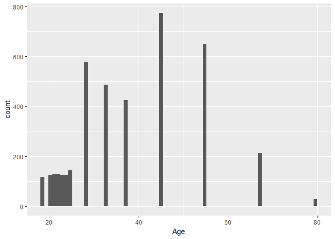
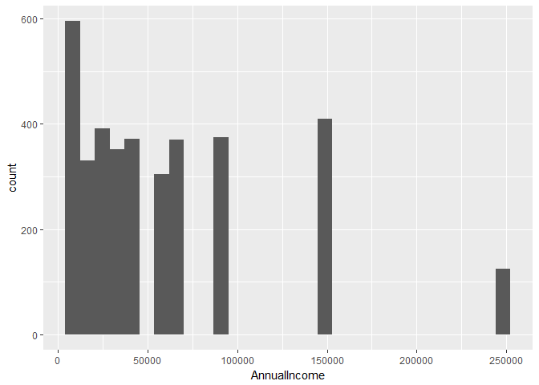
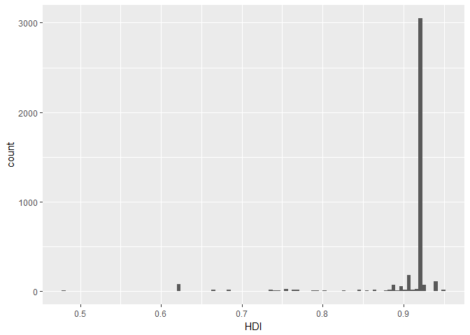
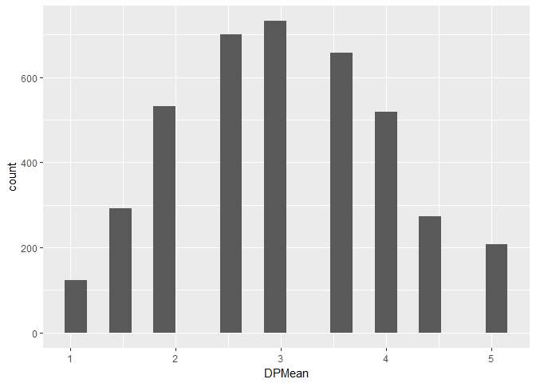
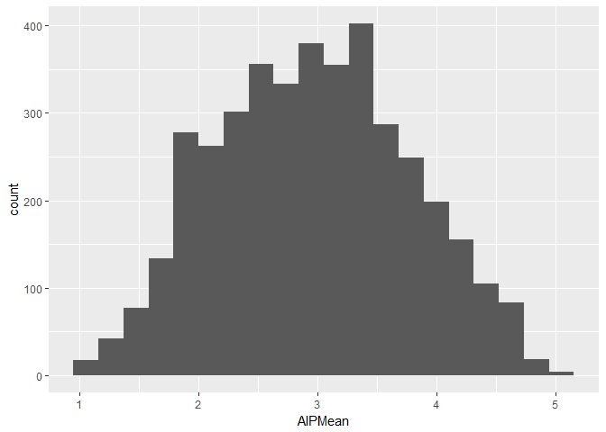
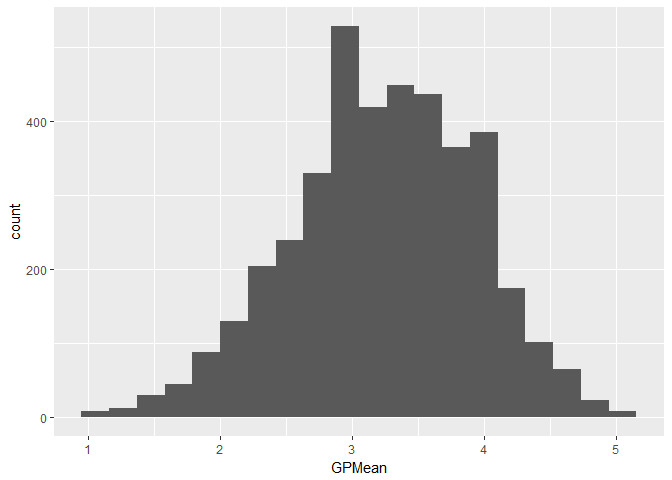
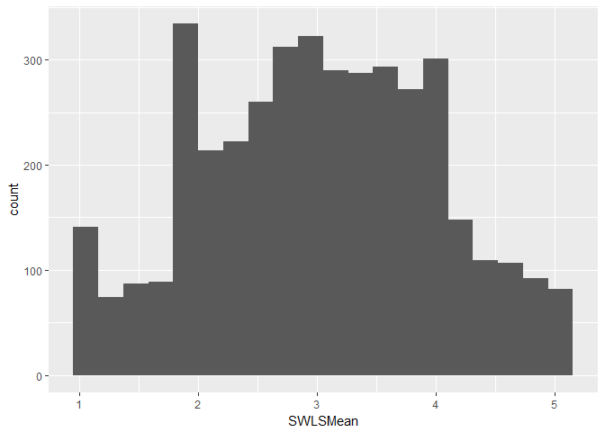

# Analysis 4A
Randall Hendrickson  
December 5, 2017  


## Procrastination Analysis


```r
library(here)
```

```
## here() starts at D:/dataScience/doingDS/case-study02/msds6306Case2
```

```r
library(knitr)
library(kableExtra)
script1 <- here("scripts", "AnalysisMikeQ4.R")
read_chunk(script1)
```


```r
# The Procrastination Analysis script wrapped in a RMD document
```

## Question 4a and 4b


```r
library(knitr)
library(ggplot2)
library(dplyr)
```

```
## 
## Attaching package: 'dplyr'
```

```
## The following objects are masked from 'package:stats':
## 
##     filter, lag
```

```
## The following objects are masked from 'package:base':
## 
##     intersect, setdiff, setequal, union
```

```r
library(here)
cleaned_file_name <- here("data", "CleanedMike.csv")
df <- read.csv(cleaned_file_name)

## we only care about these 7 columns
df2 <- df[ , c( match("Age",names(df)),
                match("AnnualIncome",names(df)),
                match("HDI",names(df)),
                match("DPMean",names(df)),
                match("AIPMean",names(df)),
                match("GPMean",names(df)),
                match("SWLSMean",names(df)) ) ]

## get some statistics of each coliumn
medians <- apply(df2,2, function(x) round( median(x,na.rm=TRUE), 2) )
q1s <- apply(df2,2, function(x) round( quantile(x,0.25,na.rm=TRUE ), 1) )
q3s <- apply(df2,2, function(x) round( quantile(x,0.75,na.rm=TRUE ), 1) )
mins <- apply(df2,2, function(x) round( min(x, na.rm=TRUE ), 1) )
maxs <- apply(df2,2, function(x) round( max(x, na.rm=TRUE ), 0) )
means <- apply(df2,2, function(x) round( mean(x,na.rm=TRUE), 2) )
sds <- apply(df2,2, function(x) round( sd(x,na.rm=TRUE), 2) )

SummaryStats <- cbind(mins,q1s,medians,q3s,maxs,means,sds)
SummaryStats
```

```
##                 mins     q1s  medians     q3s   maxs    means      sds
## Age             19.0    28.0    37.50    45.0     80    38.28    13.72
## AnnualIncome 10000.0 15000.0 45000.00 87500.0 250000 59879.87 55329.93
## HDI              0.5     0.9     0.92     0.9      1     0.91     0.06
## DPMean           1.0     2.5     3.00     3.5      5     3.03     0.99
## AIPMean          1.0     2.4     2.93     3.5      5     2.96     0.80
## GPMean           1.0     2.8     3.25     3.8      5     3.24     0.69
## SWLSMean         1.0     2.4     3.00     3.8      5     3.05     0.97
```

```r
## view them in a table
kable(SummaryStats)
```

                   mins       q1s    medians       q3s     maxs      means        sds
-------------  --------  --------  ---------  --------  -------  ---------  ---------
Age                19.0      28.0      37.50      45.0       80      38.28      13.72
AnnualIncome    10000.0   15000.0   45000.00   87500.0   250000   59879.87   55329.93
HDI                 0.5       0.9       0.92       0.9        1       0.91       0.06
DPMean              1.0       2.5       3.00       3.5        5       3.03       0.99
AIPMean             1.0       2.4       2.93       3.5        5       2.96       0.80
GPMean              1.0       2.8       3.25       3.8        5       3.24       0.69
SWLSMean            1.0       2.4       3.00       3.8        5       3.05       0.97

```r
## remove NAs for Age
cleanedAge <- df2[ !is.na(df2$Age),  ]
## there are only 14 different ages, which is really weird
## setting bins=70 lets you see all 14 ages. might want to do a diff kind of plot
unique(df2$Age)
```

```
##  [1] 80.0 55.0 45.0 67.5 37.5 32.5 28.0 23.0 19.0 22.0 20.0 24.0 25.0 21.0
## [15]   NA
```

```r
ggplot(cleanedAge, aes(Age) ) + 
  geom_histogram(bins=70)
```

<!-- -->

```r
## similarly, there are only 10 diff incomes so this is an ugly plot too
unique(df2$AnnualIncome)
```

```
##  [1]  10000  87500 150000  67500  55000  35000 250000  45000  25000  15000
## [11]     NA
```

```r
cleanedIncome <- df2[ !is.na(df2$AnnualIncome), ]
ggplot(cleanedIncome, aes(AnnualIncome)) +
  geom_histogram()
```

```
## `stat_bin()` using `bins = 30`. Pick better value with `binwidth`.
```

<!-- -->

```r
unique(df2$HDI)
```

```
##  [1] 0.479 0.764 0.745 0.858    NA 0.827 0.939 0.893 0.792 0.795 0.896
## [12] 0.674 0.698 0.754 0.865 0.794 0.920 0.847 0.738 0.727 0.856 0.878
## [23] 0.925 0.722 0.739 0.691 0.680 0.895 0.897 0.926 0.579 0.866 0.638
## [34] 0.917 0.836 0.921 0.624 0.774 0.923 0.899 0.887 0.730 0.903 0.555
## [45] 0.848 0.898 0.748 0.789 0.762 0.647 0.556 0.924 0.915 0.645 0.949
## [56] 0.550 0.788 0.740 0.682 0.855 0.843 0.802 0.804 0.890 0.666 0.901
## [67] 0.884 0.766 0.913 0.767 0.743 0.909 0.683
```

```r
##also ugly
ggplot(df2, aes(HDI)) + 
  geom_histogram(bins=100)
```

```
## Warning: Removed 242 rows containing non-finite values (stat_bin).
```

<!-- -->

```r
## all are 1.0, 1.5, 2.0, 2.5, 3.0, 3.5, 4.0, 4.5, 5.0
## would likely look prettier as categorical
unique(df2$DPMean)
```

```
##  [1] 3.5 3.0 2.5 4.0 2.0 1.5 4.5 1.0 5.0  NA
```

```r
ggplot(df2, aes(DPMean)) + 
  geom_histogram(bins=20)
```

```
## Warning: Removed 71 rows containing non-finite values (stat_bin).
```

<!-- -->

```r
## this one actually looks like a real plot, probably should use this one
ggplot(df2, aes(AIPMean)) + 
  geom_histogram(bins=20)
```

```
## Warning: Removed 71 rows containing non-finite values (stat_bin).
```

<!-- -->

```r
## same
ggplot(df2, aes(GPMean)) + 
  geom_histogram(bins=20)
```

```
## Warning: Removed 71 rows containing non-finite values (stat_bin).
```

<!-- -->

```r
## ~21 diff possibilities
unique(df2$SWLSMean)
```

```
##  [1] 2.8 2.4 1.4 3.0 3.8 4.2 3.6 4.0 2.0 3.4 1.0 2.2 4.8 3.2 1.8 2.6 1.2
## [18] 1.6 5.0 4.4 4.6  NA
```

```r
ggplot(df2, aes(SWLSMean)) + 
  geom_histogram(bins=20)
```

```
## Warning: Removed 71 rows containing non-finite values (stat_bin).
```

<!-- -->

## Question 4C and 4D


```r
## 4C/D tables for frequency 
## might want to make a function to do this quicker

## group by different genders
CountByGender <- df %>% group_by(Gender) %>% summarise(count = length(Gender))
kable(CountByGender)
```


Gender    count
-------  ------
Female     2309
Male       1721
Other        77

```r
## group by different work status
CountByWorkStatus <- df %>% group_by(WorkStatus) %>% summarise(count = length(WorkStatus))
kable(CountByWorkStatus)
```


WorkStatus    count
-----------  ------
full-time      2260
Other           113
part-time       465
retired         174
student         837
unemployed      258

```r
## group by different countries
CountByCountries <- df %>% group_by(CountryOfRes) %>% summarise(count = length(CountryOfRes))
CountriesSorted <- CountByCountries[ order(CountByCountries$count, decreasing=TRUE), ]
kable(CountriesSorted)
```


CountryOfRes          count
-------------------  ------
United States          2785
Canada                  243
Other                   231
United Kingdom          177
Australia                99
India                    78
Italy                    62
Germany                  36
Brazil                   20
Ireland                  19
Israel                   19
Netherlands              18
Sweden                   15
Norway                   14
France                   13
Japan                    13
Spain                    13
China                    12
Finland                  12
Mexico                   12
New Zealand              12
South Africa             12
Switzerland              12
Philippines              11
Greece                   10
Belgium                   9
Denmark                   9
Turkey                    9
Hong Kong                 7
Portugal                  7
Slovenia                  6
Poland                    5
Romania                   5
Afghanistan               4
Chile                     4
Croatia                   4
Malaysia                  4
Singapore                 4
Algeria                   3
Argentina                 3
Austria                   3
Czech Republic            3
Ecuador                   3
Puerto Rico               3
Uruguay                   3
Albania                   2
Andorra                   2
Bermuda                   2
Bulgaria                  2
Colombia                  2
Ghana                     2
Iran                      2
Malta                     2
Peru                      2
Saudi Arabia              2
South Korea               2
Thailand                  2
Ukraine                   2
Venezuela                 2
Yugoslavia                2
Antigua                   1
Bahamas                   1
Barbados                  1
Bolivia                   1
Botswana                  1
Brunei                    1
Cyprus                    1
Dominican Republic        1
Egypt                     1
El Salvador               1
Guam                      1
Guyana                    1
Hungary                   1
Iceland                   1
Jamaica                   1
Kazakhstan                1
Kenya                     1
Lithuania                 1
Luxembourg                1
Macao                     1
Macedonia                 1
Morocco                   1
Myanmar                   1
Nicaragua                 1
Pakistan                  1
Panama                    1
Qatar                     1
Russia                    1
Sri Lanka                 1
Taiwan                    1
Vietnam                   1

```r
#lol occupation, we need to clean this up
CountByOccupation <- df %>% group_by(CurrentOccu) %>% summarise(count = length(CurrentOccu))
kable(CountByOccupation)
```


CurrentOccu                                   count
-------------------------------------------  ------
'utterly shiftless arts student'... at p          1
abc                                               1
academic                                          2
academic assistant                                2
academic/career coach & admin assistant           1
account manager                                   1
account planner                                   1
account service rep                               1
accountant                                        2
accounting                                        2
accounting assistant                              1
accounting manager                                2
accounts payable                                  1
accounts payable / fleet manager                  1
acounting analyst                                 1
activities leader                                 1
actress                                           1
acupuncturist                                     1
adjunct faculty / university + communit           1
admin assist                                      2
administration assistant                          4
administrative asistant for jewelry stor          1
administrative officer                            1
administrator                                    10
adult care                                        1
advocate                                          1
agronomist                                        1
airline                                           1
airport ground handler                            1
analyst                                           5
anthropologist                                    1
antique dealer                                    1
architect                                         4
art director                                      2
artist                                            6
artist/ designer/builder                          1
artist/administrator                              1
artist/designer/homemaker                         1
assistant                                         1
assistant district attorney                       1
assistant general counsel                         1
assistant professor                              13
assoc. governmental program analyst               1
associate                                         2
associate / investment banking                    1
associate at law firm                             1
associate director                                1
associate director/ marketing communicat          1
associate producer                                1
asst                                              1
asst. pre-school teacher                          1
asst. prof.                                       1
astrohysicist                                     1
attorney                                         49
attorney-self employed                            1
attorney - self employed for 2 years – f        1
attorney – associate                            1
audio engineer                                    1
aviation specialist                               1
bank teller                                       3
banker                                            2
bar & restaurant owner                            1
bartender                                         1
biologist                                         1
bookkeeper                                        1
bookkeeper/ actor                                 1
bookseller                                        1
box office representative                         1
braillist                                         1
budget analyst                                    1
business                                          1
business / test analyst                           1
business consulta                                 1
business consultant                               1
business manager                                  1
business owner                                    7
business systems analyst                          1
businesswoman                                     1
buyer                                             1
c e o/ m d                                        1
cad operator                                      1
cad technician                                    1
camera coordinator                                1
campus planner                                    1
capstone golf course                              1
career placement associate                        1
case manager                                      1
casting director                                  1
cataloguer /  freelance artist                    1
catholic priest/ full timestudent                 1
ceo                                               3
certified nurse's assistant                       1
chairman of the board                             1
chauffeur                                         1
chief financial officer                           1
chief of staff                                    2
chiefe development engineer                       1
chiropractor                                      1
civil servant                                     2
clerk                                             5
client relationship assistant                     1
clinical dietitian                                1
clinical psychologist                             1
clinical research assistant                       1
clinical trial assistant                          1
clutter clearer,  video editor, caterer           2
co-proprietor                                     1
collection management specialist                  1
college administrator                             1
college faculty                                   1
college professor                                43
communications                                    2
communications & publishing                       1
company director                                  1
computer consultant                               3
computer instructor (continuing educatio          1
computer operator                                 1
computer programmer                               4
computer science                                  1
computer systems analyst                          1
computers                                         1
consultant                                       12
consultant and entrepreneur (small busin          1
consulting manager                                1
consumer case coordinator                         2
controller                                        1
contsuruction management                          1
coordinator of international programs             1
coordinatore operativo                            1
copy supervisor                                   1
copy writer                                       2
corporate instructor                              1
corporate trainer                                 1
corporation president                             1
corrections                                       1
counselor                                         2
country style employee                            1
creative consultant                               1
creative director                                 2
crna                                              1
customer service                                  9
dance teacher                                     1
data warehouse engineer                           1
dealer                                            1
dental & disability coordinator                   1
dentist                                           2
dept. director (non-profit)                       1
deputy chief of public information for t          1
deputy chieif information officer                 1
deputy director                                   3
deputy practice manager                           1
designer                                          4
detail checker                                    1
developer                                         1
dietitian                                         1
diplomat                                          2
director                                         10
director / information technology                 1
director of a language program                    1
director of academic affairs                      1
director of business development                  1
director of contract management                   1
director of non-profit organization               1
director of software company                      1
director operations                               1
director,social dvelopment                        1
disability allowance                              1
dish washer                                       1
divisional manager of a large cosmetics           1
doctor research                                   1
doctor; physician                                16
doctoral candidate!!!  no wonder i'm doi          1
driver                                            2
early child hood teacher                          1
early childhood education student/ nanny          1
ecology technician                                1
economist                                         1
economy                                           1
editor                                           21
editor attorney                                   1
education                                         1
education (at a university)                       1
education administration                          1
education specialist                              1
educator/student                                  1
efl teacher/ professional researcher              1
ehs manager                                       1
election services                                 1
electrical technician                             1
electronic technician                             1
employed by a church                              1
emt                                               1
energy therapist                                  1
engineer                                         32
enologist                                         1
entertainer                                       1
entrepreneur                                      1
entrepreneur & consultant                         1
environmental analyst                             1
environmental education non profit direc          1
environmental engineer                            1
environmental senior specialist                   1
eod                                               1
epidemiologist                                    2
esl teacher/biologist                             1
executive                                         1
executive assistant                               2
executive director                                2
executive officer                                 1
executive vice president / senior lender          1
facilitator                                       1
facilities management                             1
farm manager                                      1
federal excise tax auditor                        1
field coordinator                                 1
film editor                                       1
film industry/miscelanious                        1
film maker                                        1
finance                                           5
financial advisor                                11
financial analyst                                 2
financial consultant                              1
financial controller                              1
financial officer / small career-trainin          1
financial risk manager                            1
first vp & associate general counsel              1
fitness assistant / wellness mentor / ca          1
fitness instructor                                1
flight surgeon                                    1
food department director                          1
food service supervisor                           1
foreign affairs specialist                        1
framer/sales associate                            1
free lance bookkeeper                             1
free lance editor and tutor--in theory            1
free professionist                                1
freelance                                         1
freelance esl teacher                             1
freelance musician / part time emt / pri          1
freelance project manager                         1
full-time mother / part-time editor               1
full time student and part time bartende          1
fulltime office assistant                         1
furniture maker, home restorer                    1
gender/public health consultant                   1
geologist                                         2
geophysicist                                      1
gove service                                      1
graduate assistant                                5
graduate research assistant                       2
graduate researcher                               1
graduate student--research and teaching           1
graduate student/university instructor            1
grants administrator                              1
graphic designer                                 10
grocery store salesman                            1
groundskeeper                                     1
head - operations & qa                            1
health care                                       1
healthcare consultant                             1
home maker                                       11
host                                              1
hostess                                           1
hotel desk clerk                                  1
housekeeping                                      1
houswife                                         16
hr generalist                                     1
human resource manager                            3
human resource manger                             1
hvac tech                                         1
ict director                                      1
in-house legal counsel                            1
information assisstant                            1
information developer                             1
information management                            1
information technology                            1
information technology consultant                 2
innkeeper                                         1
instructional assistant online                    1
instructor / coach                                1
insurance                                         2
insurance agent                                   4
insurance broker's assistant                      1
insurance claims supervisor                       1
insurance coordinator                             1
intern                                            1
internet & media consultant                       1
internship                                        2
interpreter                                       1
investigative specialist                          1
investment assistant                              1
investment banker                                 1
investment counsel                                1
istraining coordinator                            1
it                                                2
it admin                                          1
it administrator                                  1
it analyst                                        1
it assistant                                      1
it consultant                                     4
it director                                       2
it engineer                                       1
it manager                                        1
it security consultant                            1
it specialist                                     2
it support                                        2
it support engineer                               2
it systems administrator                          1
it technician                                     1
janitor                                           1
jewelry artist                                    1
journalist                                        6
journalist (freelance)                            2
juvenile corrections officer                      1
lab director/archeologist                         1
lab services assistant                            1
labor relations specialist                        1
laboratory technician                             2
laborer (construction)                            1
land use planner                                  1
landscape designer                                1
language service provider                         1
language trainer                                  1
law clerk                                         2
law enforcement                                   3
lecturer                                          2
legal assistant                                   3
legal assistant / office manager                  1
legal secretary                                   1
legislation analyst                               1
letter carrier                                    2
librarian                                         9
library assistant                                 1
library paraprofessional                          1
library technician                                2
licensed professional counselor                   1
life guard                                        1
lpn                                               1
maintenance tech.                                 1
management consultant                             1
management consultant & entrepreneur              1
manager                                          32
manager - analytical and environmental s          1
manager it                                        1
manager,interacitve media                         1
manufacturing                                     1
market analyst                                    5
market research analyst                           2
marketing                                        20
marketing copywriter                              2
massage therapist                                 1
master control operator                           1
md                                                1
mechanical engineer                               1
media consultant                                  1
media relations manager                           1
media relations/science writing                   1
medical                                           1
medical / public health educator                  1
medical laboratory                                1
medical practitioner                              1
medical sonographer                               1
medical transcriptionist                          1
mentor/special events intern                      1
military                                          1
mktg                                              1
mover                                             1
multimedia developer                              1
museum docent                                     1
musician                                          3
musician/student/teacher                          1
nanny                                             5
nanny and student                                 1
network engineer                                  2
network services engineer                         1
new realtor                                       1
newspaper carrier                                 1
night dispatch supervisor  (it's just a           1
non-profit consultant                             1
nurse                                            13
nursing home                                      1
office                                            1
office admin                                      1
office manager                                    1
office manager / accountant                       1
office services manager                           1
online media buyer                                1
operations manager                                4
organic grocery store cashier/shift lead          1
ornithology graduate student and teachin          1
other                                          2535
ouh                                               1
outdoor recreation coordinator                    1
owner                                             2
owner - private practice physical therap          1
p-t college faculty & p-t self-employed           1
page designer for a newspaper                     1
paralegal                                         2
paraprofessional                                  2
parent educator/supervisor                        1
partner                                           1
pastor ; life coach  clergy                       5
pathology                                         1
pca for a quadrapilegic and a pca for a           1
pharmaceutical merchandiser                       1
pharmacist                                        3
pharmacy tech.                                    1
phd student researcher                            1
photo profucer                                    1
physical science technician                       1
physician (internist)                             1
physicist                                         1
physiotherapst                                    1
pjublic relations director                        1
plant engineering supervisor                      1
please specify                                  200
please specify title manager for regulat          1
policy analyst                                    2
post grad physician                               1
postdoc                                           2
postdoctoral researcher                           1
pr and communications firm owner                  1
president                                         7
president nongovernmental organization            1
president/ceo                                     1
press officer                                     2
private equity principal                          1
pro poker player /   website owner                1
probation supervisor                              1
process engineer                                  1
procrastinator                                    1
produce associate                                 1
producer                                          1
product field test manager                        1
production operations support analyst             1
professional organizer                            1
program assistant                                 1
program coordinator                               1
program director                                  1
program director at a non-profit organiz          1
program manager                                   1
program manager and acting director               1
program officer                                   1
program specialist                                1
programmer                                        3
programmer analyst                                1
programmer/developer                              1
programmer/software analyst                       2
project manager                                  10
proofreader                                       1
proposal director                                 1
psychiatrist in private practice                  1
psychologis                                       7
psychotherapist                                   3
public health                                     1
public relations                                  1
publishing                                        1
quality manager                                   1
quotations specialist                             1
real estate                                       1
real estate agent                                 1
real estate appraiser                             1
real estate broker                                1
real estate developer                             1
realtor                                           1
reasearch assistant                               1
receptionist                                      3
recreational staff                                1
regional sales manager                            1
registered respiratory therapist                  1
regulatory affairs                                1
research / gis analyst                            1
research analyst                                  1
research assistant                                8
research associate                                4
research coordinator                              1
research intern                                   1
research manager                                  1
research scholar                                  1
research scientist                                8
research specialist                               1
research technician                               1
research/teaching assistant                       1
researcher                                        3
researcher - physician                            1
residence don                                     1
resident physician                                1
residential services supervisor                   1
respiratory therapist                             1
restaurant mgr / student / and looking f          1
restaurant operations manager                     1
retail                                            4
retail / artist /writer                           1
retired                                          28
retired/adjunct                                   1
rn                                                4
rn - medical sales                                1
rocket scientist                                  1
sales                                             4
sales executive                                   1
sales expert                                      1
sales insurance                                   1
sales manager                                     3
sales rep                                         3
sales/ daycare worker                             1
school counselor                                  1
science writing intern                            1
scientist                                        12
secretary                                         5
self-employed / personal trainer / stren          1
self-employed family therapist                    1
self-employed freelance writer/author             1
self-employed photographer                        2
self-employed translator                          1
self-employed writer/editor                       1
self employed                                     3
self employed public relations                    1
self employeed                                    1
selfemplyed renovator                             1
senior consultant                                 1
senior consultant programmer/analyst              1
senior grant officer                              1
senior human resources consultant                 1
senior policy advisor                             1
senior project manager                            1
senior records analyst                            1
senior staff writer                               1
senior systems analyst                            1
server                                           10
service co-ordinator                              1
service registrar/english instructor              1
set designer                                      1
set lighting technician                           1
shipping/receiving/warehouse mgnt                 1
social media consultant                           1
social policy analyst                             1
social work intern                                1
social worker                                     7
software analyst                                  1
software developer                               16
software engineer                                 2
software pro                                      2
software sales                                    2
software trainer                                  1
speaker author consultant                         1
speaker/actor                                     1
special education administrative assista          1
special education teacher                         4
special projects editor                           1
specialist                                        1
speech and language assistant                     1
sr. drug safety associate                         1
statistician                                      1
stay-at-home dad                                  1
steamship agent                                   1
stocker                                           2
student                                           1
student / working part-time                       1
student and administrative assistant              1
student and part time secretary                   1
student and private curator                       1
student childhood and youth studies               1
student fysiotherapy /home care / massage         1
student part-time and sales full-time             1
student/barmaid                                   1
student/imvestor                                  1
student/retail                                    1
student/teacher                                   1
student/waiter                                    1
studey                                            1
supervising program development speciali          1
supervisor                                        2
supervisor shelderd workshop for handcap          1
surgeon                                           1
surgical resident                                 1
system analyst                                    1
system manager                                    1
systems analyst                                   2
systems programmer/analyst                        1
tax consultant                                    1
tax examiner                                      1
teacher                                          74
teacher's assistant/afterschool leader            1
teacher / administrator                           1
teacher and full time doctoral student            1
teacher assistant                                 3
teaching assistant/graduate student               1
tech analyst/gis                                  1
tech support                                      1
technical coordinator                             1
technical director                                1
technical officer                                 1
technical support rep                             1
technical trainer                                 1
technical writer                                  4
technology (cto)                                  1
technology curriculum developer science           1
television director                               1
television producer                               1
temp                                              1
temporary office                                  1
test item writer (self-employed)                  1
theater artist/ teacher                           1
theater general manager                           1
tour guide                                        1
town clerk                                        1
town planner                                      1
trader                                            1
traffic reporter-radio                            1
trainee                                           1
training coordinator                              2
translator                                        6
treatment support co-ordinator                    1
tutor                                             5
tv broadcast technician                           1
tv news executive producer                        1
unemployed                                       18
university faculty                                2
university staff                                  1
urban planner/economic development plann          1
veterinarian                                      2
vetrans representative                            1
vice-president                                    2
vice president                                    1
vice president / program office                   1
vidoe                                             1
visual artist                                     1
vmd                                               1
volunteer director                                1
volunteer mental health worker                    1
vp scientific affairs / pharmaceutical c          1
warehouse                                         1
warehouse supervisor                              1
web communications                                1
web designer                                      4
webmaster / print designer                        1
wig designer                                      1
writer                                           19
writer & director of content solutions            1
writer / eductor                                  1
writer / lecturer / consultant                    1
writer / web designer/ web-master                 1
writer and management consultant                  1
writer/editor                                     2
writer/editor/musician                            1
writer/musician                                   1
writing consultant                                2
yoga teacher                                      1

```r
## only need these 2 columns for 4E
df3 <- df[ , c(60,61)]
#View(df3)
head(df3)
```

```
##   SWLS5 YouProcast
## 1     2        yes
## 2     2        yes
## 3     2        yes
## 4     1         no
## 5     2        yes
## 6     4        yes
```

```r
df3$both <- "other"   ## there are some NAs probably
df3$both[ df3$YouProcast=="yes" & df3$OthersThinkU=="yes" ] <- "We both do" 
df3$both[ df3$YouProcast=="no" & df3$OthersThinkU=="no" ] <- "We both don't" 
df3$both[ df3$YouProcast=="yes" & df3$OthersThinkU=="no" ] <- "I do they don't" 
df3$both[ df3$YouProcast=="no" & df3$OthersThinkU=="yes" ] <- "I don't they do" 
CountBySame <- df3 %>% group_by(both) %>% summarise(count = length(both))
kable(CountBySame)
```


both     count
------  ------
other     4107

### Reproducible research show sessionInfo


```r
sessionInfo()
```

```
## R version 3.4.2 (2017-09-28)
## Platform: x86_64-w64-mingw32/x64 (64-bit)
## Running under: Windows 10 x64 (build 16299)
## 
## Matrix products: default
## 
## locale:
## [1] LC_COLLATE=English_United States.1252 
## [2] LC_CTYPE=English_United States.1252   
## [3] LC_MONETARY=English_United States.1252
## [4] LC_NUMERIC=C                          
## [5] LC_TIME=English_United States.1252    
## 
## attached base packages:
## [1] stats     graphics  grDevices utils     datasets  methods   base     
## 
## other attached packages:
## [1] bindrcpp_0.2     dplyr_0.7.4      ggplot2_2.2.1    kableExtra_0.6.1
## [5] knitr_1.17       here_0.1        
## 
## loaded via a namespace (and not attached):
##  [1] Rcpp_0.12.13      bindr_0.1         xml2_1.1.1       
##  [4] magrittr_1.5      hms_0.3           rvest_0.3.2      
##  [7] munsell_0.4.3     colorspace_1.3-2  viridisLite_0.2.0
## [10] R6_2.2.2          rlang_0.1.2       highr_0.6        
## [13] stringr_1.2.0     httr_1.3.1        plyr_1.8.4       
## [16] tools_3.4.2       grid_3.4.2        gtable_0.2.0     
## [19] htmltools_0.3.6   assertthat_0.2.0  lazyeval_0.2.0   
## [22] yaml_2.1.14       rprojroot_1.2     digest_0.6.12    
## [25] tibble_1.3.4      readr_1.1.1       glue_1.1.1       
## [28] evaluate_0.10.1   rmarkdown_1.6     labeling_0.3     
## [31] stringi_1.1.5     compiler_3.4.2    scales_0.5.0     
## [34] backports_1.1.1   pkgconfig_2.0.1
```
