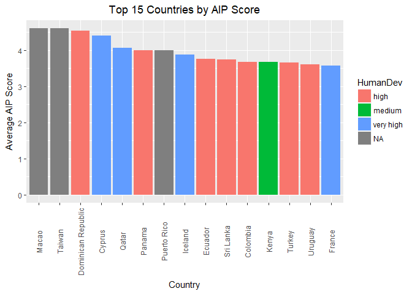
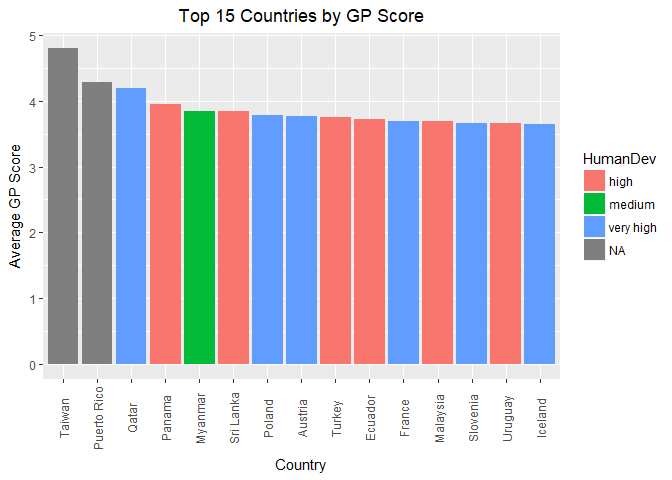
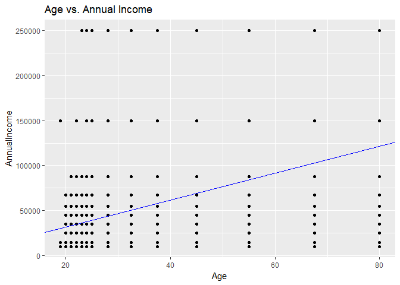
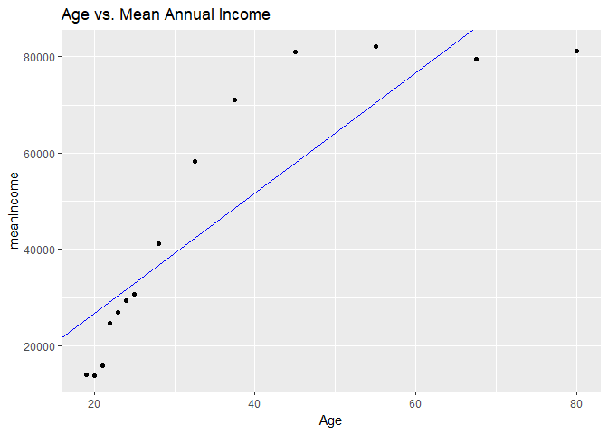
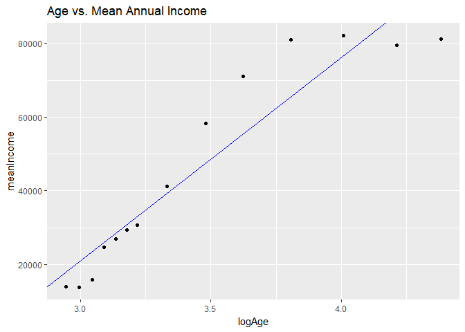
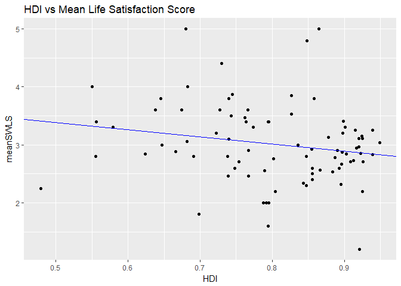
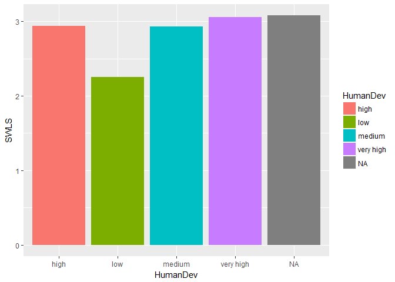

# Analysis 5A
Randall Hendrickson  
December 5, 2017  


## Procrastination Analysis


```r
library(here)
```

```
## here() starts at D:/dataScience/doingDS/case-study02/msds6306Case2
```

```r
library(knitr)
library(kableExtra)
script1 <- here("scripts", "AnalysisMikeQ5.R")
read_chunk(script1)
```


```r
# The Procrastination Analysis script wrapped in a RMD document
```

## Question 5

#### The Top 15 Nations in Average AIP Score
Macau, Taiwan, Dominican Republic, Cyprus, Qatar, Panama, Puerto Rico, Iceland, Ecuador, Sri Lanka, Columbia, Kenya, Turkey, Uruguay, France

#### The Top 15 Nations in Average GP Score
Taiwan, Puerto Rico, Qatar, Panama, Myanmar, Sri Lanka, Poland, Austria, Turkey, Ecuador, France, Malaysia, Slovenia, Uruguay, Iceland

#### The following Nations appear in both Top 15 Nations in AIP and Top 15 Nations in GP
Ecuador, France, Iceland, Panama, Puerto Rico, Qatar, Sri Lanka, Taiwan, Turkey, Uruguay 

#### There is a relationship and trend between Age and Income. The older the Age, the higher the income.

#### There doesn't seem to be a discernible relationship between Life Satisfaction and HDI.


```r
library(knitr)
library(ggplot2)
library(dplyr)
```

```
## 
## Attaching package: 'dplyr'
```

```
## The following objects are masked from 'package:stats':
## 
##     filter, lag
```

```
## The following objects are masked from 'package:base':
## 
##     intersect, setdiff, setequal, union
```

```r
library(here)
cleaned_file_name <- here("data", "CleanedMike.csv")
hdi_by_country_file <- here("data", "HDIbyCountry.csv")
df <- read.csv(cleaned_file_name)
#View(df)
head(df)
```

```
##   X CountryOfRes  Age Gender     Kids Education WorkStatus AnnualIncome
## 1 1  Afghanistan 80.0 Female  No Kids     grade unemployed        10000
## 2 2  Afghanistan 55.0   Male  No Kids       deg  full-time        87500
## 3 3  Afghanistan 55.0   Male Yes Kids        ma  full-time       150000
## 4 4  Afghanistan 55.0 Female Yes Kids       deg  full-time        10000
## 5 5      Albania 45.0 Female  No Kids     ltuni  full-time       150000
## 6 6      Albania 67.5   Male Yes Kids       deg  part-time        87500
##        CurrentOccu CurJobYears CurJobMonths CommunitySize MaritalStatus
## 1            other           0            0  Medium-Sized        Single
## 2            other           0            6    Large Town       Married
## 3            other           0            0    Large Town       Married
## 4            other           7            0       Village      Divorced
## 5            other           0            0    Large Town        Single
## 6 media consultant           4            0    Large-City      Divorced
##   Sons Daughters DP1 DP2 DP3 DP4 DP5 AIP1 AIP2 AIP3 AIP4 AIP5 AIP6 AIP7
## 1    0         0   2   3   2   3   5    2    2    3    4    2    2    2
## 2    0         0   3   3   3   4   3    3    2    2    2    3    2    3
## 3    4         2   4   4   4   3   3    3    4    5    4    3    4    3
## 4    4         0   4   3   4   3   2    1    2    1    4    3    5    4
## 5    0         0   3   3   5   3   3    3    1    2    1    2    2    2
## 6    0         2   4   3   2   2   1    4    1    5    1    2    1    1
##   AIP8 AIP9 AIP10 AIP11 AIP12 AIP13 AIP14 AIP15 GP1 GP2 GP3 GP4 GP5 GP6
## 1    1    1     3     5     4     3     3     4   4   4   1   4   4   4
## 2    3    2     3     4     2     4     2     3   4   2   4   3   3   3
## 3    5    4     3     5     5     1     5     4   4   4   5   3   1   3
## 4    4    3     3     3     4     3     3     3   3   2   2   5   3   3
## 5    2    1     2     3     2     2     1     5   5   3   2   2   5   4
## 6    3    2     3     3     1     3     1     5   4   1   2   2   3   2
##   GP7 GP8 GP9 GP10 GP11 GP12 GP13 GP14 GP15 GP16 GP17 GP18 GP19 GP20 SWLS1
## 1   4   3   2    2    3    3    2    3    2    4    4    4    3    4     2
## 2   3   4   4    2    2    3    2    4    3    4    3    3    4    4     3
## 3   4   4   4    4    4    4    3    4    4    4    4    4    3    4     3
## 4   3   5   3    1    2    3    1    1    3    3    3    4    3    3     1
## 5   5   5   5    1    3    4    5    5    5    4    3    4    4    4     3
## 6   2   2   4    1    2    4    4    4    4    4    4    3    4    4     3
##   SWLS2 SWLS3 SWLS4 SWLS5 YouProcast OthersThinkU DPMean  AIPMean GPMean
## 1     4     3     3     2        yes           no    3.5 2.733333    3.2
## 2     2     2     3     2        yes           no    3.0 2.666667    3.2
## 3     3     2     2     2        yes          yes    3.5 3.866667    3.7
## 4     1     1     3     1         no          yes    3.0 3.066667    2.8
## 5     3     3     4     2        yes           no    3.0 2.066667    3.9
## 6     4     3     5     4        yes           no    2.5 2.400000    3.0
##   SWLSMean   HDI HumanDev
## 1      2.8 0.479      low
## 2      2.4 0.479      low
## 3      2.4 0.479      low
## 4      1.4 0.479      low
## 5      3.0 0.764     high
## 6      3.8 0.764     high
```

```r
hdi <- read.csv(hdi_by_country_file)
colnames(hdi)[1] = "CountryOfRes"    ## need column names to match to merge


## may want to make a function for this

## find the mean of each type per country
CountryMeanDP <- df %>% group_by(CountryOfRes) %>% summarise(meanDP = mean(DPMean, na.rm=TRUE))
CountryMeanAIP <- df %>% group_by(CountryOfRes) %>% summarise(meanAIP = mean(AIPMean, na.rm=TRUE))
CountryMeanGP <- df %>% group_by(CountryOfRes) %>% summarise(meanGP = mean(GPMean, na.rm=TRUE))
CountryMeanSWLS <- df %>% group_by(CountryOfRes) %>% summarise(meanSWLS = mean(SWLSMean, na.rm=TRUE))

## sort from highest to lowest
MeanDPSorted <- CountryMeanDP[ order(CountryMeanDP$meanDP, decreasing=TRUE), ]
MeanAIPSorted <- CountryMeanAIP[ order(CountryMeanAIP$meanAIP, decreasing=TRUE), ]
MeanGPSorted <- CountryMeanGP[ order(CountryMeanGP$meanGP, decreasing=TRUE), ]
MeanSWLSSorted <- CountryMeanSWLS[ order(CountryMeanSWLS$meanSWLS, decreasing=TRUE), ]

## remove all that aren't top 15
top15DP <- MeanDPSorted[c(1:15),]
top15AIP <- MeanAIPSorted[c(1:15),]
top15GP <- MeanGPSorted[c(1:15),]
top15SWLS <- MeanSWLSSorted[c(1:15),]

## merge with hdi file becuase we want to group by hdi in the barcharts
## need all.x=TRUE because not all of these countries have a recorded hdi
DP <- merge(top15DP,hdi,by="CountryOfRes",all.x=TRUE)
AIP <- merge(top15AIP,hdi,by="CountryOfRes",all.x=TRUE)
GP <- merge(top15GP,hdi,by="CountryOfRes",all.x=TRUE)
SWLS <- merge(top15SWLS,hdi,by="CountryOfRes",all.x=TRUE)

both <- cbind(AIP,GP)
# kable(both)
## Ecuador, France, Iceland, Panama, Puerto Rico, Qatar, Sri Lanka, Taiwan, Turkey, Uruguay in both
## might want to redo this but only include countries with 2+ entries

## plot for 5B
ggplot(AIP, aes(CountryOfRes, meanAIP, fill=HumanDev) ) +                  
  geom_col() + 
  ggtitle("Top 15 Countries by AIP Score") + 
  xlab("Country") + 
  ylab("Average AIP Score") + 
  theme(axis.text.x = element_text(angle = 90, vjust = 0.5),        ## rotate labels on x-axis
        plot.title = element_text(hjust = 0.5) )  +                  ## centers the title
  scale_x_discrete(limits = top15AIP$CountryOfRes)                  ## maintain the order
```

<!-- -->

```r
  #guides(fill=FALSE)                                                  ## removes labels

## plot for 5C
ggplot(GP, aes(CountryOfRes, meanGP, fill=HumanDev) ) +
  geom_col() + 
  ggtitle("Top 15 Countries by GP Score") + 
  xlab("Country") + 
  ylab("Average GP Score") + 
  theme(axis.text.x = element_text(angle = 90, vjust = 0.5),
        plot.title = element_text(hjust = 0.5) )  +
  scale_x_discrete(limits = top15GP$CountryOfRes) 
```

<!-- -->

```r
  #guides(fill=FALSE)


## 5D
model <- lm( df$AnnualIncome ~ df$Age )
summary(model)
```

```
## 
## Call:
## lm(formula = df$AnnualIncome ~ df$Age)
## 
## Residuals:
##     Min      1Q  Median      3Q     Max 
## -111693  -28861  -14370   11139  213623 
## 
## Coefficients:
##             Estimate Std. Error t value Pr(>|t|)    
## (Intercept)  1950.98    2592.53   0.753    0.452    
## df$Age       1496.77      63.23  23.671   <2e-16 ***
## ---
## Signif. codes:  0 '***' 0.001 '**' 0.01 '*' 0.05 '.' 0.1 ' ' 1
## 
## Residual standard error: 51490 on 3619 degrees of freedom
##   (486 observations deleted due to missingness)
## Multiple R-squared:  0.1341,	Adjusted R-squared:  0.1338 
## F-statistic: 560.3 on 1 and 3619 DF,  p-value: < 2.2e-16
```

```r
## y = 1950.98 + 1496.77 * Age
## r^2 = 0.1341, p-value: 2e-16

## plots all the data
## while the pvalue is low, the r-squared is low. the data is shitty
ggplot(df, aes(x=Age,y=AnnualIncome)) + 
  geom_point() + 
  geom_abline(intercept=1950.98,slope=1496.77,color="blue") +
  ggtitle("Age vs. Annual Income")
```

```
## Warning: Removed 486 rows containing missing values (geom_point).
```

<!-- -->

```r
MeanIncomePerAge <- df %>% group_by(Age) %>% summarise(meanIncome = mean(AnnualIncome, na.rm=TRUE))
model2 <- lm( MeanIncomePerAge$meanIncome ~ MeanIncomePerAge$Age )
summary(model2)
```

```
## 
## Call:
## lm(formula = MeanIncomePerAge$meanIncome ~ MeanIncomePerAge$Age)
## 
## Residuals:
##    Min     1Q Median     3Q    Max 
## -20667 -10423  -2991   9791  22962 
## 
## Coefficients:
##                      Estimate Std. Error t value Pr(>|t|)    
## (Intercept)            1781.8     8176.9   0.218    0.831    
## MeanIncomePerAge$Age   1251.1      203.2   6.157  4.9e-05 ***
## ---
## Signif. codes:  0 '***' 0.001 '**' 0.01 '*' 0.05 '.' 0.1 ' ' 1
## 
## Residual standard error: 14150 on 12 degrees of freedom
##   (1 observation deleted due to missingness)
## Multiple R-squared:  0.7595,	Adjusted R-squared:  0.7395 
## F-statistic:  37.9 on 1 and 12 DF,  p-value: 4.897e-05
```

```r
## y = 1781.8 + 1251.1 * Age
## r^2 = 0.7959

## plotting just the mean income at each age
## looks curved

ggplot(MeanIncomePerAge, aes(x=Age,y=meanIncome)) + 
  geom_point() + 
  geom_abline(intercept=1781.8,slope=1251.1,color="blue") +
  ggtitle("Age vs. Mean Annual Income")
```

```
## Warning: Removed 1 rows containing missing values (geom_point).
```

<!-- -->

```r
## take the log of age to smooth out the line a little
MeanIncomePerAge$logAge <- log(MeanIncomePerAge$Age)
model3 <- lm( MeanIncomePerAge$meanIncome ~ MeanIncomePerAge$logAge )
summary(model3)
```

```
## 
## Call:
## lm(formula = MeanIncomePerAge$meanIncome ~ MeanIncomePerAge$logAge)
## 
## Residuals:
##    Min     1Q Median     3Q    Max 
## -16109  -6180  -1417   4657  15644 
## 
## Coefficients:
##                         Estimate Std. Error t value Pr(>|t|)    
## (Intercept)              -144819      19557  -7.405 8.22e-06 ***
## MeanIncomePerAge$logAge    55255       5602   9.863 4.16e-07 ***
## ---
## Signif. codes:  0 '***' 0.001 '**' 0.01 '*' 0.05 '.' 0.1 ' ' 1
## 
## Residual standard error: 9561 on 12 degrees of freedom
##   (1 observation deleted due to missingness)
## Multiple R-squared:  0.8902,	Adjusted R-squared:  0.881 
## F-statistic: 97.27 on 1 and 12 DF,  p-value: 4.157e-07
```

```r
## y = -144819 + 55255 * log(Age)
## r^2 = 0.8902

ggplot(MeanIncomePerAge, aes(x=logAge,y=meanIncome)) + 
  geom_point() + 
  geom_abline(intercept=-144819,slope=55255,color="blue") +
  ggtitle("Age vs. Mean Annual Income")
```

```
## Warning: Removed 1 rows containing missing values (geom_point).
```

<!-- -->

```r
## doubling the age 55255 * log(2) = 38300 increase in mean salary

## 5E
LifeSat <- merge(MeanSWLSSorted,hdi,by="CountryOfRes",all.x=TRUE)
model4 <- lm( LifeSat$meanSWLS ~ LifeSat$HDI )
summary(model4)
```

```
## 
## Call:
## lm(formula = LifeSat$meanSWLS ~ LifeSat$HDI)
## 
## Residuals:
##      Min       1Q   Median       3Q      Max 
## -1.66610 -0.37348 -0.01162  0.38223  2.06499 
## 
## Coefficients:
##             Estimate Std. Error t value Pr(>|t|)    
## (Intercept)   3.9996     0.5542   7.217 2.57e-10 ***
## LifeSat$HDI  -1.2307     0.6866  -1.792   0.0768 .  
## ---
## Signif. codes:  0 '***' 0.001 '**' 0.01 '*' 0.05 '.' 0.1 ' ' 1
## 
## Residual standard error: 0.6729 on 81 degrees of freedom
##   (8 observations deleted due to missingness)
## Multiple R-squared:  0.03815,	Adjusted R-squared:  0.02628 
## F-statistic: 3.213 on 1 and 81 DF,  p-value: 0.07679
```

```r
## SWLS = 4 - 1.23 HDI
## r^2 = 0.0381, p=0.0768  (not sig at alpha=0.05)

ggplot(LifeSat, aes(x=HDI,y=meanSWLS)) + 
  geom_point() + 
  geom_abline(intercept=4,slope=-1.23,color="blue") +
  ggtitle("HDI vs Mean Life Satisfaction Score")
```

```
## Warning: Removed 8 rows containing missing values (geom_point).
```

<!-- -->

```r
## group by hdi as a category
hd <- df %>% group_by(HumanDev) %>% summarise(SWLS = mean(SWLSMean, na.rm=TRUE))
ggplot(hd, aes(HumanDev, SWLS, fill=HumanDev) ) +
  geom_col() 
```

<!-- -->

```r
## no still not really correlated
```

### Reproducible research show sessionInfo


```r
sessionInfo()
```

```
## R version 3.4.2 (2017-09-28)
## Platform: x86_64-w64-mingw32/x64 (64-bit)
## Running under: Windows 10 x64 (build 16299)
## 
## Matrix products: default
## 
## locale:
## [1] LC_COLLATE=English_United States.1252 
## [2] LC_CTYPE=English_United States.1252   
## [3] LC_MONETARY=English_United States.1252
## [4] LC_NUMERIC=C                          
## [5] LC_TIME=English_United States.1252    
## 
## attached base packages:
## [1] stats     graphics  grDevices utils     datasets  methods   base     
## 
## other attached packages:
## [1] dplyr_0.7.4      ggplot2_2.2.1    kableExtra_0.6.1 knitr_1.17      
## [5] here_0.1        
## 
## loaded via a namespace (and not attached):
##  [1] Rcpp_0.12.13      bindr_0.1         xml2_1.1.1       
##  [4] magrittr_1.5      hms_0.3           rvest_0.3.2      
##  [7] munsell_0.4.3     colorspace_1.3-2  viridisLite_0.2.0
## [10] R6_2.2.2          rlang_0.1.2       stringr_1.2.0    
## [13] httr_1.3.1        plyr_1.8.4        tools_3.4.2      
## [16] grid_3.4.2        gtable_0.2.0      htmltools_0.3.6  
## [19] assertthat_0.2.0  lazyeval_0.2.0    yaml_2.1.14      
## [22] rprojroot_1.2     digest_0.6.12     tibble_1.3.4     
## [25] bindrcpp_0.2      readr_1.1.1       glue_1.1.1       
## [28] evaluate_0.10.1   rmarkdown_1.6     labeling_0.3     
## [31] stringi_1.1.5     compiler_3.4.2    scales_0.5.0     
## [34] backports_1.1.1   pkgconfig_2.0.1
```
